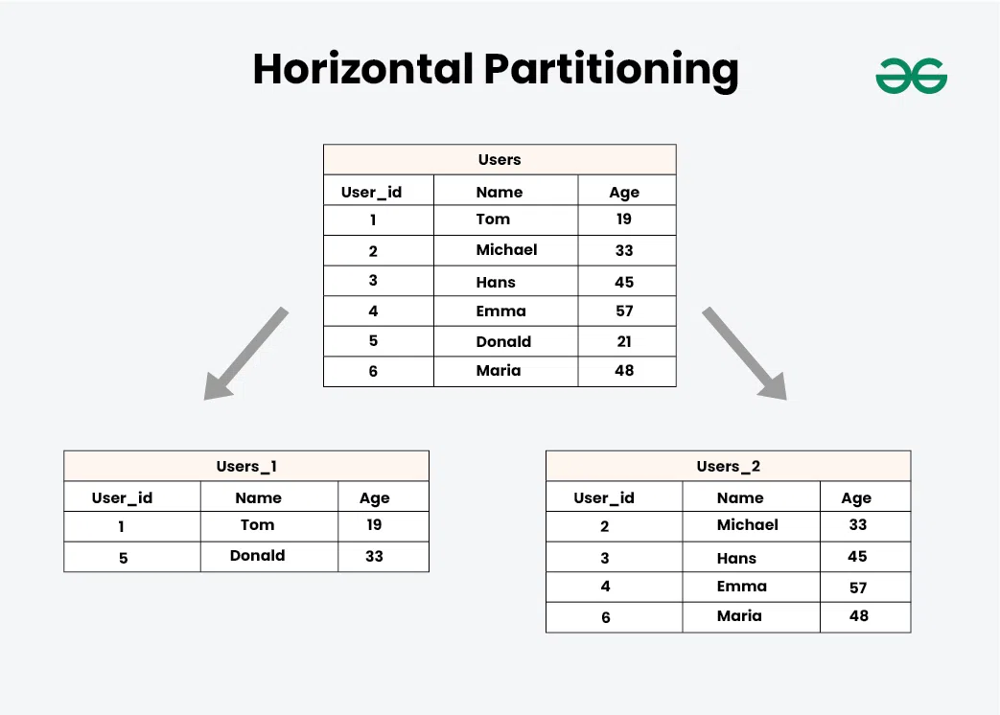
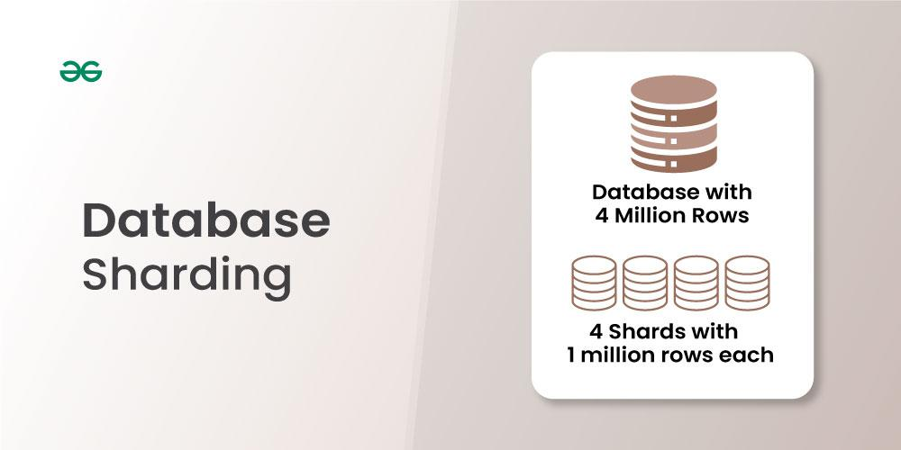
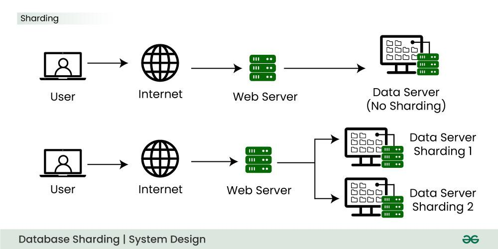

# **Database Partitioning vs Sharding**

Although **partitioning** and **sharding** aim to improve database performance and scalability by breaking large datasets into smaller, manageable pieces, they differ significantly in architecture, purpose, and implementation.

## **Database Partitioning**
The process of splitting a dataset into more manageable, smaller pieces in order to improve efficiency, scalability, and performance is known as data partitioning.

## **Database Sharding**
Database sharding is a technique for horizontal scaling of databases, where the data is split across multiple database instances, or shards, to improve performance and reduce the impact of large amounts of data on a single database.

---

## **Key Differences**

| **Aspect**                | **Partitioning**                                                                                   | **Sharding**                                                                                      |
|---------------------------|----------------------------------------------------------------------------------------------------|--------------------------------------------------------------------------------------------------|
| **Definition**             | Partitioning divides a database into smaller segments (partitions) within a single server.         | Sharding is a form of horizontal partitioning where data is distributed across multiple servers. |
| **Data Storage**           | All partitions are stored on the same server or cluster.                                          | Shards are distributed across different servers or clusters.                                    |
| **Management Scope**       | Managed within a single database instance or cluster.                                             | Requires multiple independent database instances, each managing a shard.                        |
| **Scaling**                | Limited to vertical scaling (increasing server capacity).                                         | Supports horizontal scaling by adding more servers (shards).                                    |
| **Performance**            | Improves performance by reducing the size of individual partitions for queries.                   | Improves performance by distributing both data and query load across multiple shards.           |
| **Complexity**             | Easier to implement, as it operates within a single database system.                             | More complex to implement and maintain, as it involves multiple databases and distributed systems. |
| **Querying**               | Queries across partitions can be optimized using partition pruning.                              | Queries spanning multiple shards require a query router or middleware to aggregate results.     |
| **Failure Handling**       | A failure affects the entire database since partitions reside on the same server.                | A failure in one shard typically affects only that shard, improving overall availability.       |
| **Use Case**               | Used to optimize performance within a large, single database by dividing large tables.            | Used to handle very large datasets that exceed the capacity of a single server.                 |

---

## **Types of Partitioning**

1. **Horizontal or Range Partitioning**  
   - Divides data based on a range of values (e.g., dates or IDs).  
   - **Example:**  
     - Partition 1: Data from Jan–Jun.  
     - Partition 2: Data from Jul–Dec.

2. **List Partitioning**  
   - Divides data based on predefined lists of values.  
   - **Example:** Orders for different regions can be placed in different partitions.

3. **Hash Partitioning**  
   - Uses a hash function to distribute data across partitions.  
   - Ensures even data distribution.

4. **Composite Partitioning**  
   - Combines two or more partitioning methods (e.g., range + hash).

---

## **Types of Sharding**

1. **Horizontal or Range-Based Sharding**  
   - Similar to range partitioning but applied across multiple servers.  
   - **Example:** Users with IDs 1–1000 in Shard A, 1001–2000 in Shard B.

2. **Hash-Based Sharding**  
   - Uses a hash function to determine which shard a record belongs to.  
   - Ensures a more even distribution of data across shards.

3. **Geo-Based Sharding**  
   - Data is sharded based on geographic location.  
   - **Example:** Data from North America on one shard, Europe on another.

---

## **When to Use Partitioning**

- The dataset is large but manageable on a single server.  
- Query patterns are predictable (e.g., most queries target recent data).  
- The goal is to improve query performance by reducing the data scanned for each query.

**Example Use Case:**  
A financial application storing transaction history where recent transactions are queried more frequently. Range partitioning can be used to separate data by date.

---

## **When to Use Sharding**

- The dataset is too large for a single server to handle.  
- High availability and horizontal scaling are crucial.  
- The system needs to handle very high read and write throughput.

**Example Use Case:**  
A social media application where user data is sharded by user ID to distribute the load across multiple servers.

---

## **Summary**

| **Factor**                  | **Partitioning**                 | **Sharding**                      |
|-----------------------------|----------------------------------|-----------------------------------|
| **Server Setup**            | Single server or cluster         | Multiple servers                  |
| **Scalability Type**        | Vertical                         | Horizontal                        |
| **Complexity**              | Low                              | High                              |
| **Query Optimization**      | Partition pruning                | Query routing                     |
| **Failure Isolation**       | No                               | Yes                               |
| **Best for**                | Moderate-sized datasets          | Massive datasets                  |

---

