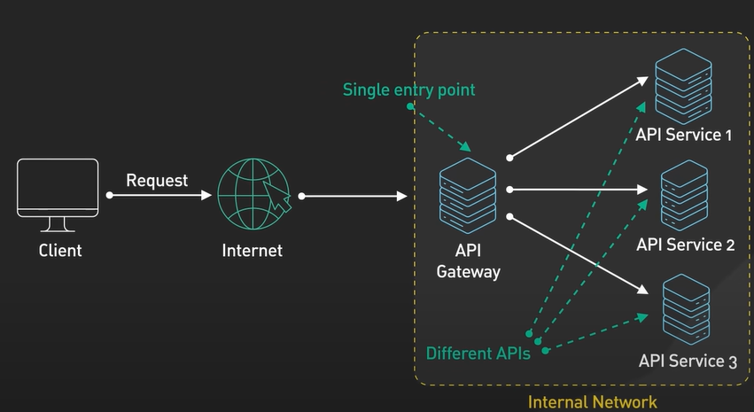

# **Reverse Proxy, API Gateway, and Load Balancer**

These are essential networking components, but they serve different purposes in system architecture. Below is a breakdown of their roles and key differences.

---

## **1. Reverse Proxy**

A reverse proxy acts as an intermediary between clients and servers. Instead of clients directly contacting the backend server, the reverse proxy forwards requests to the appropriate server.

### **Features**
- Hides backend server details (IP, port) from clients.
- Handles **SSL/TLS termination**.
- Provides **load balancing** by distributing traffic across multiple servers.
- **Caches responses** to improve performance.
- Enhances security by preventing direct access to backend servers.

### **Example Tools**
- **NGINX**, **HAProxy**, **Apache HTTP Server**, **Traefik**

---

## **2. API Gateway**
It serves as a centralized entry point for managing and routing requests from clients to the appropriate microservices or backend services within a system.

An API Gateway is a specialized reverse proxy designed for managing APIs. It routes client requests to appropriate microservices while centralizing API management.

One service that serves as a reverse proxy between clients and backend services is the API Gateway. After receiving incoming client requests, it manages a number of responsibilities, including rate limitation, routing, and authentication, before forwarding the requests to the appropriate backend services.

### **Features**
- Centralizes **authentication**, **authorization**, and **rate limiting**.
- Handles cross-cutting concerns like **logging**, **monitoring**, and **versioning**.
- Supports **request transformation** (e.g., protocol or format conversion).
- Enables **service discovery** and routing based on API version or path.

### **Example Tools**
- **AWS API Gateway**, **Azure API Management**, **Kong**, **Tyk**, **Traefik**, **NGINX Plus**

---

## **3. Load Balancer**

A load balancer distributes incoming traffic across multiple servers to ensure high availability and fault tolerance. It can operate at different OSI layers.

### **Types of Load Balancers**
- **Layer 4 Load Balancer**:  
  Operates at the transport layer (TCP/UDP). Routes traffic based on **IP address** and **port**.
- **Layer 7 Load Balancer**:  
  Operates at the application layer (HTTP/HTTPS). Routes traffic based on **URL**, **headers**, and **content**.

### **Features**
- Distributes traffic to improve availability and reliability.
- Detects **unhealthy servers** and removes them from the pool.
- Supports **session persistence** and **SSL offloading**.
- Provides high availability and fault tolerance.

### **Example Tools**
- **AWS Elastic Load Balancer (ELB)**, **NGINX**, **HAProxy**, **F5 Big-IP**, **Traefik**

---

## **Key Differences**

| Aspect               | Reverse Proxy                | API Gateway                        | Load Balancer                     |
|----------------------|------------------------------|------------------------------------|-----------------------------------|
| **Primary Role**     | Intermediary between client and server | API management and routing         | Distribute traffic across servers |
| **Focus**            | Security, caching, load distribution | API-specific concerns (auth, rate limit) | Availability and reliability      |
| **Protocol Support** | HTTP/HTTPS, WebSocket, TCP   | Primarily HTTP/HTTPS APIs          | TCP, UDP, HTTP/HTTPS              |
| **Advanced Features**| SSL termination, caching, request rewriting | Authentication, authorization, logging | Health checks, session persistence |
| **Use Case**         | General-purpose intermediary | Managing microservices and APIs    | Balancing load across instances   |

---

## **When to Use Each**

- **Reverse Proxy**:  
  Use when you need to hide backend server details, handle **SSL termination**, cache content, or provide basic **load balancing**.
  
- **API Gateway**:  
  Use when you are exposing multiple microservices through a unified API layer and need advanced API management features like **authentication**, **rate limiting**, and **logging**.
  
- **Load Balancer**:  
  Use when you want to distribute traffic across multiple servers for **high availability** and **scalability**. It’s especially useful in environments with multiple instances of the same service.

---

