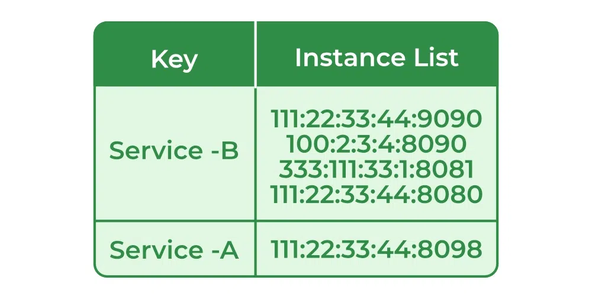
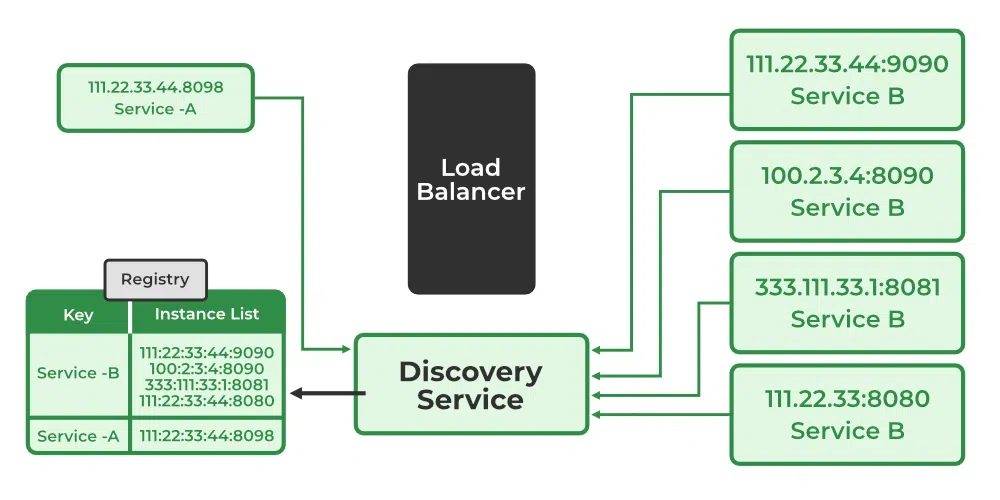
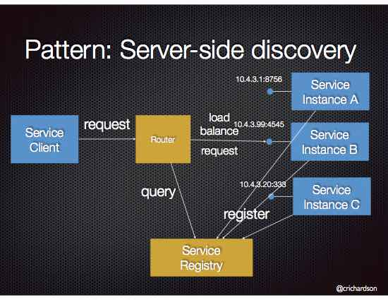
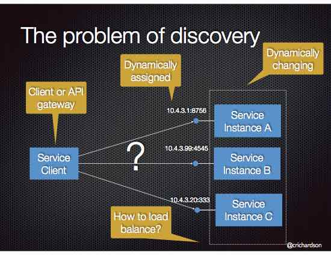

# Service Discovery Responsibilities

**Service discovery** is a critical component in microservices architectures where services need to locate and communicate with each other. It plays a central role in dynamic environments, such as `Kubernetes`, where services can scale or change frequently.

---

## Service Registration:

- **Responsibility**: Services must register themselves with the service discovery system when they start and deregister when they shut down.
- **Example**: A web service starts up and registers its IP address and port with a service discovery system (e.g., Consul, Eureka). When it shuts down, it removes its registration.

## Service Lookup:

- **Responsibility**: Services must be able to look up other services they need to communicate with, dynamically retrieving their locations and available endpoints.
- **Example**: An API gateway queries the service discovery system to find the location of a backend service (e.g., users-service) and communicates with it using the retrieved address.

## Health Checks:

- **Responsibility**: Service discovery systems need to periodically check the health of registered services to ensure they are operational. This can be done via HTTP or TCP health checks.
- **Example**: A health check for a database service might check if the database is responsive before allowing traffic to be routed to it.

## Load Balancing:

- **Responsibility**: Service discovery often integrates with load balancing to distribute incoming requests across multiple instances of a service.
- **Example**: A load balancer queries a service registry to retrieve multiple instances of the payments-`Service A`nd distributes incoming payment requests evenly among them.

## Dynamic Configuration:

- **Responsibility**: Service discovery allows for dynamic configuration of services based on real-time data, such as the availability of new service instances or the scaling of existing services.
- **Example**: A Kubernetes service discovery system automatically adjusts the list of available service instances when pods are added or removed.

## Failover and Redundancy:

- **Responsibility**: Service discovery should enable automatic failover in the event of service failures, allowing clients to connect to other available instances.
- **Example**: If an instance of the auth-service fails, the service discovery system updates the registry so clients can automatically route their requests to healthy instances.

## Service Versioning:

- **Responsibility**: Service discovery can handle multiple versions of a service, enabling clients to specify which version they need.
- **Example**: The discovery system could allow requests for user-service-v1 and user-service-v2 to be routed to different instances based on the service version in the registry.

# Examples of Service Discovery Tools:

## Consul:
A popular tool for service discovery and configuration management. It provides health checks, service registration, and DNS-based service resolution.

## Eureka:
A service registry developed by Netflix, which allows services to register themselves and provides an API for service discovery. It's commonly used with Spring Cloud applications.

## Zookeeper:
Often used in distributed systems for service discovery, coordination, and configuration management. Apache Kafka uses it as a distributed service registry.
## Kubernetes DNS-based Discovery:

In Kubernetes, services are automatically registered in DNS, and clients can resolve service names to their IP addresses.

## Amazon Route 53 (AWS):
Provides DNS-based service discovery, where services register their IPs or endpoints with AWS, and clients can query Route 53 to resolve service names.

---

## Example Workflow:
- ``Service A`` registers with the discovery system (e.g., Consul) at startup, including its IP and port.
- `Service B` needs to communicate with `Service A`, so it queries the service discovery system for the current IP and port of `Service A`.
- The service discovery system returns the address of `Service A` if it is healthy.
- `Service A` performs health checks, and if it becomes unhealthy, the service discovery system removes it from the list of available services, preventing `Service B` from sending traffic to it.
- If `Service A` scales up, the service discovery system will register the new instances, and `Service B` can use them.

---

## Problem :
How does the client of a service - the API gateway or another service - discover the location of a service instance?

## Solution :  
When making a request to a service, the client makes a request via a router (a.k.a load balancer) that runs at a well known location. The `API Gateway` queries a service registry, which might be built into the router, and forwards the request to an available service instance.

Here, `router` is actually `API Gateway`.

# Summary of How API Gateway and Service Discovery Work Together:

- **Service Registration**: Services register themselves with a service discovery system when they are deployed.
- **Service Lookup**: API Gateway queries the service discovery system to get a list of available instances of the required services.
- **Routing**: API Gateway uses the information from the service discovery system to route the request to the correct service instance.
- **Health Monitoring**: The service discovery system continuously monitors the health of service instances and removes unhealthy instances from the registry.
- **Load Balancing**: API Gateway distributes the traffic across available instances of a service, based on the load balancing strategy.
