# AWS Solutions Architect Associate [SAA-C03]

This page contains notes primarily from Adrian Cantrill’s [AWS Solutions Architect - Associate (SAA-C03)](https://learn.cantrill.io/p/aws-certified-solutions-architect-associate-saa-c03). These notes should enable you to answer most, if not all, of the questions you may encounter in the exam.


### Additional Material:

- https://github.com/alozano-77/AWS-SAA-C02-Course#16-elastic-cloud-compute-ec2
- https://tutorialsdojo.com/aws-cheat-sheets/


# 🧔 Accounts - Identity and Access Management (IAM) Basics

## Account and IAM **Basics**

💡 **AWS Account:** Container for **identities** (users) and **resources.** 

Account **root user** has full control over all of the AWS account and any resources created within in. The root user can’t be restricted. 

IAM **User Groups** and **Roles** can also be created and given full or limited permissions. All identities start with no permissions. 

May be good practice to create multiple AWS Accounts for different uses (prod, dev, test).


- Every AWS account comes with its own running copy of IAM, which is a database.
- IAM is a globally resilient service, so any data is always secure across all AWS regions. (Exam Q)
- The IAM in each of your accounts is your own dedicated instance of IAM, separate from other accounts.
- IAM
    - User
        - IDs which represent humans or apps that need access to your account
    - Group
        - Collection of related users, e.g. dev team, finance or HR
    - Role
        - Can be used by **AWS Services**, or for granting **external access** to your account
        - Used when the number of things is uncertain.
- IAM Policy
    - Allow or deny access to AWS services when and only when they’re attached to IAM users, groups or roles.
- IAM three main jobs
    - **Manage identities** - *An ID Provider (IDP)*
        - Create, modify and delete IDs such as users and roles
    - **Authenticate identities**
        - Prove you are who you claim to be - generally username and passwords
    - **Authorize**
        - Allow or deny access to resources
- IAM is provided for free
    - No cost for users, groups and roles. Limits for number of each.
- IAM is global service.
- Allow or deny its ids on its AWS account
- No direct control on external accounts or users - only control local ids in your account
- **Identity federation and MFA**
    - Use Facebook, Twitter, Google etc. to access AWS resources

## IAM Access Keys

- Long-term credentials
    - Don’t update manually
- IAM User don’t need username and password - for CLI access key is enough
- IAM User can have up to two access keys
    - Can be created, deleted, made inactive or made active

### Access Keys consist of two parts

- Both are provided when created an access key
- These are only provided once - no ability to get access to the keys again. Need to be stored safely.
- Both parts are used when accessing AWS via CLI
- Access keys need to be deleted and recreated if they are leaked
- Possible to have two sets of keys such that you can create a new one, update all applications using the keys and then delete the old set

**Access Key ID:** ABABABABABABABA

**Secret Access Key:** oierWRhoefWORIOF/DFLWAnljef


# ☁️ Cloud Computing Fundamentals

## Essential Characteristics of Cloud Computing

💡 **On demand self-service:** A consumer can unilaterally provision computing capabilities, such as server time and network storage, as needed automatically without requiring human interaction with each service provider. 
*Can provision capabilities as needed without requiring human interaction.*

`Provision and terminate using a UI/CLI without human interaction.`

**Broad network access:** Capabilities are available over the network and accessed through standard mechanisms that promote use by heterogeneous thin or thick client platforms (e.g., mobile phones, tablets, laptops, and workstations). 
*Capabilities are available over the network and accessed through standard mechanisms.*

`Access services over any networks, on any devices, using standard protocols and methods.`

**Resource pooling:** The provider’s computing resources are pooled to serve multiple consumers using a multi-tenant model, with different physical and virtual resources dynamically assigned and reassigned according to consumer demand. There is a sense of location independence in that the customer generally has no control or knowledge over the exact location of the provided resources but may be able to specify location at a higher level of abstraction (e.g., country, state, or datacenter). Examples of resources include storage, processing, memory, and network bandwidth. 
*There is a sense of **location independence**… no **control** or **knowledge** over the exact **location** of the resources. Resources are **pooled** to serve multiple consumers using a **multi-tenant model**.* 

`Economies of scale, cheaper service.`

**Rapid elasticity:** Capabilities can be elastically provisioned and released, in some cases
automatically, to scale rapidly outward and inward commensurate with demand. To the
consumer, the capabilities available for provisioning often appear to be unlimited and can
be appropriated in any quantity at any time. 
*Capabilities can be **elastically provisioned** and **released** to scale **rapidly** outward and inward with demand. To the consumers, the capabilities available for provisioning ofter **appear** to be **unlimited**.* 

`Scale UP (OUT) and DOWN (IN) automatically in response to system load.`

**Measured service:** Cloud systems automatically control and optimize resource use by leveraging a metering capability at some level of abstraction appropriate to the type of service (e.g., storage, processing, bandwidth, and active user accounts). Resource usage can be monitored, controlled, and reported, providing transparency for both the provider and consumer of the utilized service. 
*Resource usage can be **monitored, controlled, reported** and **BILLED**.*

`Usage is measured. Pay for what you consume.`


## Public vs Private vs Hybrid vs Multi Cloud

💡 **Public cloud:** AWS, Azure, Google. Meet the essential characteristics of cloud computing. 

**Multi-cloud:** Using more than one of the public cloud platforms. 

**Private cloud:** Run on business premises. AWS Outpost, Azure Stack, Anthos. 

**Hybrid cloud:** Using **private** cloud and **public** cloud in cooperation as a single environment.


## Cloud Service Models

> ***X** **a**s **a** **S**ervice*
> 

**Infrastructure Stack**

- Application
- Data
- Runtime
- Container
- OS
- Virtualization
- Servers
- Facilities

Parts **you** manage, parts managed by the **vendor**.

Unit of consumption is what makes each service model different - application vs OS

**XaaS Services**

**On-Premises**

- Application
- Data
- Runtime
- Container
- OS
- Virtualization
- Servers
- Infrastructure
- Facilities

**DC Hosted**

- Application
- Data
- Runtime
- Container
- OS
- Virtualization
- Servers
- Infrastructure
- ~~Facilities~~

*Data centre* 

**IaaS**

- Application
- Data
- Runtime
- Container
- **OS**
- ~~Virtualization~~
- ~~Servers~~
- ~~Infrastructure~~
- ~~Facilities~~

*EC2 uses the IaaS service model*

**PaaS**

- Application
- Data
- **Runtime**
- ~~Container~~
- ~~OS~~
- ~~Virtualization~~
- ~~Servers~~
- ~~Infrastructure~~
- ~~Facilities~~

*Heroku is a PaaS*

**SaaS**

- **Application**
- ~~Data~~
- ~~Runtime~~
- ~~Container~~
- ~~OS~~
- ~~Virtualization~~
- ~~Servers~~
- ~~Infrastructure~~
- ~~Facilities~~

*Netflix, Dropbox, Office 365 etc.*

++ Faas, CaaS, DBaaS


## 🗣YAML - *YAML Ain't Markup Language*

> Human readable data serialization language.
A YAML document is an unordered collection of key:value pairs, each key has a value.
YAML support strings, integers, floats, booleans, lists, dictionary.
> 

```yaml
cats: ["ben", "bin", "ban"]
# Same list can also be represented as below. Indentation matters.
cats:
	- "ben"
	- "bin" 
	- ban # values can be enclosed in "", '' or not - all valid but enclosing can be more precise

cats:
	- name: ben
		color: [black, white]
	- name: bin
		color: "mixed"
	- name: ban
		color: "white"
		numofeyes: 1

Resources:
	s3bucket:
		Type: "AWS::S3::Bucket"
		Properties:
			BucketName: "1337"
```


# 🐣 AWS Fundamentals

## Public vs Private Services


## AWS Global Infrastructure

**AWS Regions + AWS Edge Locations**

**Geographic Separation:** Isolated **Fault Domain**

**Geopolitical Separation:** Different **governance**

**Location Control:** Performance 

Region Code: us-east-1

Region Name: N. Virginia

**Availability Zone (AZ):** Level of granularity below regions. Isolated infrastructure within a region. 

us-east-1a, us-east-1b, …, us-east-1f

**Service Resilience:**

- **Globally** resilient: IAM and Route 53. Can tolerate failure of multiple regions without affecting service.
- **Region** resilient: If an AZ in a region fails, the service can continue operating. If all AZ fails, the service fails.
- **AZ** resilient

## Virtual Private Cloud (VPC) Basics


#### ✅ **VPC (Virtual Private Cloud)**

* A **VPC** is your **isolated virtual network** in AWS — like your own private data center.
* When you create a VPC, you define its **CIDR block** (e.g., `10.0.0.0/16`).

#### ✅ **Subnets in VPC**

* A subnet (short for subnetwork) is a smaller network segment within a larger computer network. It’s used to divide a large network into multiple, smaller, more manageable sections.
* A **subnet** is a **subset of the VPC’s IP range** (e.g., `10.0.1.0/24`).
* Subnets must reside entirely **within one Availability Zone**.
* You can create **multiple subnets** across different AZs for high availability.

#### ✅ **Types of Subnets:**

* **Public Subnet**: Has a route to the **Internet Gateway**, so resources like EC2 instances can access the internet.
* **Private Subnet**: No direct internet access — typically used for databases, backend services, etc.

#### ✅ **Subnet Usage Examples:**

* Deploy a web server in a **public subnet**.
* Place a database in a **private subnet**.
* Set up NAT Gateway in a **public subnet** to allow internet access from private subnets.

### 🔐 Security and Routing:

* Subnets work with **route tables**, **NACLs (network ACLs)**, and **security groups** to control traffic flow.
* You can assign **custom route tables** per subnet to route traffic differently.


### 🔧 Example Setup:

* VPC CIDR: `10.0.0.0/16`
* Public Subnet: `10.0.1.0/24` (with Internet Gateway)
* Private Subnet: `10.0.2.0/24` (with NAT (Network Access Translation) Gateway access via public subnet)

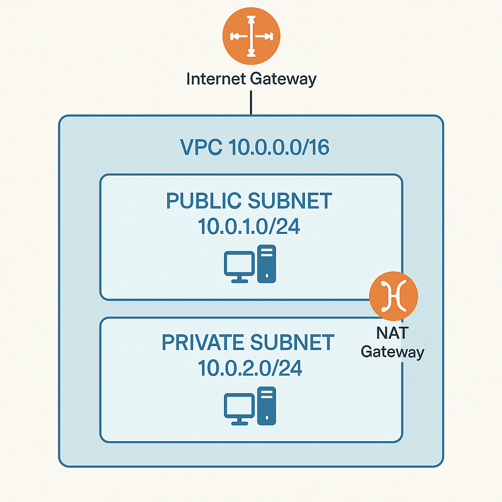

---
A **NAT Gateway (Network Address Translation Gateway)** in AWS allows **instances in a private subnet** to connect to the **internet or other AWS services**, while **preventing the internet from initiating connections** to those instances.

---

### 🔍 **Why use a NAT Gateway?**

Instances in a **private subnet** can't directly access the internet. But sometimes, they need to:

* Download updates
* Access external APIs
* Send logs to AWS services (e.g., CloudWatch)

A **NAT Gateway** lets them make **outbound-only** internet requests **securely**.

---

### 🔧 **How it works:**

1. The **NAT Gateway** is placed in a **public subnet**.
2. It has a **public IP address**.
3. **Private subnet route tables** are updated to forward internet-bound traffic to the NAT Gateway.
4. The NAT Gateway **translates private IPs to its public IP**, sends requests, and passes back responses.

---

### ✅ Example Setup:

* **VPC CIDR**: `10.0.0.0/16`
* **Public Subnet**: `10.0.1.0/24` (hosts NAT Gateway)
* **Private Subnet**: `10.0.2.0/24` (hosts EC2 instances)
* **Route Table (Private)**:

  * Destination: `0.0.0.0/0` → Target: `NAT Gateway`

---


💡 A virtual network inside AWS

**A VPC is within 1 account & 1 region** ❗

Private and isolated unless you decide otherwise

Two types: Default VPC and Custom VPCs

**Custom VPCs used in almost all AWS deployments. More later.**

VPCs are created within a region. VPCs cannot communicate outside their network unless you specifically allow it. 
**By default a VPC is entirely private.**❗

**VPC CIDR (Classless Inter-Domain Routing):** Every VPC is allocated a range of IP addresses. If you allow anything to communicate to a VPC, it needs to communicate to that VPC CIDR. Any outgoing connection is going to originate from that VPC CIDR. Custom VPCs can have multiple CIDR ranges, but the default VPC only gets one, which is always the same.
❗**Default VPC IP range: 172.31.0.0/16** ❗

****Each subnet within a VPC is located within a AZ, and can never be changed. Default VPC is configured to have a subnet in every AZ. Each use a part of the IP range and cannot overlap. This is how a VPC is resilient.


### Default VPC Basic

- One per region - can be removed and recreated
- **Default VPC CIDR is always 172.31.0.0/16** ❗
- /20 subnet in each AZ in the region
- The higher the /number is the smaller the range. /17 is half the size of /16.
- **IGW: Internet Gateway**
    - VPC
- **SG: Security Group**
    - (EC2) Instances
    - Stateful
        - Incoming rule change = allow outgoing response traffic
            - Open port 80 for incoming will allow port 80 for outgoing response
    - Allow rules only
    - Instances can have multiple SGs
    - Allow CIDR, IP, SG as destination
- **NACL: Network Access Control List**
    - Subnet
    - Stateless
        - Open rule 80 for incoming does not allow port 80 for outgoing
    - Allow and deny rules
    - Subnets can have only one NACL
    - Only allow CIDR as destination
- Subnets assign public IPv4 addresses
- Best practice not to use default VPC


Source: https://medium.com/awesome-cloud/aws-difference-between-security-groups-and-network-acls-adc632ea29ae

## Elastic Compute Cloud (EC2) Basics

> ***EC2 is AWS’s implement of IaaS - Infrastructure as a Service**
Default compute service within AWS.
Provide access to VMs known as instances*
> 

### EC2 Key Facts & Features

- IaaS - Provides Virtual Machines (Instances)
- **Private** service by default - uses VPC networking
- AZ resilient - Instance fails if AZ fails
- Different instance sizes and capabilities
- On-Demand Billing - **Per second**
- Local on-host storage or **Elastic Block Store (EBS)**
- Instance composition: CPU, memory, disk and networking. All four are billed when running. ❗
    - Only disk storage is billed when stopped (EBS).

### Instance Lifecycle

- Running
- Stopped
- Terminated

### Amazon Machine Image (AMI)

- An EC2 instance can be created from an AMI, or an EC2 can be used to create an AMI
- Contains
    - Permissions - who can and can’t use the AMI
        - Public - Everyone can launch instances from that AMI (Linux and Windows)
        - Owner - Implicit allow
        - Explicit - specific AWS accounts allowed
    - Boot Volume
        - The drive that boots the OS
    - Block Device Mapping
        - Links the volumes the AMI have
        - Mapping between volumes

### Connecting to EC2

- EC2 instances can run different OS’s
- Windows: **RDP - Remote Desktop Protocol**
    - Protocol Port 3389
- Linux: SSH protocol
    - Port 22

## Simple Storage Service (S3) Basics

- Global Storage Platform - regional based/resilient
    - Data is replicated across AZs in that region
- Public service, unlimited data & multi-user
- Movies, audio, photos, text, large data sets
- Economical & accessed via UI/CLI/API/HTTP
- Should be your default storing point
- **Objects** & **Buckets**
    - Objects is the data you store
    - Buckets are container for objects

### S3 Objects

- A file made up of two parts: key and value
    - E.g koala.jpg : koala-image
    - Value is the content being stored
- 0 - 5 TB data
- Version ID
- Metadata
- Access Control
- Subresources

### S3 Buckets

- Never leaves a region unless you configure it to do so
- A bucket is identified by its bucket name, which must be **globally unique**
    - Often AWS stuff is only unique within an account or region - bucket is exception to this
- Unlimited Objects
- Flat Structure - all objects are stored at root level in the bucket
    - Folders are prefixed names - but objects are still stored at the same level

### Summary

- Bucket names are **globally unique**
- 3-63 characters, all lower case, no underscores
- Start with a lowercase letter or a number
- Can’t be IP formatted e.g. 1.1.1.1
- Buckets - **100 soft limit, 1000 hard per account**
- Unlimited objects in bucket, **0 bytes to 5TB**
- Key = Name, Value = Data
- **ARN: Amazon Resource Name**

### S3 Patterns and Anti-Patterns

- S3 is an **object** store - not **file** or **block**
- S3 has no file system - it is flat
- You **can’t mount** an S3 bucket as (K:\ or /images)
- Great for large scale data storage, distribution or upload
- Great for **“offload”**
- **INPUT** and/or **OUTPUT** to **MANY AWS** products

## CloudFormation Basics

> ***CloudFormation is a Infrastructure as Code (IaC) product in AWS which allows automation infrastructure creation, update and deletion**
Templates created in YAML or JSON
Templates used to create stacks, which are used to interact with resources in an AWS account*
> 

### YAML

```yaml
AWSTemplateFormatVersion: "version date"

Description: # Must directly follow AWSTemplateFormatVersion if defined
	String

Metadata: # Control the UI
	template metadata

Parameters: # Add fields that prompt the user for more information
	set of parameters

Mappings: # Key/Value pairs which can be used for lookups
	set of mappings

Conditions: # Allow decision making. Create Condition / Use Condition. 
	set of conditions

Transform: 
	set of transforms

Resources: 
	set of resources

Outputs: # Outputs from the template being applied
	set of outputs
```

### Template

- All those other things
- Resources
    
    ```yaml
    Resources:
    	Instance:
    		Type: 'AWS::EC2::Instance' # Logical Resource
    		Properties:
    			ImageId: !Ref LatestAmiId
    			InstanceType: !Ref InstanceType
    			KeyName: !Ref KeyName
    
    ```
    

### Stack

- **A living representation of a template**
- Class/Instance ~ Template/Stack
- Physical Resource is the actual EC2 instance
- Create, Update or Delete Stack

## CloudWatch Basics

> *Core supporting service within AWS which provides metric, log and event management services.
Used through other AWS services for health and performance monitoring, log management and serveless architectures*
> 


- Collects and manages operational data
- **Metrics -** AWS Products, Apps, on-premises
- CloudWatch Agent to monitor outside AWS
    - Also to monitor certain things within certain products requires the CW Agent
- UI, API, CLI
- CloudWatch **Logs** - AWS Products, Apps, on-premises
    - Same as above for CW Agent
- CloudWatch **Events -** AWS Services & Schedules

### Namespace

- Can think of as a container - separate things into different areas
    - Reserved: AWS/service → AWS/EC2

### Metric

- Collection of Time Ordered Set of Data points
- CPU Usage, Network I/O, Disk I/O

### Datapoint

- CPU Utilization Metric
- Consist of two things in its simplest form:
    - Timestamp: 2019-12-03T08:45:45Z
    - Value: 98.3 (% CPU utilization)

### Dimension

- Dimensions separate datapoints for different **things** or **perspectives** within the same metric
- Use dimensions to look at the metric for a specific InstanceId

### Alarm

- Linked to a specific metric
- Can set criteria for an alarm to move into an alarm state and further define an SNS or action
    - Billing alarm is an example of this
- Three states: OK, ALARM, INSUFFICIENT DATA

## Shared Responsibility Model

> *The Shared Responsibility Model - is how AWS provide clarity around which areas of systems security are theirs, and which are owned by the customer.*
> 


- AWS responsible for the security of the cloud
    - Hardware/AWS Global Infrastructure
    - Regions, AZ, Edge Locations
    - Compute, Storage, Database, Networking
    - Software
- Customer responsible for security in the cloud
    - Client-side data encryption, integrity & authentication
    - Server-side encryption (File system and/or data)
    - Networking traffic protection (encryption, integrity, identity)
    - OS, Network and Firewall configuration
    - Platform, applications, identity and access management
    - Customer Data

## High-Availability (HA) vs Fault-Tolerance (FT) vs Disaster Recovery (DR)

### High-Availability (HA)

> *Aims to ensure an agreed level of operational performance, usually uptime, for a higher than normal period. 
**Maximizing a system’s uptime / minimize outages.***
> 
- E.g.
    - 99.9% = 8.77 hours /year downtime
    - 99.999% = 5.26 minutes /year downtime
- User disruption, such as re-login, is okay
- If a server goes down, but another is ready on standby, users may notice small disruptions, but thats okay
- Often require redundant service or architecture to achieve the agreed SL

### Fault-Tolerance (FT)

> *Is the property that enables a system to **continue operating properly** in the event of the **failure of some** (one or more faults within) of its **components.
Operate through faults.***
> 
- High availability is not enough
- If a server goes down, disruption is not okay
- The system must be able to tolerate the failure
    - Levels of redundancy and system of components which can route around failures
- Implementing FT when you need HA is expensive and is harder to implement
- Implementing HA when you need FT can be a disaster

### Disaster Recovery (DR)

> *A set of policies, tools and procedures to **enable the recovery** or **continuation** of **vital** technology infrastructure and system **following a natural or human-induced disaster.
Used when FT and HA don’t work***
> 
- Parachute

## Domain Name System (DNS) Basics

### DNS 101

- DNS is a **discovery service**
- Distributed database
- Translates machine into human and vice-versa
- [amazon.com](http://amazon.com) → 104.98.34.131
- It’s **huge** and has to be distributed
- Zone files that can be queried

### ❗Remember these ❗

- **DNS Client:** Your laptop, phone, tablet, PC, etc.
- **Resolver:** Software on your device, or a server which queries DNS on your behalf
- **Zone:** A part of the DNS database (e.g. amazon.com)
- **Zonefile:** Physical database for a zone
- **Nameserver:** Where zonefiles are hosted

### DNS Root

- Starting point of DNS
- www.amazon.com
    - Read right to left
- Hosted on 13 Root servers
    - Operated by 12 different large companies and organization
    - Only operates the servers, not the database itself
    - Each root server can be a cluster of servers
- Root Hints
    - Provided by Vendor
    - List of these root servers, pointer to DNS root servers
- Root Zone is operated by IANA - Internet Assigned Numbers Authority

### DNS Hierarchy

- Root zone - Database of top level domains | IANA
    - .com, .org, .uk, etc.
- .com zone | Verisign
    - amazon.com
    - NS - w.x.y.z
- [amazon.com](http://amazon.com) zone
    - www ⇒ 104.98.34.131

### Registry

- Organization that maintains the zones for a TLD

### Registrar

- Organization with relationship with .org TLD zone manager allowing domain registration

### DNS Resolution


### ❗Remember these❗

- **Root hints:** Config points at the root servers IPs and addresses
- **Root Server:** Hosts the DNS root zone
- **Root zone:** Point at TLD authoritative servers
- **gTLD:** generic Top Level Domain (.com .org etc)
- **ccTLD:** country-code Top Level Domain (.uk, .eu, etc)

## Route53 Fundamentals

### R53 Basics

- **Register** domains
- Host **Zones** … managed **nameservers**
- Global servers … single database
- Globally Resilient

### Register domains

- Registries
    - .com .io .net
- Create a zonefile
    - animals4life.org
- Put zonefile to four nameservers

### Hosted Zones

- **Zone files** in AWS
- Hosted on four managed name servers
- Can be **public**
- Or **private** … linked to **VPC(s)**
- Stores records (**recordsets)**

## DNS Record Types

### Nameserver (NS)

- Record types that allow delegation to occur in DNS
- .com zone
    - Multiple nameserver records inside it for amazon.com
        - Point at servers managed by the [amazon.com](http://amazon.com) team

### A and AAAA Records

- Map host names to IP
- A: www → ipv4
- AAAA: → ipv6

### CNAME Records

- Host to host
- ftp, mail, www (references) → A server
- Cannot point directly at an IP address, only other names

### MX Records

- Important for email
- MX records are used as part of the process of sending email
- E.g. inside [google.com](http://google.com) zone
    - MX 10 mail
        - means mail.google.com
    - MX 20 mail.other.domain.
        - Fully qualified domain name
        - means mail.other.domain
    - Lower values for the priority field means higher priority
    - MX 20 is only used if MX 10 doesn’t work

### TXT Records

- Allow you to add arbitrary text to a domain
- E.g. [animals4life.org](http://animals4life.org) zone
    - Add: TXT cats are the best
    - Important to prove that you own domain (animals4life.com)

### TTL - Time To Live

- TTL 3600 (seconds)
    - Value configured by [amazon.com](http://amazon.com) admin
    - Results of query stored at the resolver server for 1 hour
    - **Authoritative:** Query results directly from [amazon.com](http://amazon.com) server
    - **Non-authoritative:** If another client queries the resolver within 3600 seconds, the resolver can immediately return the results of the query
    
    
    


# 🦠 IAM, Account and AWS Organizations

## IAM Identity Policies

- Users, groups and roles
- Grants access or denies access

### **IAM Policy Document**

- At high level just one or more statements that grant or deny access
- Need to identify
- Statement only applies if the interaction with AWS match the action and the resource
- Wildcards (*) match any action
- Effect defines what to do if the action and resource match
- Often statements overlap, and you may be allowed and denied at the same time.
- **Explicit denies are first priority. Deny always win.**
- Priority list
    1. **Explicit DENY**
    2. **Explicit ALLOW**
    3. **Default DENY**

```json
{
	"Version": "2012-10-17",
	"Statement": [
		{
			"Sid": "Fullaccess", # StatementID
			"Effect": "Allow",
			"Action": ["s3:*"],
			"Resource": ["*"],
		},
		{
			"Sid": "DenyCatBucket",
			"Effect": "Deny",
			"Action": ["s3:*"],
			"Resource": ["arn:aws:s3:::catgifs", "arn:aws:s3:::catgifs/*"],	
		}
	]
}
```

### Inline Policy

- Write a JSON for multiple users individually
    - Bad practice for many users - have to change a lot of JSONs if there are 100 users
- Only use in special or exceptional allow or deny situations

### Managed Policy

- Reusable
- Low management overhead
- Should be the default

## IAM Users and ARNs

> *IAM Users are an identity used for anything requiring **long-term** AWS access e.g. **humans, applications or service accounts***
> 
- **Principal:** Something or someone wanting access resources in AWS
    - Must authenticate to gain access
        - Access Keys
        - Username/password
- When a principal is authenticated, it is known as a **authenticated identity**
- When the authenticated user tries to do an action, e.g. upload something to a S3 bucket, IAM checks that the authenticated user have access to perform that action (authorization)

## Amazon Resource Name (ARN)

> Uniquely identify resources within any AWS accounts
> 

```yaml
aws:partition:service:region:account-id:resource-id
aws:partition:service:region:account-id:resource-type
aws:partition:service:region:account-id:resource-type:resource-id

arn:aws:s3:::catgifs # Bucket
arn:aws:s3:::catgifs/* # Objects in bucket

# These two don't overlap. First is access to manage the bucket, second is to manage objects in bucket. 
```

- **5000 IAM Users per account**
- IAM User can be a member of 10 groups
- This has systems design impacts
    - Internet-scale applications
    - Large orgs and org merges
- IAM Roles and Identity Federation fix this (more later)

## IAM Groups

> ***IAM Groups are containers for Users***
> 
- Allow for easier management
- Groups can have (identity) policies attached to them
    - Users can have individual (identity) policies too
- Trick question exam: “All users” group does not exist natively (but you can technically create it)
- ❗300 groups ❗
- ❗10 groups per user ❗
- **No nesting**
- Resource policies (e.g. for a bucket) can allow one or more specific user to allow access
- **Resource policies cannot grant access to a group!**
    - Further, cannot be referenced from a resource policy at all

## IAM Roles

> *An IAM role is an IAM identity that you can create in your account that has specific permissions. An IAM role is similar to an IAM user, in that it is an AWS identity with permission policies that determine what the identity can and cannot do in AWS. However, instead of being uniquely associated with one person, a role is intended to be assumable by anyone who needs it. Also, a role does not have standard long-term credentials such as a password or access keys associated with it. Instead, when you assume a role, it provides you with temporary security credentials for your role session.

-* https://docs.aws.amazon.com/IAM/latest/UserGuide/id_roles.html
> 
- Role best suited for unknown number of principals or more than 5000 users
- IAM Roles are assumed. You become that role.
- ❗**Two types of policy for a role:**❗
    - **Trust policy**
    - **Permissions policy**
- If a role is assumed by something that is allowed to assume it, temporary security credentials are created.
    - ❗**STS: Secure Token Service** ❗
        - Generates the security tokens
        - sts:AssumeRole
    - Permissions policy define what they have access to
    - When they expire the role has to be assumed again to regain access

### ❓When to use IAM Roles

- Most common use case is for other AWS services
- E.g. AWS Lambda
    - No permissions by default
    - **Lambda Execution Role**
    - Runtime environment assumes the role.
    - Better to use a role than to hardcode access keys to the Lambda function
- Emergency or unusual situations
- E.g. team with read-only access:
    - 99% read-only access is OK
    - “Break glass for key”
    - User of team can assume an emergency role to perform a certain write action
- A corporation with > 5000 ids
    - **ID federation**
    - Can allow an organization to use previous existing accounts for SSO (Active Directory)
    - AD users are allowed to assume a role to gain access to e.g. a bucket
- App with millions of users
    - **Web Identity Federation**
    - Users might need to interact with a DynamoDB
    - Users are allowed to assume a role to interact with the db
    - No AWS credentials on the app
    - Uses existing customer logins (twitter, fb, google)
    - Scales to large number of accounts
- Cross AWS accounts

## Service-linked Roles & PassRole

> A service-linked role is a unique type of IAM role that is linked directly to an AWS service. Service-linked roles are predefined by the service and include all the permissions that the service requires to call other AWS services on your behalf. The linked service also defines how you create, modify, and delete a service-linked role. A service might automatically create or delete the role. It might allow you to create, modify, or delete the role as part of a wizard or process in the service. Or it might require that you use IAM to create or delete the role.
> 
- IAM role linked to a specific AWS service
- Predefined by a service
- Providing permissions that a service needs to interact with other AWS services on your behalf
- Or allow you to during the setup or within IAM
- You can’t delete the role until it’s no longer required
- **PassRole**: Grant a user permission to pass a role to an AWS service
    - Bad: Bob may create and assign a role to a AWS service that has permissions that exceeds the permissions that Bob has himself
        - E.g. create resources
    - Good: Bob cannot assign roles with permissions that exceeds his own
    

## AWS Organizations

> *Suitable for organization with multiple AWS accounts*
> 


- Use a standard AWS account to create a AWS organization
    - This account will be the **management account** or **master account - can only be one**
    - The organization is not *within* the AWS account
- Invite other standard accounts into the organization
- Organization Root is a container within AWS Organization which contains either **other AWS account or other organizational units**
- Consolidated billing: Member accounts pass their billing to the payment/management/master account
    - Removes financial overhead
    - Consolidation of reservation and volume discounts
- **Two important concepts of AWS Organizations:**
    - In a organization you can create accounts directly within the organization - one step process instead of invitation
    - Don’t need to have IAM Users inside every AWS account. IAM Roles can be used. Can role switch into different accounts.

## Service Control Policies (SCP)

> JSON doc with policies. Can be attached to organizations as a whole. Cascade to all orgs below that which it is attached to.
**Management account is special and is unaffected by SCP!**
> 


- SCPs are **account permissions boundaries**
- They limit what the account (including account root user) can do
- SCPs can e.g. limit the size of an EC2 instance within a specific region
- **SCPs don’t grant any permissions!**
- **Allow list vs Deny list**
    - Default is a deny list
    - FullAWSAccess Default for new account
    - DenyS3 - Deny S3 to organizations - even though they have FullAWSAccess (deny, access, deny)
- To implement allow list:
    - Remove FullAWSAccess - add a new list: AllowS3EC2
        - Explicit say which services are allowed
        - More overhead, may block access to services you don’t intend to block
- Best practice is deny list architecture


## CloudWatch Logs

> *CloudWatch Logs is a service which can accept logging data, store it and monitor it.
It is often the default place where AWS Services can output their logging too.
CloudWatch Logs is a public service and can also be utilized in an on-premises environment and even from other public cloud platforms.*
> 

💡 **Public Service:** Usable from AWS or on-premises


- **Store, Monitor** and **access** logging data
- **AWS Integrations** - EC2, VPC Flow logs, Lambda, CloudTrail, R53 and more
- **Metric filter:** Can generate metrics based on logs
- Regional service


## CloudTrail Essentials

### CloudTrail Basic


- Logs API calls/activities as a **CloudTrail Event**
- 90 days stored by default in **Event History**
- Enabled by default - no cost for 90 day history. No S3.
- To customize the service, create one or more **Trails**
- **Management events**
    - Provide information about management operation that are performed on resources in your AWS account
    - AKA **Control Plane Operations**
    - Create EC2 instance etc
    - **Enabled by default** ❗
- **Data events**
    - Objects being uploaded to S3
    - Lambda being invoked
    - **Not enabled by default. Come at an extra cost.** ❗
- Trails can be set to one region or all regions
- Organizational trail - it is what it sounds like
- **Trails are how you configure S3 and CWLogs.**
- Management event **only** by default
- **IAM, STS, CloudFront → Global Service Events**
    - Only these logs global
- **NOT REALTIME** - There is a delay
    - Typical 15 minutes ❗

---

| **Feature**              | **AWS CloudTrail**                                           | **Amazon CloudWatch**                                        |
| ------------------------ | ------------------------------------------------------------ | ------------------------------------------------------------ |
| **Purpose**              | Governance, compliance, and auditing of AWS account activity | Monitoring performance, operational health, and metrics      |
| **Data Type**            | Logs of API calls (who did what, when, and where)            | Metrics, logs, events, and alarms                            |
| **Source**               | AWS Management Console, CLI, SDKs, API calls                 | AWS services (e.g., EC2, Lambda), custom apps, OS-level logs |
| **Use Case**             | Security audits, resource change tracking, forensic analysis | Infrastructure monitoring, alerting, troubleshooting         |
| **Event Granularity**    | API call-level (e.g., `StartInstances`, `CreateBucket`)      | Time-series metrics (e.g., CPU utilization, memory usage)    |
| **Storage**              | Stored in S3 (can be encrypted, analyzed in Athena)          | Metrics in CloudWatch; Logs stored in CloudWatch Logs        |
| **Real-time Capability** | Near real-time logging                                       | Real-time metrics and log streaming                          |
| **Integration**          | AWS Config, CloudWatch Logs, Lambda, SIEM tools              | Lambda, SNS, Auto Scaling, dashboards                        |
| **Retention**            | Controlled via S3 lifecycle policies                         | Metrics: 15 months (free tier), Logs: configurable           |
| **Cost**                 | Based on number and volume of events logged                  | Based on number of metrics, dashboards, alarms, logs         |
---
### Summary:

* **CloudTrail** tracks **"who did what"** in your AWS account.
* **CloudWatch** monitors **"how well it's running"**.
---


---
## AWS Control Tower

> *AWS Control Tower offers a straightforward way to set up and govern an AWS multi-account environment, following prescriptive best practices. AWS Control Tower orchestrates the capabilities of several other [AWS services](https://docs.aws.amazon.com/controltower/latest/userguide/integrated-services.html), including AWS Organizations, AWS Service Catalog, and AWS IAM Identity Center (successor to AWS Single Sign-On), to build a landing zone in less than an hour. Resources are set up and managed on your behalf.

AWS Control Tower orchestration extends the capabilities of AWS Organizations. To help keep your organizations and accounts from drift, which is divergence from best practices, AWS Control Tower applies preventive and detective controls (guardrails). For example, you can use guardrails to help ensure that security logs and necessary cross-account access permissions are created, and not altered.*
> 


- Quick and easy setup of multi-account environment
- Orchestrates other AWS services to provide this functionality
- Organizations, IAM Identity Center, CloudFormation, Config and more
- Landing Zone - multi-account environment
- SSO/ID Federation, Centralized Logging and Auditing
- Guard Rails - Detect/Mandate rules/standard across all accounts
- Account Factory - Automates and standardizes new account creation
- Dashboard - single page oversight of the entire environment

### Landing Zone

- **Well Architected** multi-account environment. **Home region.**
- Built with AWS Organizations, AWS Config, CloudFormation
- Security **OU (Organizational Unit)** - Log Archive and Audit Accounts (CloudTrail & Config Logs)
- Sandbox OU - Test/less rigid security
- You can create other OU’s and Accounts
- IAM Identity Center (AWS SSO) - SSO, multiple-accounts, ID Federation
- Monitoring and Notifications - CloudWatch and SNS
- End User account provisioning via Service Catalog

### Guard Rails

- Guardrails are rules for multi-account governance
- **Mandatory, strongly recommended** or **elective**
- **Preventive -** Stop you doing things (AWS ORG SCP)
- Enforced or not enabled
    - i.e. allow or deny regions or disallow bucket policy changes
- Detective - compliance checks (AWS CONFIG Rules)
- Clear, in violation or not enabled
- Detect CloudTrail enabled or EC2 Public IPv4

### Account Factory

- **Automated Account Provisioning**
- Cloud admins or end users (with appropriate permissions)
- **Guardrails** - automatically added
- Account admin given to a named user (IAM Identity Center)
- Account & network standard configuration
- Account can be closed or repurposed
- Can be fully integrated with a business SDLC (Software Development Life Cycle)


# 💾 Simple Storage Service S3

## S3 Security

> *S3 is private **by default***
> 

### S3 Bucket Policies

- A form of **resource policy** ❗
- Like identity policies, but attached to a bucket
- Resource perspective permissions
- ALLOW/DENY same or **different** accounts
- ALLOW/DENY **anonymous** principals
    
    
    

### Access Control Lists (ACLs)

- ACLs on objects and bucket
- A subresource
- **LEGACY!**❗
- Inflexible and simple permissions

### Block Public Access

- Fail safe

### Summary

- Identity: Controlling different resources
- Identity: You have a preference for IAM
- Identity: Same account
- Bucket: Just controlling S3
- Bucket: Anonymous or Cross-Account
- ACLs: **Never** - unless you must

## S3 Static Hosting

### Static Website Hosting

- Normal access is via **AWS APIs**
- This feature allows access via HTTP - e.g. Blogs
- **Index** and **Error** documents are set
- **Website Endpoint** is created
- Custom Domain via **R53** - Bucket name matters!
- **Offloading:** Large data files such as pictures can be saved in a static S3 bucket to offload the page being accessed
- **Out-of-band pages:** During maintenance of a server, configure DNS to point at an error HTML page hosted at static S3.


### S3 Pricing

- Per GB month charge ❗
- Every GB in is free ❗
- Every GB out of S3 is charged ❗
- GET, PUT, POST etc pricing per 1000 requests  ❗

## Object Versioning & MFA Delete

> **Once enabled, you can never disable it again! Can be suspended and reenabled. 
Versioning lets you store multiple versions of objects within a bucket. Operations which would modify objects generate a new version.** 

*Almost guaranteed to feature on the exam* ❗
> 
- Without versioning each object is identified by their key
- With versioning disabled on an object, the id of the object is set to null
- If an object is requested without specifying the id, you always retrieve the latest object
- If we delete an object without specifying id, the objects is not actually deleted but it adds a delete marker.
    - Delete markers can be deleted
- To fully delete you must provide the id of the object you delete
- **OBJECT VERSIONING CANNOT BE SWITCHED OFF**
- Space is consumed by all versions
- You are billed for all versions

### MFA Delete (Multi-Factor Authentication)

- Enabled in **versioning configuration**
- MFA is required to change bucket **versioning state**
- MFA is required to **delete versions**
- Serial number (MFA) + Code passed with API CALLS

## S3 Performance Optimization

### Single PUT Upload

- Single data stream to S3
- Stream fails - upload fails
- Requires full start
- Speed & reliability = limit of 1 stream
- Any upload to to 5 GB

### Multipart Upload

- Data is broken up
- **Min data size 100 MB**
- 10 000 max parts, 5MB → 5GB ❗
- Parts can fail, and be restarted
- Transfer rate = speed of all parts

### S3 Accelerated Transfer (Off)

- Uses the network of edge locations
- Default turned off
- Some restrictions to enable it
- Transfers data via the AWS network - more efficient than public internet
- Lower, consistent latency
- The worse the initial connection, the bigger the gain of uses accelerated transfer

## Key Management Service (KMS)

> **Regional & Public Service
Create, Store and Manage Keys
Symmetric and Asymmetric Keys
Cryptographic operations (encrypt, decrypt &…)
Keys never leave KMS - Provides FIPS 140-2 (L2)**
> 

### KMS Keys

- Consider it a container
- **Logical -** ID, date, policy, desc & state
- … backed by **physical** key material
- Generated or imported
- KMS Keys can be used for up to 4KB of data
- **Everything on disk is encrypted, never in plaintext form** ❗
    - **May be in plaintext in memory** ❗

### KMS and KMS Keys

> **CMK - Customer Managed Keys**
> 


### Data Encryption Keys (DEKs)

- **GenerateDataKey - works on > 4KB**
1. Plaintext Version → Lock (Encrypt data)
2. Ciphertext Version → Unlock (Decrypt data)
3. Encrypt data using plaintext key
4. Discard plaintext version
5. Store encrypted key with data

### Key Concepts

- KMS Keys are isolated to a region and never leave
- Multi-region keys exist
- AWS Owned & Customer Owned
- Customer Owned: AWS Managed og *Customer Managed KEYS*
- Customer Managed keys are more configurable
- KMS Keys support rotation
- Backing Key (and previous backing keys)
- Aliases

### Key Policies and Security

- Key Policies (Resource)
- Every KEY has one
- Key Policies + IAM Policies
- Key Policies + Grants

```json
{
	"Sid": "Enable IAM User Permissions",
	"Effect": "Allow",
	"Principal": {"AWS": "arn:aws:iam:1122334455:root"},
	"Action": "kms:*",
	"Recource": "*"
}

{
	"Version": "2012-10-17",
	"Statement": {
		"Effect":"Allow",
		"Action": [
			"kms:Encrypt",
			"kms:Decrypt"
		]
		"Resource": [
			"arn:aws:kms:*:1122334455:key/*"
		]
	}
}
```

## S3 Encryption

> Buckets aren’t encrypted. **Objects are!**
> 
- **Client**-Side Encryption
    - Encrypted by client before upload
    - Keys, process, tooling
- **Server**-Side Encryption
    - Objects themselves aren’t encrypted. Reaches S3 in plaintext, and is then encrypted.

### Server-Side Encryption (SSE-C , SSE-S3 and SSE-KMS)

- Server-Side Encryption with Customer-Provided Keys **(SSE-C)**
    - Customer is responsible for keys used to encrypt/decrypt
    - S3 manages the actual encryption - no CPU requirement on client, but still need to manage the actual keys ❗
    - When uploading an object, provide **object and key** ❗
    - Encrypted objects is stored on S3
    - To decrypt you must provide a key to decrypt and specify the object you wish to retrieve
- Server-Side Encryption with Amazon S3-Managed Keys **(SSE-S3) [AES256]**
    - AWS Manages encryption & keys
    - S3 creates a root key
    - Creates a key thats unique for every object
        - This key encrypts plaintext object, then root key is used to encrypt that key
        - Original unencrypted version of this key is discarded
        - *?Root key decrypts unique key, that is again used to decrypt object?*
    - Cons:
        - No access to keys
        - No control over rotation of keys
        - No role separation
- Server-Side Encryption with KMS KEYS Stored in AWS KMS **(SSE-KMS)**
    - Root key is handled by KMS
    - The KMS key is used to generate a unique key for every object that is encrypted using SSE-KMS
    - You are not restricted to use the KMS Key provided på AWS. You can use your own customer-managed KMS key.
        - You can control permissions and rotation
    - **Role separation!** S3 admin with full access can’t see the unencrypted version of objects - need access to the KMS key
        
        
                
        ---
        | Method     | Key Management | Encryption Processing | Extras                |
        |------------|----------------|------------------------|------------------------|
        | Client-Side | You            | You                    |                        |
        | SSE-C       | You            | S3                     |                        |
        | SSE-S3      | S3             | S3                     |                        |
        | SSE-KMS     | S3 & KMS       | S3                     | Rotation Control, Role Separation |
        ---
        
        
        ### Bucket Default Encryption
        
        - PUT operation when uploading
        - header
            - x-amz-server-side-encryption : “AES256” eller “aws:kms”
                - How you specify to use S3 encryption
                - AES-256: SSE-S3
                - aws:kms : SSE-KMS
        - Can set a default for a bucket when you don’t specify this header
        - Can also restrict what encryption is possible on a bucket

## S3 Object Storage Classes

### S3 Standard


### S3 Standard-IA (Infrequent Access)

> Cheaper! 
But, retrieval fee. Overall cost increases with frequent access.
> 


### S3 One Zone-IA


### S3 Glacier Instant

> Like S3 Standard-IA… cheaper storage, more expensive retrieval, longer minimum
> 


### S3 Glacier Flexible

> **Cold objects**
cannot be made publicly accessible. Any Access of data requires a retrieval process.
> 


### S3 Glacier Deep Archive

> Cheapest alternative. LONG time to retrieve - hours to days.
> 


### S3 Intelligent-Tiering


## S3 Lifecycle Configuration

> Automatically transition or expire objects in a bucket. Optimize costs.
> 
- A lifecycle configuration is a **set of rules**
- Rules consist of **actions**
    - on a **bucket** or **groups of objects**
- Transition actions
    - e.g. to S3 Glacier
- Expiration actions
    - Delete object(s) after a certain time

### Transitions

> Sort of waterfall between the S3 Storage Classes
> 


## S3 Replication

- **CRR: Cross-Region Replication**
    - Replicate buckets across regions
- **Same-Region Replication:**
    - Replicate buckets within the same region
- Only differ by whether they are in the same or different account
- For different accounts:
    - Role is not trusted by default since its configured by another account
    - Add bucket policy to allow role
    
    
    

### S3 Replication Options

- **All objects** or a **subset**
- **Storage Class** - default is to maintain
- **Ownership** - default is the source account
    - Can override such that destination account is the owner
- **RTC: Replication Time Control**
    - Make sure that buckets are in sync
    - 15 minutes

### S3 Replication Considerations

- **Not retroactive!** Versioning needs to be ON
- **One-way replication:** Source to destination
    - Objects added to destination wont be added to source
- Unencrypted, SSE-S3 & SSE-KMS (with extra config)
    - Not SSE-C! ❗
- Source bucket owner needs permissions to objects
- No system events, Glacier or Glacier Deep Archive
    - Lifecycle actions wont be replicated at destination
    - Can’t replicate any objects within Glacier+
- NO DELETES
    - Delete markers are not replicated
    - Not enabled by default
    
    ### Why use replication?
    
    > SSR: Same Region Replication
    CRR: Cross Region
    > 
    - SSR - Log Aggregation
    - SSR - Prod and Test Sync
    - SSR - Resilience with strict sovereignty
    - CRR - Global Resilience Improvements
    - CRR - Latency Reduction

## S3 Presigned URLs

> *Give another person or application access to a object in a bucket using your credentials in a safe way!*
> 
- Expire at a certain time
- Person using URL is acting as the person who created the presigned URL
    - PUT, GET
- Offload media to S3
- You can create a URL for an object you have **no access to**
    - Few use cases, but possible
- When using the URL, the permissions match the **identity which generated**
- Access denied could mean the generating ID **never had access**, or **doesn’t now**
- **Don’t generate with a role**! URL stops working when the temporary credentials expire.


## S3 Select and Glacier Select

> *Ways to retrieve parts of objects rather than the object.
SQL-Like statement*
> 
- S3 can store objects up to 5 TB
- You often want to retrieve the entire objects
- S3/Glacier select let you use SQL-Like statements
    - select part of the object, pre-filtered by S3
- CSV, JSON, Parquet, BSZIP2 compression for CSV and JSON

### Architecture


## S3 Events

> *Receive notifications when certain events happen in your bucket*
> 

### S3 Notifications

- Notification generated when events occur in a bucket
    - can be delivered to SNS, SQS and Lambda functions
- Object Created (Put, Post, copy, CompleteMultiPartUpload)
- Object Delete (*, Delete, DelteMarkedCreated)
- Object Restore (Post(Initiated), Completed)
- Replication
- **Use EventBridge as default!**
    - Newer and adds support for more services and events


## S3 Access Logs

> *Provides detailed records for the requests that are made to a bucket*
> 


## S3 Object Lock

> *You can use S3 Object Lock to store objects using a write-once-read-many (WORM) model. It can help you prevent objects from being deleted or overwritten for a fixed amount of time or indefinitely. You can use S3 Object Lock to meet regulatory requirements that require WORM storage, or add an extra layer of protection against object changes and deletion.*
> 
- Object Lock enabled on “new” buckets* (Support for existing)
- Write-Once-Read-Many (**WORM) - No delete, No owerwrite**
- Requires **versioning - individual versions** are locked
- 1 - **Retention** Period
- 2 - **Legal Hold**
- **Both, One** or **the other**, or **none**
- A bucket can have **default object lock settings**

### Retention

- Specify **DAYS & YEARS -** A Retention Period
- **COMPLIANCE** - **Cant be adjusted, deleted, overwritten**
    - even by account root user
    - **until retention expires**
    - Use due to compliance
- **GOVERNANCE** - special **permissions** can be granted allowing lock settings to be adjusted
- **s3:ByPassGovernanceRetention**
    - x-ams-bypass-governance-retention:true (console default)

### Legal Hold

- Set on an **object version - ON or OFF**
    - No retention
- **NO DELETES** or changes until removed
- s3:PutObjectLegalHold is required to add or remove
- Prevent accidental deletion of object version


# ⛅ Virtual Private Cloud (VPC)

## VPC Sizing and Structure

### VPC Considerations

- VPC CIDR (Classless Inter-Domain Routing) range
- What size should the VPC be
- Are there any networks we can’t use?
- VPC’s, Cloud, On-premises, Partners & Vendors
- Try to predict the future
- VPC Structure - Tiers & Resiliency (Availability) Zones
- Global architecture
    - E.g. ranges to avoid in a real-case scenario
- **VPC minimum /28 (16 IPs), maximum /16 (65536 IPs)**
- Personal preference for the 10.x.y.z range
- **Avoid common ranges** - avoid future issues
- Reserve 2+ networks per region being used per account

| VPC Size     | Netmask | Subnet Size | Hosts/Subnet* | Subnets/VPC | Total IPs* |
|--------------|---------|-------------|----------------|--------------|-------------|
| Micro        | /24     | /27         | 27             | 8            | 216         |
| Small        | /21     | /24         | 251            | 8            | 2008        |
| Medium       | /19     | /22         | 1019           | 8            | 8152        |
| Large        | /18     | /21         | 2043           | 8            | 16344       |
| Extra Large  | /16     | /20         | 4091           | 16           | 65456       |


### VPC Structure

- Number of AZs for VPC
- Start with 3 as default
    - 1 as spare for future
- Four tiers default
    - Web, app, db, spare
    
    
    

## **Custom VPCs**


VPC Design - End state

### Custom VPC Fundamentals

- Regional service - All AZ’s in the region
- Isolated network
- Nothing IN or OUT without explicit configuration
- Flexible configuration - simple or multi-tier
- Hybrid networking - other cloud & on-premises
- Default or dedicated tenancy
- IPv4 Private CIDR Blocks & Public IPs
- 1 Primary Private IPv4 CIDR Block
    - min /28 max /16 (16 - 65536 IPs)
- Optional secondary IPv4 Blocks
- Optional single assigned IPv6 /56 CIDR Block

### DNS in a VPC

- Provided by R53
- VPC ‘Base IP +2’ Address
- **enableDnsHostnames**
    - gives instances DNS Names
- **enableDnsSupport**
    - enables DNS resolution in VPC

## VPC Subnets

- AZ resilient
- A subnetwork of a VPC - within a particular AZ
- 1 subnet → 1 AZ, 1 AZ → 0+ Subnets
- IPv4 CIDR is a subset of the VPC CIDR
- Cannot overlap with other subnets
- Optional IPv6 CIDR (/64 subset of the /56 VPC - space for 256)
- Subnets can communicate with other subnets in the VPC

### Subnet IP Addressing

- Reserved IP addresses (5 in total)
- 10.16.16.0/20 (10.16.16.0 → 10.16.16.255)
- Reserved addresses
    - **Network Address** (10.16.16.0)
        - First in network is always reserved. Goes for all networks.
    - Network+1 (10.16.16.1)
        - VPC Router
    - Network+2 (10.16.16.2)
        - Reserved (DNS*)
    - Network+3 (10.16.16.3)
        - Reserved Future Use
    - **Broadcast** Address 10.16.31.255
        - Last IP in subnet
- **DHCP** Option Set (**Dynamic Host Configuration Protocol**)
    - How devices receive IP addresses automatically
- Per subnet:
    - Auto assign public IPv4
    - Auto assign public IPv6

## VPC Routing and Internet Gateway

### VPC Router

- Every VPC has a VPC Router - Highly available
- In every subnet ’network+1’ address
- Routes traffic between subnets
- Controlled by ‘route tables’ each subnet has one
- A VPC has a **Main** route table - subnet default
- Route tables are attached to 0 or more subnets
- `/n` higher n = more specific = higher priority
    - A subnet has to have a route table. Either main by VPC or a custom.
- Route table controls what happens to data as it leaves the subnet that route table is associate with
- **A subnet can only be associated with 1 route table at the time**

### Internet Gateway (IGW)

- Region resilient gateway attached to a VPC
- 1 VPC = 0 or 1 IGW, 1 IGW = 0 or 1 VPC
- Runs from within the AWS Public Zone
- Gateways traffic between the VPC and the Internet or AWS Public Zone (S3, SQS, SNS, etc)
- Managed - AWS handles performance
- Self note:
    - Maps private IP to Public IP and vice versa

### Using an IGW


### IPv4 Addresses with a IGW


- **OS on EC2 is at no point aware of its public IPv4!**

### Bastion Host / Jumpbox

- Bastion Host = Jumpbox
- An instance in a public subnet
- Incoming management connections arrive there
- Then access internal VPC resources
- Often the only way IN to a VPC

## Stateful vs Stateless Firewalls

### Transmission Control Protocol (TCP)

> *TCP is a connection based protocol. A connection is established between two devices using a **random port** on a client and a **known port** on the server. Once established the connection is **bi-directional**. The “connection” is a reliable connection, provided via the segment encapsulated in IP packets.*
> 

💡 **HTTP: Port 80
HTTPS: Port 443**


### Stateful vs Stateless Firewalls


### Stateless Firewalls

> 2 Rules (1 IN, 1 OUT) per connection (inbound application)
2 Rules (1 OUT, 1 IN) per connection (outbound application)
> 


### Stateful Firewalls

> *Intelligent enough to identify the request and response components of a connection as being related*
> 


## Network Access Control Lists (NACL)

> Can be considered a traditional firewall within AWS VPC
Every subnet has an associated NACL
> 


- **Inbound rules** and **Outbound rules.**
- **Inbound:** Traffic entering the subnet
- **Outbound:** Traffic leaving the subnet
- Rules match the DST IP/Range, DST Port and Protocol and Allow or Deny based on that match
- Rules are processed in order, lowest rule number first. Once a match occurs, processing STOPS.
    - * is an implicit DENY if nothing else matches


- NACLs are **STATELESS.** Both request and response need individual rules.
    - These rule-pairs (**app port** and **ephemeral ports)** are needed  on each NACL for each communication type which occurs
        1. Within a VPC
        2. TO a VPC
        3. FROM a VPC
- A VPC is created with a default NACL
    - Inbound and outbound rules have the implicit deny (*) and an ALLOW ALL rule
    - The result - all traffic is allowed, the NACL has no effect

### Custom NACL

> *Custom NACLs can be created for a specific VPC and are initially associated with no subnets*
> 
- They only have 1 INBOUND rule - implicit (*) DENY
    - All traffic is denied
- They only have 1 OUTBOUND rule - the implicit (*) DENY

### NACL Key Points

- **Stateless:** Request and Response seen as different
- Only impacts data crossing subnet boundary
- NACL can explicitly ALLOW and DENY
- IPs/CIDR, Ports & Protocols - no logical resources
- NACLs cannot be assigned to AWS resources - only subnets
- Use together with Security Groups to add explicit DENY (Bad IPs/Nets)
- Each subnet can have **ONE NACL** (default or custom)
- A NACL can be associated with **MANY Subnet**

## VPC Security Groups (SG)

> *Security Groups (SGs) are another security feature of AWS VPC ... only unlike NACLs they are attached to AWS resources, not VPC subnets.*
> 
> 
> *SGs offer a few advantages vs NACLs in that they can recognize AWS resources and filter based on them, they can reference other SGs and also themselves.*
> 
> *But.. SGs are not capable of explicitly blocking traffic - so often require assistance from NACLs*
> 

💡 **STATEFUL
NO EXPLICIT DENY -** Need assistance from NACL


- **STATEFUL** - detect response traffic automatically
- Allowed (IN or OUT) request = allowed response
- **NO EXPLICIT DENY** - only allow or Implicit DENY
    - can’t block specific bad actors
- Support IP/CIDR and **logical resources**
    - including other security groups and itself
- Attached to ENI’s (Elastic Network Interfaces) not instances (even if the UI shows it this way)

### Logical References

> *Logical referencing scales. 
Any new instances which use the webSG are allowed to communicate with any instances using the APP SG.
Reduce admin overhead*
> 


### SG Self References

> Anything with the same security group can communicate
> 


## Network Address Translation (NAT) and NAT Gateways

> Giving a private resource outgoing access to the internet
> 

### What is NAT?

- A set of processes - remapping source og dest IPs
- **IP masquerading:** Hiding CIDR Blocks behind one IP
- Gives Private VID range **outgoing** internet* access

### NAT Architecture


### NAT Gateways

- Runs from a **public subnet**
- Uses **ELASTIC IPs (Static IPv4 Public)**
- **Don’t support security groups! Only NACLs**
- **AZ resilient Service** (HA in that AZ)
    - Need a NATGW in every AZ
- For region resilience - **NATGW in each AZ**
    - RT in for each AZ with that NATGW as target
- Managed, scales to 45 Gpbs
    - $ Duration & Data Volume

### VPC Design - NATGW Full Resilience


### Nat Instance vs NAT Gateway


### What about IPv6?

- NAT isn’t required for IPv6
- All IPv6 addresses in AWS are publicly routable
- The internet gateway works with all IPv6 IPs directly
- NAT Gateways **don’t work with IPv6**
- ::/0 Route + IGW for bi-directional connectivity
- ::/0 Route + Egress-Only Internet Gateway - Outbound Only


# 🖥 Elastic Compute Cloud (EC2) Basics

> *AZ resilient - very reliant on the AZ it is running in*
> 

## Virtualization 101

> *EC2 is virtualization as a Service (IaaS)*
> 

💡 **Virtualization** is running more than one operating system on a physical hardware or server
**Kernel** is the only part of the operating system that is able to directly interact with the hardware (CPU & MEM, Network, Devices)


### Emulated Virtualization (Software Virtualization)

- Software run i privileged mode and had access to HW
- Emulated hardware, but OS believed it was running on real hardware.
    - OS tried to control HW despite it
    - Overwrite each other, crash
- Slow!


### Para-Virtualization

- Only works on a small subset of OS
    - Modified source code to call the hypervisor rather than the hardware
- OS became *almost* aware of virtualization


### Hardware Assisted Virtualization

- Hardware itself is aware of virtualization


### SR-IOV (Single Root IO Virtualization)

> In EC2 - This is **enhanced networking**
> 
- Network card can present themself as multiple cards rather than one
- Less CPU usage for the host CPU


## EC2 Architecture and Resilience

- EC2 instances are **virtual machines** (OS + Resources)
- EC2 Instances run on **EC2 Hosts**
- **Shared** hosts or **Dedicated** hosts
    - Shared hosts default
- Hosts = 1 AZ - AZ Fails, Host Fails, Instances Fails
- **EBS: Elastic Block Storage**


EC2 Architecture 

### What’s EC2 Good for?

- Traditional **OS+Application** Compute
- **Long-Running** compute
- **Server** style applications
    - either **burst** or **steady-state** load
- **Monolithic** application stacks
- **Migrated** application workloads or **Disaster Recovery**
- **Tends to be default compute service within AWS!**

## EC2 Instance Types

- Raw CPU, Memory, Local Storage Capacity & Type
- **Resource Ratios**
- **Storage** and **Data** Network **Bandwidth**
- System Architecture / Vendor
    - ARM vs x86
- Additional Feature and Capabilities
    - GPUs, FPGAs

### EC2 Categories

> *Five main categories*
> 
- **General Purpose**. *Default*. Diverse workloads, equal resource ratio.
- **Computed Optimized**. Media Processing, HPC, Scientific Modeling, gaming, Machine Learning
- **Memory Optimized**. Processing large in-memory datasets, some database workloads
- **Accelerated Computing**. Hardware GPU, fields programmable gate arrays (FPGAs)
- **Storage Optimized.** Sequential and Random IO - scale-out transactional databases, data warehousing, Elasticsearch, analytics workloads

### Decoding EC2 Types

> ***R5dn.8xlarge** -* Instance type
****R** - Instance Familiy
**5 -** generation
**dn** - can vary. (d NVMe storage, n network optimized)
**8xlarge** - Instance Size
> 


https://aws.amazon.com/ec2/instance-types/


https://instances.vantage.sh/


## Storage Refresher

### Key Terms

- **Direct** (local) attached Storage - Storage on the EC2 Host
- **Network** attached Storage - Volumes delivered over the network (EBS)
- **Ephemeral storage** - Temporary Storage
- **Persistent** storage - Permanent storage - lives on past the lifetime of the instance
- **Block** storage - **Volume** presented to the OS as a collection of blocks. No Structure provided.
    - **Mountable**
    - **Bootable**
- **File** storage - Presented as a file share. Has structure.
    - **Mountable.**
    - **NOT Bootable**
- **Object storage**. Collection of objects, flat.
    - **Not mountable**
    - **Not bootable**
    - S3

### **Storage Performance**

- IO (block size)
    - “Bigger wheels”
- IOPS (Input Output Per Second)
    - “Rev of wheels”
- Throughput (MB/s)
    - “End speed”
- Block size: 16 KB, IOPS: 100 → 1.6 MB/s
    - 1 MB block size wont necessarily lead to 1000 MB/s - throughput limits etc

## Elastic Block Storage (EBS)

> *Amazon Elastic Block Store (Amazon EBS) provides block level storage volumes for use with EC2 instances. EBS volumes behave like raw, unformatted block devices. You can mount these volumes as devices on your instances. EBS volumes that are attached to an instance are exposed as storage volumes that persist independently from the life of the instance. You can create a file system on top of these volumes, or use them in any way you would use a block device (such as a hard drive).*
> 
- **Block storage:** Raw disk allocations (volume). Can be **encrypted using KMS**.
    - Instances see block device and create **file system** on this device (ext3/4, xfs)
- Storage is provisioned in **ONE AZ (AZ Resilient)**
- Attached to *one EC2 instance (or other service) over a storage network
    - **Detached** and **reattached**. Not lifecycle linked to one instance. **Persistent.**
- **Snapshot** (backup) into **S3**. Create a volume from snapshot (migrate **between AZs).**
- Different physical storage types, different sizes, different performance profiles.
- Billed based on **GB-month** (and is some cases performance)


## EBS Volume Types - General Purpose SSD

> *GP2 and GP3*
> 

## GP2

- 1GB to 16 TB
- 1 IO credit = 16 KB chunk of data
- IO Credit bucket **capacity of 5.4 million** IO Credits
    - Fills at rate of **Baseline Performance**
- Bucket fills with min 100 IO Credits per second
    - Regardless of volume size
    - Beyond this, bucket **fill with 3 IO credits per second, per GB of volume size (Baseline Performance)**
- **Burst up to 3000 IOPS by depleting the bucket**
- Bucket starts off full! 5.4 million IO credits
- If you’re depleting the bucket at a higher rate than it’s refilling you’re losing credits
- Volumes up to 1 TB use this IO credit architecture
- Above 1 TB baseline is above burst. Credit system isn’t used and you **always achieve baseline**
- Up to maximum for GP2 of 16000 IO credit per second (baseline performance)

### GP3

> Removes credit bucket architecture
> 
- **3000 IOPS**
- **125 MiB/s - Standard**
- GP3 is cheaper (20%) vs GP2
- Extra cost for up to 16000 IOPS or 1000 MiB/s
- 4x Faster max throughput vs GP2
    - 1000 MiB/s vs 250 MiB/s
- Benefits of both GP2 and IO1
- Suitable for
    - Virtual desktops, medium sized single instance databases such as MSSQL Server and Oracle DB, low-latency interactive apps, dev&test, boot volumes

## Provisioned IOPS SSD (io1/2)

- io1/2/BlockExpress
- IOPS can be adjusted independently of size
- Consistent Low latency and jitter
- Up to:
    - 64000 IOPS per volume (4x GP2/3)
    - 256000 IOPS per volume (Block Express)
    - 1000 MB/s throughput
    - 4000 MB/s throughput (Block Express)
- 4GB - 16TB io1/2
- 4GB-64TB BlockExpress
- Limits:
    - io1 50 IOPS/GB (max)
    - io2 500 IOPS/GB (max)
    - BlockExpress 1000 IOPS/GB (max)
- Per instance restriction:
    - io1 - 260000 IOPS & 7500 MB/s
    - io2 - 160000 IOPS & 4750 MB
    - io2 Block Express - 260000 IOPS & 7500 MB/s
    
    
    

## HDD-Based

- Two types (three, but legacy)
- **st1**
    - Throughput optimized
    - Cheap
    - 125GB - 16 GB
    - Max 500 IOPS (1MB blocks)
    - Max 500 MB/s
    - 40MB/s TB Base
    - 250 MB/s Burst
    - Frequent Access
    - Throughput-intensive
    - Sequential
    - Big data, data warehouses, log processing
- **sc1**
    - Cheaper
    - Cold
    - Max 250 IOPS (1 MB blocks)
    - Max 250 MB/s
    - 12 MB/s/TB Base
    - 80 MB/s/TB Burst
    - Coder data requiring fewer scans per day
    - Lowest cost HDD volume designed for less frequently accessed workloads
- 

## Instance Store Volumes

> An *instance store* provides temporary block-level storage for your instance. This storage is located on disks that are physically attached to the host computer. Instance store is ideal for temporary storage of information that changes frequently, such as buffers, caches, scratch data, and other temporary content, or for data that is replicated across a fleet of instances, such as a load-balanced pool of web servers.
> 
> 
> An instance store consists of one or more instance store volumes exposed as block devices. The size of an instance store as well as the number of devices available varies by instance type.
> 
> The virtual devices for instance store volumes are `ephemeral[0-23]`. Instance types that support one instance store volume have `ephemeral0`. Instance types that support two instance store volumes have `ephemeral0` and `ephemeral1`, and so on.
> 
- **Block Storage** devices
- Physically connected to **one EC2 host**
- Instances **on that host** can access them
- **Highest storage performance in AWS!**
- Included in instance price
- **ATTACH AT LAUNCH!**
    - Can’t be added after launch


- When instances move across volumes their storage will be blank
    - Stop and start will migrate to a new host
- D3 = 4.6 GB/s throughput
- I3 = 16 GB/s of sequential throughput
- **More IOPS and throughput vs EBS!**

### Key points

- Local on EC2 Host
- Add at **launch ONLY**
- Lost if instance **move, resize or hardware failure**
- High performance
- Tradeoff - much higher performance but higher risk
- You pay for it anyway - included in instance price
- **TEMPORARY!**
    - Not for persistent storage of data

## Instance Store vs EBS

### EBS

- Persistence
- Resilience
- Storage isolated from lifecycle
- Resilience with app in-built replication
- High performance needs

### Instance Store

- Resilience with app in-built replication
- High performance needs
- Super high performance needs
- Cost (often included)

### Instance Store vs EBS

- **Cheap = ST1 or SC1**
- **Throughput, streaming… = ST1**
- **Boot = NOT ST1 or SC1**
- GP2/3 - up to 16000 IOPS
- IO1/2 up to 64000 IOPS (*256000)
- RAID0 + EBS up to 260000 IOPS (io1/2-BE/GP2/3)
- More than 260000 IOOPS → **INSTANCE STORE!**

## EBS Snapshots

> *EBS Snapshots are backups of data consumed within EBS Volumes - Stored on S3.*
> 
> 
> *Snapshots are incremental, the first being a full backup - and any future snapshots being incremental.*
> 
> *Snapshots can be used to migrate data to different availability zones in a region, or to different regions of AWS.*
> 
- Snapshots are incremental volume copies to S3
- The first is a **full copy** of “data” on the volume
    - If 10GB of 40GB is used, the 10GB is copied
- Future snaps are **incremental**
    - They only store the difference between this and previous snapshot
- Volumes can be created (restored) from snapshots
- Snapshots can be copied to another region
- **STOP** and **START** of EC2 instances will move to another host
    - You will lose your data

### EBS Snapshots/Volume Performance

- New EBS volume = **full performance immediately**
- **Snaps restore lazily** - fetched gradually
- Requested blocks are fetched immediately
- Force a real of all data immediately
- Fast Snapshot Restore (**FSR)** - Immediate restore
    - Up to 50 snaps per region. Set on the **Snap & AZ**

### Snapshot Consumption and Billing

- GB per month
- Used **NOT** allocated data

## CLI Commands to Mount Filesystem on a EBS Volume

```bash
# Commands User

## Instance 1

lsblk
sudo file -s /dev/xvdf # Output data, because EBS is only attached but has no mounted fs
sudo mkfs -t xfs /dev/xvdf # Make file system on EBS volune
sudo file -s /dev/xvdf # Will output file system
sudo mkdir /ebstest # Make directory to mount EBS on 
sudo mount /dev/xvdf /ebstest # Mounts attached EBS volume to directory
cd /ebstest
sudo nano amazingtestfile.txt
# add a message
# save and exit
ls -la

## Reboot Instance 1

sudo reboot

## Instance 1 After Reboot

df -k # Volume won't show - must configure st volume is auto mounted on reboot
sudo blkid # List unique IDs for all mounted volumes
sudo nano /etc/fstab
  ADD LINE 
  UUID=YOURUUIDHEREREPLACEME  /ebstest  xfs  defaults,nofail
sudo mount -a # Will mount all files in the /etc/fstab file
cd /ebstest
ls -la # Amazingtestfile.txt still exists - volume is persistent even after reboot

## Instance 2
# We mount the same volume we detached from instance 1, and see that content is still the same
lsblk 
sudo file -s /dev/xvdf
sudo mkdir /ebstest
sudo mount /dev/xvdf /ebstest
cd /ebstest
ls -la

## Instance 3
# Instance in another AZ - we created a snapshot and created a volume from the snapshot in another AZ
lsblk 
sudo file -s /dev/xvdf
sudo mkdir /ebstest
sudo mount /dev/xvdf /ebstest
cd /ebstest
ls -la

## InstanceStoreTest

lsblk
sudo file -s /dev/nvme1n1 
sudo mkfs -t xfs /dev/nvme1n1
sudo file -s /dev/nvme1n1
sudo mkdir /instancestore
sudo mount /dev/nvme1n1 /instancestore
cd /instancestore
sudo touch instancestore.txt

## InstancStoreTest - After Restart

df -k
its not there
but we can mount it
sudo mount /dev/nvme1n1 /instancestore
cd /instancestore
ls -la

## InstanceStoreTest - After Stop/Start

sudo file -s /dev/nvme1n1
```

## EBS Encryption

> *By default no encryption is applied. This adds risk - encryption helps mitigate this risk.*
> 

💡 Data only exist in encrypted form on the volume. 
Plaintext data only ever exist in the memory of the EC2 host
KMS Keys - aws/ebs or customer managed


### Key Concepts

- Accounts can be set to **encrypt by default** - default KMS Key
- Otherwise **choose a KMS Key** to use
- Each volume uses **1 unique DEK (Data Encryption Key)**
- **Snapshots & future volumes** use the **same DEK**
- **Can’t change a volume to NOT be encrypted!!**
- OS isn’t aware of the encryption
    - **No performance loss!**
- If you need the OS to encrypt things, you must configure volume encryption (software disk encryption) by yourself

---
**Amazon EBS (Elastic Block Store)** is a **block storage** service designed for use with **EC2 instances**. It provides **durable, high-performance** storage volumes that behave like raw, unformatted block devices. These volumes persist independently of the EC2 instance lifecycle.

---

## 🔑 **Key Features**

* **Persistent**: Data is retained even after instance termination (if not deleted).
* **Encrypted**: Supports in-transit and at-rest encryption using AWS KMS.
* **Snapshot support**: Easily back up volumes to S3.
* **Scalable**: Volumes can be resized or reconfigured with minimal downtime.
* **Attachable**: One volume can be attached to a single EC2 instance (multi-attach for some types).

---

## 🧱 **EBS Volume Types**

| Volume Type | Description                                       | Use Case                            | Max IOPS        | Max Throughput |
| ----------- | ------------------------------------------------- | ----------------------------------- | --------------- | -------------- |
| **gp3**     | General-purpose SSD (latest generation)           | Most workloads                      | 16,000          | 1,000 MB/s     |
| **gp2**     | Previous-generation general-purpose SSD           | General use (replaced by gp3)       | 16,000 (scales) | 250 MB/s       |
| **io2**     | Provisioned IOPS SSD (higher durability: 99.999%) | I/O-intensive workloads             | 64,000          | 1,000 MB/s     |
| **io1**     | Older version of io2                              | Legacy high-performance needs       | 64,000          | 1,000 MB/s     |
| **st1**     | Throughput-optimized HDD                          | Big data, log processing, streaming | \~500 IOPS      | 500 MB/s       |
| **sc1**     | Cold HDD (lowest cost)                            | Infrequent access, archival         | \~250 IOPS      | 250 MB/s       |

---

### 📊 Quick Selection Guide

| Use Case                       | Best Volume Type |
| ------------------------------ | ---------------- |
| Boot volumes, dev/test systems | gp3              |
| Databases, OLTP workloads      | io2              |
| Data warehousing, big data     | st1              |
| Backup storage, cold data      | sc1              |

---

## 💾 **Snapshots & Backup**

* Snapshots are stored in **S3**.
* They can be used to **create new volumes**, **restore data**, or **move across regions**.
* Integrated with **AWS Backup** for scheduled backups and lifecycle management.

---

## 🛡️ **Security**

* **KMS-based encryption** (AES-256)
* Encrypted volumes also encrypt data in transit and all snapshots automatically

---

## 💡 Tips

* Always prefer **gp3** over **gp2** — more cost-effective with configurable performance.
* Use **multi-attach** (with `io1/io2`) to attach a single volume to multiple EC2s in clustered applications.

---
## (Elastic) Network Interfaces, Instance IPs and DNS

### EC2 Network & DNS Architecture

> **ENI - Elastic Network Interface**
> 
- Every EC2 instance has *at least one* **ENI**
    - Must be in same AZ
- When you launch an instance with SGs, that SG is on the ENI, not the instance itself
- (Primary) **(Elastic) Network interfaces have…**
    - **MAC Addresses!**
    - IPv4 Private IP → 10.16.0.10 → (dns) ip-10-16-0-10.ec2.internal
        - DNS can be used for internal use
    - 0 or more secondary IPs
    - 0 or 1 Public IPv4 Address → random IP → random dns based on IP
    - 1 elastic IP per private IPv4 address
        - If you assign it
        - Removes the Public IPv4
        - Replaces with the Elastic IP
        - You can’t regain the old public IPv4 if you remove Elastic IP
    - 0 or more IPv6 addresses
    - Security Groups
    - Source/Destination Check
        - Enable/disable
        - Disable to use EC2 instance as NAT
- Secondary ENI
    - As above, but can be detached and moved to other EC2 instances

### Key Concepts

- Secondary ENI + MAC  = **Licensing**
    - Move licensing between instances by moving ENI
- Multi-homed (subnets) Management and Data
- Different Security Groups - **multiple interfaces with different SG on each**
- OS - **DOESN’T SEE PUBLIC IPv4.**
    - Stop & Start = **Change**
- Public DNS = **private IP in VPC**
    - Public IP everywhere else

---

### 🔧 **What is an ENI?**

An **Elastic Network Interface (ENI)** is like a **virtual network card** in AWS. Just like a physical network card in a computer connects it to a network, an ENI connects an **EC2 instance** (a virtual server) to a **VPC** (a private network in AWS).

---

### 📦 **What does an ENI contain?**

An ENI can include:

* **Private IP address** – the main way your instance communicates inside the VPC.
* **Elastic IP** – a public IP that doesn’t change, which can be assigned to the ENI.
* **Security groups** – firewall rules to control what traffic can reach your instance.
* **MAC address** – a unique identifier like in physical network cards.
* **IPv6 addresses** – optional if your VPC supports IPv6.

---

### 🧩 **Why use ENIs?**

1. **High Availability / Failover**

   * If an EC2 instance fails, you can **move the ENI** to another instance — so the IP, MAC, and security groups stay the same.

2. **Multiple Network Interfaces**

   * Attach **more than one ENI** to an instance to **separate traffic** (e.g., one for public-facing traffic, one for internal use).

3. **Traffic Monitoring / Security**

   * You can **monitor network traffic** or create **security appliances** by attaching ENIs to special instances.

4. **Multiple IPs on one EC2**

   * A single ENI can have **multiple private IPs**, which is useful for hosting multiple services.

---

### 🧪 Example Scenario

You have a web app and a database. You create:

* One ENI with a public IP for your **web server** (to serve users).
* One ENI without a public IP for your **database** (internal access only).

---


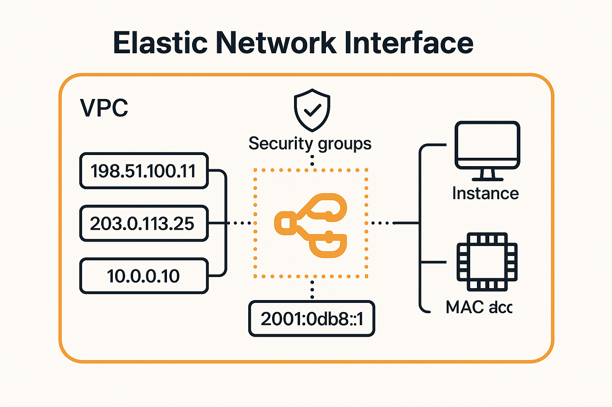
## DEMO: Installation of Wordpress on EC2

```bash
# DBName=database name for wordpress
# DBUser=mariadb user for wordpress
# DBPassword=password for the mariadb user for wordpress
# DBRootPassword = root password for mariadb

# STEP 1 - Configure Authentication Variables which are used below
DBName='a4lwordpress'
DBUser='a4lwordpress'
DBPassword='REPLACEME'
DBRootPassword='REPLACEME'

# STEP 2 - Install system software - including Web and DB
sudo yum install -y mariadb-server httpd wget
sudo amazon-linux-extras install -y lamp-mariadb10.2-php7.2 php7.2

# STEP 3 - Web and DB Servers Online - and set to startup

sudo systemctl enable httpd
sudo systemctl enable mariadb
sudo systemctl start httpd
sudo systemctl start mariadb

# STEP 4 - Set Mariadb Root Password
mysqladmin -u root password $DBRootPassword

# STEP 5 - Install Wordpress
sudo wget http://wordpress.org/latest.tar.gz -P /var/www/html
cd /var/www/html
sudo tar -zxvf latest.tar.gz
sudo cp -rvf wordpress/* .
sudo rm -R wordpress
sudo rm latest.tar.gz

# STEP 6 - Configure Wordpress

sudo cp ./wp-config-sample.php ./wp-config.php
sudo sed -i "s/'database_name_here'/'$DBName'/g" wp-config.php
sudo sed -i "s/'username_here'/'$DBUser'/g" wp-config.php
sudo sed -i "s/'password_here'/'$DBPassword'/g" wp-config.php   
sudo chown apache:apache * -R

# STEP 7 Create Wordpress DB

echo "CREATE DATABASE $DBName;" >> /tmp/db.setup
echo "CREATE USER '$DBUser'@'localhost' IDENTIFIED BY '$DBPassword';" >> /tmp/db.setup
echo "GRANT ALL ON $DBName.* TO '$DBUser'@'localhost';" >> /tmp/db.setup
echo "FLUSH PRIVILEGES;" >> /tmp/db.setup
mysql -u root --password=$DBRootPassword < /tmp/db.setup
sudo rm /tmp/db.setup

# STEP 8 - Browse to http://your_instance_public_ipv4_ip
```

## Amazon Machine Images (AMI)

> *Amazon Machine Images (AMI) 's are the images which can create EC2 instances of a certain configuration.*
> 
> 
> *In addition to using AMI's to launch instances, you can customize an EC2 instance to your bespoke business requirements and then generate a template AMI which can be used to create any number of customized EC2 instances.*
> 
- AMI’s can be used to **launch EC2** instance
- **AWS** or **Community** provided
- Marketplace (can include **commercial software**)
- **Regional. Unique ID**. e.g. ami-0a893824e0928592f20
- Permissions (Public, Your Account, Specific Accounts)
- You can create an AMI from an EC2 instance you want to template
- AMI’s are containers that reference snapshots

### AMI Lifecycle


### Key Concepts

- AMI = **One region**. Only works in that one region.
- **AMI Baking** - Creating an AMI from a configured instance + application
- An AMI **can’t be edited**. Launch instance, update configuration and *make a new AMI*
- Can be copied **between regions** (includes its snapshots)
- Remember permissions. **Default = your account**
---
**Amazon Machine Images (AMIs)** are pre-configured templates used to launch virtual machines (called instances) in **Amazon EC2**. Each AMI includes:

* A **root volume** with an operating system (e.g., Amazon Linux, Ubuntu, Windows).
* **Launch permissions** that control who can use the AMI.
* **Block device mappings** for additional storage volumes.

### Key Concepts

* **Public AMIs**: Provided by AWS or community members. Freely available for anyone.
* **Private AMIs**: Created and visible only to your AWS account or shared with specific AWS accounts.
* **Marketplace AMIs**: Provided by third-party vendors. Often come with software pre-installed (e.g., antivirus, database servers).

### AMI Usage

When launching an EC2 instance:

1. Select an AMI (e.g., `Amazon Linux 2023`, `Ubuntu 22.04`).
2. Choose instance type, storage, networking, and other settings.
3. The instance boots with the OS and configuration defined in the AMI.

### Creating Your Own AMI

You can create custom AMIs from an existing EC2 instance:

* Install your software and configure the instance.
* Stop the instance and create an image from the AWS console or CLI.
* Use that image to launch identical configured instances later.
---
## DEMO: A4L AMI

```bash
# DBName=database name for wordpress
# DBUser=mariadb user for wordpress
# DBPassword=password for the mariadb user for wordpress
# DBRootPassword = root password for mariadb

# STEP 1 - Configure Authentication Variables which are used below
DBName='a4lwordpress'
DBUser='a4lwordpress'
DBPassword='4n1m4l$L1f3'
DBRootPassword='4n1m4l$L1f3'

# STEP 2 - Install system software - including Web and DB
sudo yum install -y mariadb-server httpd wget
sudo amazon-linux-extras install -y lamp-mariadb10.2-php7.2 php7.2

# STEP 3 - Web and DB Servers Online - and set to startup

sudo systemctl enable httpd
sudo systemctl enable mariadb
sudo systemctl start httpd
sudo systemctl start mariadb

# STEP 4 - Set Mariadb Root Password
mysqladmin -u root password $DBRootPassword

# STEP 5 - Install Wordpress
sudo wget http://wordpress.org/latest.tar.gz -P /var/www/html
cd /var/www/html
sudo tar -zxvf latest.tar.gz
sudo cp -rvf wordpress/* .
sudo rm -R wordpress
sudo rm latest.tar.gz

# STEP 6 - Configure Wordpress

sudo cp ./wp-config-sample.php ./wp-config.php
sudo sed -i "s/'database_name_here'/'$DBName'/g" wp-config.php
sudo sed -i "s/'username_here'/'$DBUser'/g" wp-config.php
sudo sed -i "s/'password_here'/'$DBPassword'/g" wp-config.php   
sudo chown apache:apache * -R

# STEP 7 Create Wordpress DB

echo "CREATE DATABASE $DBName;" >> /tmp/db.setup
echo "CREATE USER '$DBUser'@'localhost' IDENTIFIED BY '$DBPassword';" >> /tmp/db.setup
echo "GRANT ALL ON $DBName.* TO '$DBUser'@'localhost';" >> /tmp/db.setup
echo "FLUSH PRIVILEGES;" >> /tmp/db.setup
mysql -u root --password=$DBRootPassword < /tmp/db.setup
sudo rm /tmp/db.setup

# STEP 8 - Browse to http://your_instance_public_ipv4_ip

# Step 9

sudo yum install -y cowsay

cowsay "oh hi"

Create file /etc/update-motd.d/40-cow

sudo nano /etc/update-motd.d/40-cow

#!/bin/sh
cowsay "Amazon Linux 2 AMI - Animals4Life"

sudo chmod 755 /etc/update-motd.d/40-cow
sudo rm /etc/update-motd.d/30-banner

sudo update-motd
sudo reboot

Relogin

## STEP 10 - CREATE AMI
## STEP 11 - USE AMI to launch an instance
```

## EC2 Purchase Options (Launch Types)


### On-Demand

- Default
- No specific pros or cons
- Instances of **different sizes** run on the same EC2 hosts - consuming a **defined allocation** of resources
- **On-Demand** instances are isolated but **multiple customer instances** run on shared hardware
- **Per-second billing** while an instance is running. Associated resources such as storage **consume capacity**, so **bill**, **regardless of instance state**
- **Default** purchase option.
- No **interruption**
- Predictable pricing
- No upfront cost
- No discount
- Short term workloads
- Unknown workloads
- Apps which can’t be interrupted

### Spot

- SPOT pricing is AWS **selling unused EC2 host capacity** for up to **90%** discount - the spot price is based on the spare capacity at a given time
- If spot price goes above your limit the instances are terminated
    - Makes Spot unreliable
- **Never** use spot for workloads which **can’t tolerate interruptions**
- **Non time critical**
- Anything which can be **rerun**
- **Bursty** capacity needs
- **Cost sensitive** workloads
- Anything which is **stateless**

### Reserved

> Long term consistent usage of EC2
> 
- Matching instances - reduced or no per sec price
- **Unused reservation still billed**
- **Partial coverage** of **larger** instance
- You commit to AWS that you will use the instance for a longer period of time - regardless of whether you use them or not
- Reservations are for **one or three years**
- **No-Upfront:**
    - Some savings for agreeing to the term
    - Per second
- **All upfront:**
    - Means no per second fee
- **Partial upfront:**
    - Reduced per second fee

### Dedicated Instance

- No other customers use the same hardware
    - You have the hardware to yourself
- You neither own or share the host
- Extra charges for instances, but dedicated hardware
- You don’t manage capacity

### Dedicated Host

> The host is allocated to you in its entirety
> 
- Pay for HOST
- No instance charges
- You must managed the capacity and the resources
- **Use because of licensing based on sockets/cores requirements**
- Host affinity links instances to hosts

## Reserved Instances

> *Aka Standard Reserved*
> 

### Scheduled Reserved Instances

- Ideal for **long term usage** which doesn’t run constantly
- Options:
    - Batch processing daily for 5 hours starting at 23:00
    - Weekly data, sales analysis. **Every friday for 24 hours**
    - 100 hours of EC2 per month
- Doesn’t support all instance types or regions. 1200 hours per year and 1 year term minimum

### Capacity Reservations

> In case of disaster and lack of capacity, AWS uses a priority list of whom to give capacity to
> 
- Regional Reservation provides a billing discount for valid instances launched in **any AZ in that region**
- While flexible they **don’t reserve capacity within in AZ** - which is risky during major faults when capacity can be limited
- **Zonal reservations** only apply to **one AZ** providing **billing discounts and capacity reservation** in **that AZ**
- **On-demand capacity reservations** can be booked to ensure you always have access to **capacity in an AZ** when you need it - but **at full on-demand price.** No term limits - but you pay **regardless of if you consume it.**

### EC2 Savings Plan

- A **hourly commitment** for a **1-3 year** term
- A reservation of **general compute $ amounts**($20 per hour for 3 years)
    - Or a specific **EC2 Savings plan** - flexibility on size & OS
- Compute products, currently **EC2, Farge & Lambda**
- Products have an **on-demand rate** and a **savings plan** rate
- Resource usage consumes savings plan commitment at the reduced savings plan rate
- Beyond your commitment **on-demand is used**

---
Here’s a summary of the **Amazon EC2 Purchase Options** in a table format:

| **Purchase Option**         | **Description**                                                                                                                     | **Billing**                             | **Use Case**                                                | **Commitment**       |
| --------------------------- | ----------------------------------------------------------------------------------------------------------------------------------- | --------------------------------------- | ----------------------------------------------------------- | -------------------- |
| **On-Demand**               | Pay for compute capacity by the hour or second (depending on instance type) with no long-term commitments.                          | Per second or hour                      | Short-term, unpredictable workloads or development/testing  | None                 |
| **Reserved Instances (RI)** | Reserve capacity for 1 or 3 years in exchange for significant discount over On-Demand pricing.                                      | Upfront, Partial Upfront, or No Upfront | Steady-state workloads                                      | 1 or 3 years         |
| **Savings Plans**           | Flexible pricing model offering lower prices compared to On-Demand in exchange for usage commitment (e.g., \$/hr) for 1 or 3 years. | Hourly commitment                       | Flexible workloads with known usage patterns                | 1 or 3 years         |
| **Spot Instances**          | Purchase unused EC2 capacity at up to 90% discount. Can be interrupted by AWS with 2-minute notice.                                 | Per second                              | Fault-tolerant, flexible workloads like batch jobs or CI/CD | None                 |
| **Dedicated Hosts**         | Physical servers with EC2 instance capacity fully dedicated to you. Helps meet compliance requirements.                             | Per host                                | Software licensing or regulatory requirements               | Optional reservation |
| **Dedicated Instances**     | EC2 instances running on hardware dedicated to a single customer.                                                                   | Per instance                            | Workloads requiring physical isolation                      | None                 |
| **Capacity Reservations**   | Reserve capacity in a specific Availability Zone. Useful for ensuring resource availability.                                        | Per instance (On-Demand or RI pricing)  | High-priority workloads requiring guaranteed capacity       | Optional term        |
---
## Instance Status Checks & Auto Recovery

> *With instance status monitoring, you can quickly determine whether Amazon EC2 has detected any problems that might prevent your instances from running applications. Amazon EC2 performs automated checks on every running EC2 instance to identify hardware and software issues. You can view the results of these status checks to identify specific and detectable problems.*
> 
> 
> *You can create an Amazon CloudWatch alarm that monitors an Amazon EC2 instance and automatically recovers the instance if it becomes impaired due to an underlying hardware failure or a problem that requires AWS involvement to repair. Terminated instances cannot be recovered. A recovered instance is identical to the original instance, including the instance ID, private IP addresses, Elastic IP addresses, and all instance metadata*
> 

### Instance Status Checks

- Every EC2 instance have 2 status check
- **First**
    - System status
        - Loss of system power
        - Loss of network connectivity
        - Host software issues
        - Host hardware issues
- **Second**
    - Instance status
        - Corrupted file system
        - Incorrect instance networking
        - OS Kernel issues

### Termination Protection

💡 Termination Protection is a feature which adds an attribute to EC2 instances meaning they cannot be terminated while the flag is enabled.

It provides protection against unintended termination and also allows role separation, where junior admins can be allowed to terminate but ONLY for instances with no protection attribute set.


## Horizontal and Vertical Scaling

> *Within AWS Horizontal and Vertical scaling are two ways which systems have to deal with increasing or decreasing user-side load.

Adding or removing resources to a system*
> 

### Vertical Scaling

- Resizing EC2 instance
    - t3.large → t3.xlarge
- Each resize requires a reboot - **disruption**
- Larger instances often carry a **$ premium**
- There is an upper cap on performance - **instance size**
- **No application modification** required
- Works for ALL applications - **even monoliths**

### Horizontal Scaling

- Adds more instances as load increases
- Load Balancer
    - Between servers and customers
    - Distribute load over all servers
- Sessions, sessions, sessions
- Requires application support OR **off-host sessions (stateless sessions)**
- **No disruption** when scaling
- Connections can be moved between servers (if stateless sessions without disruption)
- Often less expensive - **no large instance premium**
- More granular

## Instance Metadata

> *Instance metadata* is data about your instance that you can use to configure or manage the running instance. Instance metadata is divided into categories, for example, host name, events, and security groups.
> 
> 
> Instance metadata is accessed from an EC2 instance using
> 
> ```
> http://169.254.169.254/latest/meta-data/
> ```
> 
- EC2 Service provides data to instances
- Accessible inside ALL instances
- http://169.254.169.254
    - http://169.254.169.254/latest/meta-data/
    - **REMEMBER THIS**
- All information about environment can be queried
- Networking
- Authentication
- User-Data
- **NOT AUTHENTICATED** or **ENCRYPTED**
    - Treat metadata as something that can and will be exposed

---
| **Metadata Path**                       | **Description**                                   | **Example Command**                                                        |   |
| --------------------------------------- | ------------------------------------------------- | -------------------------------------------------------------------------- | - |
| `/latest/meta-data/`                    | Root directory for metadata categories.           | `curl http://169.254.169.254/latest/meta-data/`                            |   |
| `/ami-id`                               | AMI ID used to launch the instance.               | `curl http://169.254.169.254/latest/meta-data/ami-id`                      |   |
| `/instance-id`                          | The unique ID of the instance.                    | `curl http://169.254.169.254/latest/meta-data/instance-id`                 |   |
| `/instance-type`                        | The type of the instance (e.g., t3.micro).        | `curl http://169.254.169.254/latest/meta-data/instance-type`               |   |
| `/local-ipv4`                           | Private IPv4 address of the instance.             | `curl http://169.254.169.254/latest/meta-data/local-ipv4`                  |   |
| `/public-ipv4`                          | Public IPv4 address (if assigned).                | `curl http://169.254.169.254/latest/meta-data/public-ipv4`                 |   |
| `/hostname`                             | The hostname of the instance.                     | `curl http://169.254.169.254/latest/meta-data/hostname`                    |   |
| `/security-groups`                      | Security groups associated with the instance.     | `curl http://169.254.169.254/latest/meta-data/security-groups`             |   |
| `/iam/info`                             | Info about the IAM role attached to the instance. | `curl http://169.254.169.254/latest/meta-data/iam/info`                    |   |
| `/iam/security-credentials/<role-name>` | Temporary security credentials for IAM role.      | `curl http://169.254.169.254/latest/meta-data/iam/security-credentials/`   |   |
| `/placement/availability-zone`          | Availability zone of the instance.                | `curl http://169.254.169.254/latest/meta-data/placement/availability-zone` |   |
| `/mac`                                  | MAC address of the instance.                      | `curl http://169.254.169.254/latest/meta-data/mac`                         |   |
---

> **Base URL**: `http://169.254.169.254/latest/meta-data/`

For **IMDSv2 (Instance Metadata Service Version 2)**, a token is required:

```bash
TOKEN=$(curl -X PUT "http://169.254.169.254/latest/api/token" \
  -H "X-aws-ec2-metadata-token-ttl-seconds: 21600")

curl -H "X-aws-ec2-metadata-token: $TOKEN" \
  http://169.254.169.254/latest/meta-data/instance-id
```

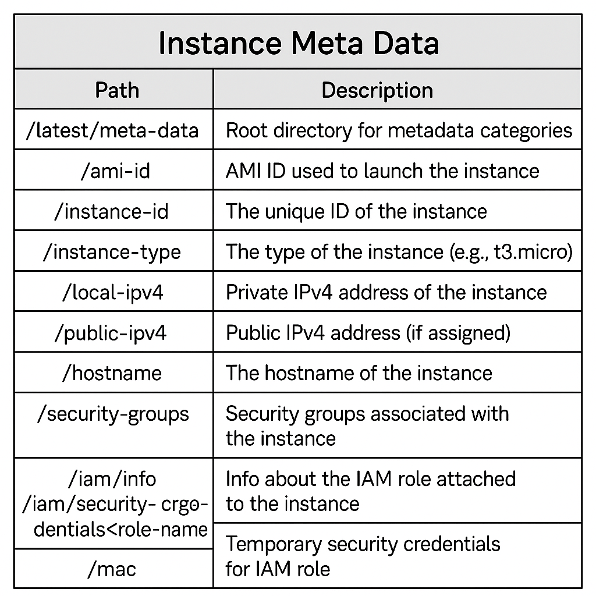

# 🐳 Containers & ECS

## Introduction to Containers

### Virtualization Problems


### Containerization


### Image Anatomy

- Running copy of a docker image
- Made up of multiple layers
- Dockerfile creates docker image
    - Each step creates fs layers
- Images are created from a **base** image or **scratch**
    - Images contain **readonly** layers, changes are layered onto the image using a **differential** architecture

### Container Anatomy

- Running copy of a docker image with one difference - **one additional read/write layer**
    - Anything happening during running is only stored in this layer


### Container Registry (e.g. Docker Hub)


### Container Key Concepts

- **Dockerfiles** are used to **build images**
- Portable - self-contained, always run as expected
- Lightweight - Parent OS used, **fs layers are shared**
- Container only runs the application & environment it needs
- Provides much of the isolations VM’s do
- Ports are **exposed** to the host and beyond
- Application stack can be multi-container…

## Elastic Container Service (ECS) Concepts

> *Remove admin overhead of managing containers*
> 

### ECS


- Runs in two modes
    - EC2
    - Fargate
        - 20 GB of free ephemeral  storage
- Create ECS Cluster
- **ECR - Elastic Container Registry (AWS alt to Docker Hub)**
- **Container definition** - Tell container where container image is
- **Task definition -** One or many container inside it
    - Represents the application as a whole
    - Store the resources used by the task
        - CPU, Memory, Network mode, compatibility (ec2 vs fargate)
        - Task role
            - IAM role that the task can use
            - Best way to give tasks access to resources
- **Service definition**
    - How many copies of a task we want to run
    - Add Load balancer
    - Scaling
    - High availability
    - **Service is what is deployed into the ECS Cluster!**

### ECS Concepts

- **Container Definition** - Image & Ports
- **Task Definition** - Security (Task Role), Container(s), Resources
- **Task Role** - IAM Role which the TASK assumes
- **Service** - How many copies, HA, Restarts

## ECS - Cluster Mode

> *ECS is capable of running in EC2 mode or Fargate mode.*
> 
> 
> *EC2 mode deploys EC2 instances into your AWS account which can be used to deploy tasks and services.*
> 
> *With EC2 mode you pay for the EC2 instances regardless of container usage*
> 
> *Fargate mode uses shared AWS infrastructure, and ENI's which are injected into your VPC*
> 
> *You pay only for container resources used while they are running*
> 

### EC2 Mode

- EC2 cluster is created within a VPC - benefit from multiple AZ’s
- **ASG - Auto Scaling Group**
    - Horizontal scaling
- Container Registry (ECR)
- **If you want to use containers, but need to manage the host the container is running on - EC2!**
    - Keep overhead and flexibility


### Fargate Mode

- “Serverless” - No servers to manage
- Not paying for EC2 instances regardless of you’re using them or not
- How containers are hosted are different from EC2 mode
- Fargate Shared Infrastructure
- **Tasks are services actually running from a shared infrastructure platform**
- **Tasks *injected* into the VPC - given ENI**
- A lot of customizability
- **You only pay for the containers you are using based on the resources you consume!**

### EC2 vs ECS (EC2) vs Fargate

- If you use containers - **ECS!**
- **Large** workload - **price conscious** - **EC2 Mode**
    - Beware of management overhead
- **Large** workload - **overhead** conscious - **Fargate**
- **Small/burst** workloads - **Fargate**
- **Batch/periodic** workloads - **Fargate**

## Elastic Container Registry (ECR)

- Managed **container image registry** service
    - like Dockerhub but for AWS
- Each AWS account has a public and private registry
- Each **registry** can have many repository
- Each **repository** can contain many **images**
- **Images** can have several **tags**
- **Public** = public R/O
    - R/W requires permissions
- **Private** = permissions required for any R/O or R/W
- Integrated with IAM
- Image scanning, **basic** and **enhanced** (inspector)
- nr real-time **Metrics** → CW(auth, push, pull)
- **API** actions = **CloudTrail**
- **Events →** EventBridge
- Replication
    - Cross-region AND Cross-account
    - 

## Kubernetes 101

> ***Kubernetes**, also known as K8s, is an open-source system for automating deployment, scaling, and management of containerized applications.*
> 

### Cluster Structure


### Cluster Detail


### Key Concepts

- **Cluster** - A deployment of Kubernetes, management, orchestration …
- **Node** - Resources; pods are placed on nodes to run
- **Pod** - 1+ containers; smallest unit in Kubernetes; often 1 container 1 pod
- **Service** - Abstraction, service running on 1 ore more pods
- **Job** - ad-hoc, creates one ore more pods until completion
- **Ingress** - Exposes a way into a service (**Ingress → Routing → Service → 1+ Pods)**
- **Ingress Controller -** used to provide ingress (e.g. AWS LB Controller uses ALB/NLB)
- **Persistent** Storage (**PV)** - Volume whose lifecycle lives beyond any 1 pod using it

## Elastic Kubernetes Service (EKS) 101

> *Amazon **Elastic** **Kubernetes** **Service** (Amazon EKS) is a fully-managed, **Kubernetes** implementation that simplifies the process of building, securing, operating, and maintaining **Kubernetes** clusters on AWS.
Kubernetes as a Service (KaaS?)*
> 
- AWS Managed Kubernetes - open source & **cloud agnostic**
- AWS, Outposts, EKS Anywhere, EKS Distro
- **Control plane scales** and runs on **multiple AZs**
- **Integrates** with **AWS services** - ECR, ELB, IAM, VPC
- **EKS Cluster**  = EKS Control Plane & EKS Nodes
- **etcd** distributed across **multiple AZs**
- **Nodes** - Self managed, managed node groups or Fargate pods
    - Windows, GPU, Inferentia, Bottlerocket, Outposts, Local zones
        - Check node type
- **Storage Providers** include - EBS, EFS, FSx Lustre, FSx for NetApp ONTAP
- Two VPC!
    - AWS Managed
    - Customer VPC
    - These will communicate


# 🉐 Advanced EC2

## Bootstrapping EC2 Using User Data

> *EC2 Bootstrapping is the process of configuring an EC2 instance to perform automated install & configuration steps 'post launch' before an instance is brought into service. With EC2 this is accomplished by passing a script via the User Data part of the Meta-data service - which is then executed by the EC2 Instance OS*
> 

### EC2 Bootstrapping

- Bootstrapping is a process which allows a system to self-configure
- Bootstrapping allows **EC2 Build Automation**
- http://169.254.169.254/latest-user-data
- Anything in User Data is **executed** by the **instance OS**
- **ONLY on launch**
- EC2 doesn’t interpret, the OS needs to understand the User Data
    
    
    

### User Data Key Points

- It’s **opaque** to EC2 - its just a **block of data**
- It’s **NOT** secure - don’t use it for passwords or long term credentials (ideally)
- User data is limited to 16 KB in size
- Can be modified when instance is stopped
- But **only executed once at launch**
    
    
    

## Enhanced Bootstrapping with CFN-INIT

> *CFN-INIT is a powerful desired-state-like configuration engine which is part of the CFN suite of products.*
> 
> 
> *It allows you to set a state for things like packages, users, groups, sources and files within resources inside a template - and it will make that change happen on the instance, performing whatever actions are required.*
> 
> *Creation policies create a 'WAIT STATE' on resources .. not allowing the resource to move to CREATE_COMPLETE until signalled using the cfn-signal tool.*
> 
- **cfn-init** helper script - installed on EC2 OS
- Simple configuration management system
- Procedural (User Data) vs Desired State (cfn-init)
- Packages, Groups, Users, Sources, Files, Commands and Services
- Provided with directives via **Metadata** and **AWS::ClodFormation::Init** on a CFN resource
- Variables passed into User Data by CloudFormation

### cfn-init


### CreationPolicy and Signals

- `-e $?` = output of previous command


## EC2 Instance Roles & Profile

> *EC2 Instance roles and Instance Profiles are how applications running on an EC2 instance can be given permissions to access AWS resources on your behalf.*
> 
> 
> *Short Term Temporary credentials are available via the EC2 Instance Metadata and are renewed automatically by the EC2 and STS Services.*
> 
> Starts with an IAM role with a permissions policy. EC2 instance role allows the EC2 service to assume that role.
> 
> The **instance profile** is the item that allows the permissions to get inside the instance. When you create an instance role in the console, an instance profile is created with the same name.
> 
> When IAM roles are assumed, you are provided temporary roles based on the permission assigned to that role. These credentials are passed through instance **meta-data**.
> 
> EC2 and the secure token service ensure the credentials never expire.
> 

### EC2 Instance Roles

- Credentials are inside meta-data
- iam/security-credentials/role-name
- Automatically rotated - Always valid
- Should always be used rather than adding access keys into instance
- CLI tools will use ROLE credentials automatically

## AWS Systems Manager Parameter Store

> *The SSM Parameter store is a service which is part of Systems Manager which allows the storage and retrieval of parameters - string, stringlist or secure string.*
> 
> 
> *The service supports encryption which integrates with KMS, versioning and can be secured using IAM.*
> 
> *The service integrates natively with many AWS services - and can be accessed using the CLI/APIs from anywhere with access to the AWS Public Spare Endpoints.*
> 

```bash
aws ssm get-parameters --names /my-app/dbstring # return JSON object

aws ssm get-parameters-by-path --path /my-app/ # return three parameters - three JSON objects

aws ssm get-parameters-by-path --path /my-app/ --with-decryption # decrypt encrypted parameters. require permissions to both interact with SSM and KMS
```

### SSM Parameter Store

- Storage for **configuration & secrets**
- String, StringList & SecureString
- License codes, Database Strings, Full Configs & Passwords
- Hierarchies & Versioning
- Plaintext and Ciphertext
- Public Parameters - **Latest AMIs per region**


## System and Application Logging on EC2

> *CloudWatch and CloudWatch Logs cannot natively capture data inside an instance.*
> 

### Logging on EC2

- CloudWatch is for metrics
- CloudWatch Logs is for logging
- Neither capture *data inside an instance*
- CloudWatch Agent is required - runs inside the instance
    - Needs configuration and permissions


## EC2 Placement Groups

> *Allows you to influence placement, having instances physically closer to each other*
> 

### Cluster Placement Groups

> *Pack Instances close together. **PERFORMANCE!***
> 
- Absolute highest **performance** possible within EC2
- In a single AZ
- Same Rack
    - Sometime **same host**
- All members have direct connections to each other
- Up to 10Gbps per stream
- 5Gbps normally
- Lowest latency and max PPS possible
- Tradeoff: Little to no resilience
- Can’t span AZs - one AZ only - locked when launching first instance
- Can span VPC peers - but impacts performance
- Requires a supported instance type
- Use the same type of instance (**not mandatory)**
- Launch at the same time (**not mandatory, very recommended)**
- **10Gbps single stream performance**
- Use cases:
    - Performance
    - Fast speeds
    - Low latency

### Spread Placement Groups

> *Keep instances separated*
> 
- Can span multiple AZs
- Distinct racks - if a single rack fail, fault is isolated to rack
- **7 instances per AZ - HARD LIMIT** - Isolated infrastructure limit
- Provides infrastructure isolation
- Each rack has its own network and power source
- Not supported for Dedicated Instances or Hosts
- Use case
    - Small number of critical instances that need to be kept separated from each other

### Partition Placement Groups

> *Groups of instances spread apart*
> 
- Across multiple AZs
- Divided into **“partitions”**
    - MAX 7 per AZ
- Each partition has its own racks - no sharing between partitions
- Instances can be placed in a specific partition
    - or auto placed
- Great for topology aware applications
    - HDFS, HBase and Cassandra
- Contain the impact of failure to part of an application
---
AWS **Placement Groups** are a feature that influence how EC2 instances are physically placed on AWS infrastructure to meet workload needs for **low latency**, **high throughput**, or **high availability**.

Here’s a comparison of the **three types of Placement Groups**:

---

### 📊 **Placement Group Types Comparison Table**

| **Placement Group Type** | **Purpose**       | **Placement Strategy**                                                       | **Ideal For**                                                      | **Limitations**                                                              |
| ------------------------ | ----------------- | ---------------------------------------------------------------------------- | ------------------------------------------------------------------ | ---------------------------------------------------------------------------- |
| **Cluster**              | High performance  | Instances are placed close together in a single AZ                           | HPC, Big Data, low-latency apps, tightly coupled nodes             | Limited to single AZ, risk of simultaneous failures                          |
| **Spread**               | High availability | Instances are placed on distinct hardware                                    | Critical applications needing separation (e.g., database replicas) | Max 7 instances per AZ (per group)                                           |
| **Partition**            | Fault isolation   | Instances are divided into logical partitions, each isolated from the others | Large-scale distributed systems like Hadoop, Cassandra             | Can have multiple partitions, but instances in same partition share hardware |

---

### 📌 **Key Details**

#### 1. **Cluster Placement Group**

* **Best for:** High-speed network communications (10 Gbps+).
* **Network Benefit:** Enhanced throughput and low latency.
* **Downside:** If the group is full, instance launches may fail.

#### 2. **Spread Placement Group**

* **Best for:** Applications where each instance must be isolated from hardware failures.
* **Instance Limit:** Up to 7 running instances per AZ per spread group.
* **Downside:** Limited scalability, but excellent fault tolerance.

#### 3. **Partition Placement Group**

* **Best for:** Large-scale, distributed and replicated workloads.
* **Design:** Each partition uses distinct racks (power/networking).
* **Max Partitions:** Up to 7 in one AZ.
* **Downside:** More complex architecture.

---

### ✅ Use Case Summary:

| **Use Case**                              | **Recommended Type** |
| ----------------------------------------- | -------------------- |
| Low latency / High throughput             | **Cluster**          |
| Fault isolation (max 7 instances per AZ)  | **Spread**           |
| Fault-tolerant, scalable distributed apps | **Partition**        |
---

## EC2 Dedicated Hosts

> *Dedicated hosts are EC2 Hosts which support a certain type of instance which are dedicated to your account.*
> 
> 
> *You can pay an on-demand or reserved price for the hosts and then you have no EC2 instance pricing to pay for instances running on these dedicated hosts.*
> 
> *Generally dedicated hosts are used for applications which use physical core/socket licensing*
> 
- EC2 Host **dedicated to you**
- Specific family, e.g. a1, c5, m5
- **No instance charges** - you pay for the host
- On-demand & Reserved options available
- Host hardware has **physical sockets and cores**


---
The key difference between an **EC2 Dedicated Host** and an **EC2 Dedicated Instance** in AWS lies in the level of physical isolation, visibility, and control over the underlying hardware:

---

### 🔹 EC2 **Dedicated Host**

| Feature                 | Description                                                                                            |
| ----------------------- | ------------------------------------------------------------------------------------------------------ |
| **Isolation**           | Provides physical server *dedicated exclusively* to your use. No other AWS customers share it.         |
| **Hardware Visibility** | Full visibility and control over the host hardware (e.g., sockets, cores).                             |
| **Licensing**           | Supports BYOL (Bring Your Own License) for Windows Server, SQL Server, etc., as you control the host.  |
| **Host Affinity**       | You can control which instances run on which host using host affinity policies.                        |
| **Pricing**             | More expensive; billed per host, not per instance.                                                     |
| **Use Case**            | Ideal when you need compliance, specific licensing requirements, or visibility into the physical host. |

---

### 🔹 EC2 **Dedicated Instance**

| Feature                 | Description                                                                                                                                 |
| ----------------------- | ------------------------------------------------------------------------------------------------------------------------------------------- |
| **Isolation**           | Runs on hardware *dedicated to you*, but you don’t control the host itself. Other dedicated instances from your account may share the host. |
| **Hardware Visibility** | No access to the underlying host information (e.g., socket or core mappings).                                                               |
| **Licensing**           | Limited BYOL support (e.g., no Windows BYOL) because you don’t manage the host.                                                             |
| **Host Affinity**       | Not available — AWS handles instance placement.                                                                                             |
| **Pricing**             | Billed per instance, with a premium over shared tenancy.                                                                                    |
| **Use Case**            | Suitable when you need isolated hardware for compliance, but don’t require full control.                                                    |

---

### Summary

| Feature       | Dedicated Host                      | Dedicated Instance              |
| ------------- | ----------------------------------- | ------------------------------- |
| **Control**   | Full control over physical host     | No control over physical host   |
| **Isolation** | Dedicated physical server           | Dedicated hardware for instance |
| **Licensing** | Full BYOL support                   | Limited BYOL                    |
| **Pricing**   | Per host                            | Per instance                    |
| **Best for**  | Compliance, licensing, and affinity | Simpler isolation needs         |
---

This is a summary of **limitations and features** specific to **AWS EC2 Dedicated Hosts**. 
---

### 🔒 **Limitations:**

1. **AMI Limits**

   * **RHEL, SUSE Linux, and Windows AMIs are not supported**
     → Certain marketplace or licensed AMIs (especially with bundled OS licensing) are restricted from running on Dedicated Hosts due to licensing or compliance constraints.

2. **Amazon RDS Instances Are Not Supported**
   → You cannot deploy **Amazon RDS** databases (like MySQL, PostgreSQL, SQL Server, etc.) on Dedicated Hosts. RDS manages its own infrastructure.

3. **Placement Groups Are Not Supported**
   → You cannot use **placement groups** (which influence how instances are placed on underlying hardware to optimize network performance or availability) with Dedicated Hosts.

---

### ⚙️ **Features:**

4. **Hosts Can Be Shared With Other ORG Accounts – RAM**
   → You can **share dedicated hosts across AWS accounts within the same AWS Organization** using **Resource Access Manager (RAM)**. This enables efficient use of reserved capacity across multiple accounts.


---

## Enhanced Networking & EBS Optimized

> *Enhanced networking is the AWS implementation of SR-IOV (Single Root IO Virtualization), a standard allowing a physical host network card to present many logical devices which can be directly utilized by instances.*
> 
> 
> *This means lower host CPU usage, better throughput, lower and consistent latency*
> 
> *EBS optimization on instances means dedicated bandwidth for storage networking - separate from data networking.*
> 

### Enhanced Networking

- Uses **SR-IOV** - NIC (Network Interface Card) is virtualization aware
- The host has multiple logical cards per physical card, which interacts with the instance
- **Higher I/O & Lower Host CPU Usage**
- More **bandwidth**
- Higher packets-per-second (**PPS)**
- Consistent **lower** **latency**
- Either enabled by default or available free of charge (for most instances)

### EBS Optimized

- **EBS** = Block storage over the network
- Historically network was **shared**
    - **Data** and **EBS**
- EBS Optimized means **dedicated capacity** for EBS
- Most instances **support** and have **enabled by default**
    - Some support, but enabling costs extra

---

# 🛣️ Route 53 - Global DNS

Amazon Route 53 (R53) is a scalable and highly available Domain Name System (DNS) web service provided by AWS. It is designed to route user requests to endpoints like AWS resources (e.g., EC2 instances, load balancers) or external servers. Here's a breakdown of the key fundamentals of Route 53:

### 1. **DNS (Domain Name System)**

* DNS is a system that translates human-readable domain names (e.g., `example.com`) into IP addresses (e.g., `192.0.2.1`) that computers use to identify each other on the network.
* When a user enters a domain name into a browser, the browser sends a DNS query to resolve that domain name to an IP address.

### 2. **Record Types in Route 53**

Route 53 supports different types of DNS records, each serving a specific purpose:

* **A Record (Address Record)**: Maps a domain to an IPv4 address (e.g., `example.com` → `192.0.2.1`).
* **AAAA Record**: Maps a domain to an IPv6 address (e.g., `example.com` → `2001:0db8:85a3:0000:0000:8a2e:0370:7334`).
* **CNAME Record (Canonical Name Record)**: Points one domain to another (e.g., `www.example.com` → `example.com`). CNAMEs can't be used on the root domain (e.g., `example.com`).
* **MX Record (Mail Exchange Record)**: Defines mail servers for email routing (e.g., `example.com` → mail servers like `mail.example.com`).
* **TXT Record (Text Record)**: Used to store arbitrary text, often for verification purposes (e.g., SPF, DKIM, etc.).
* **NS Record (Name Server Record)**: Defines the authoritative name servers for a domain (e.g., `example.com` → `ns1.exampledns.com`, `ns2.exampledns.com`).
* **PTR Record (Pointer Record)**: Used for reverse DNS lookups. It maps an IP address back to a domain name.
* **SRV Record (Service Record)**: Specifies a service’s location, such as for VoIP, XMPP, etc.
* **SOA Record (Start of Authority Record)**: Specifies the authoritative information about a domain, including the primary name server and email address for domain administration.

### 3. **Hosted Zones**

* A **hosted zone** is a container for records in a specific domain (e.g., `example.com`).
* You create a hosted zone in Route 53 when you want to manage DNS records for a domain.
* There are two types of hosted zones:

  * **Public Hosted Zone**: Manages DNS records for a publicly accessible domain.
  * **Private Hosted Zone**: Manages DNS records for a domain that is only accessible from within an Amazon VPC (Virtual Private Cloud).

### 4. **Name Servers (NS)**

* Name servers are responsible for resolving domain names into IP addresses.
* When you create a hosted zone in Route 53, AWS provides a set of name servers, which you can configure with your domain registrar.
* If you're using Route 53 to manage DNS for your domain, you'll point the registrar's NS records to Route 53's name servers.

### 5. **Routing Policies**

Route 53 offers several routing policies to control how DNS queries are answered:

* **Simple Routing**: Standard, one-to-one mapping between a domain and its resources.
* **Weighted Routing**: Distributes traffic based on a specified weight (e.g., 70% of traffic goes to one server, 30% to another).
* **Latency Routing**: Routes traffic based on the lowest latency (fastest response time) between the user and AWS resources.
* **Failover Routing**: Routes traffic to a backup resource in case the primary resource is unhealthy.
* **Geolocation Routing**: Routes traffic based on the geographic location of the requester.
* **Geoproximity Routing**: Routes traffic to the closest resource, weighted by proximity.
* **Multivalue Answer Routing**: Returns multiple records in response to a query, enabling clients to pick from multiple IP addresses.

### 6. **Health Checks**

* **Health Checks** in Route 53 are used to monitor the health of resources such as web servers, load balancers, or other endpoints.
* If a health check fails, Route 53 can route traffic to a backup resource based on the routing policy.

### 7. **TTL (Time to Live)**

* TTL defines how long a DNS record should be cached by resolvers before they query Route 53 again for an updated value.
* A lower TTL allows changes to DNS records to propagate quickly, but can result in higher DNS query traffic.

### 8. **DNS Resolution**

* When a client (e.g., a browser) makes a DNS query, it will go through a series of steps to resolve the domain name:

  * First, the resolver checks its cache for the DNS record.
  * If not found, it queries the root DNS servers, then the TLD (Top-Level Domain) servers (e.g., `.com`), and finally the authoritative name servers for the domain.

### 9. **Domain Registration**

* Route 53 also offers domain registration services. You can buy and manage domain names directly from AWS.
* Once you register a domain, you can set up the DNS records within Route 53.

### 10. **Route 53 for AWS Integration**

* Route 53 can be tightly integrated with AWS services, allowing you to route traffic to EC2 instances, load balancers, S3 buckets, CloudFront distributions, and more.

### Key Use Cases for Route 53:

* **Website Hosting**: Point a domain to an EC2 instance, S3 bucket, or load balancer.
* **Content Delivery**: Use Route 53 with CloudFront to route traffic to the nearest edge location.
* **Failover and High Availability**: Ensure uptime by routing traffic to healthy endpoints.
* **Traffic Management**: Control traffic distribution across multiple resources with routing policies.


---
## R53 Public Hosted Zones

> *A public hosted zone is a container that holds information about how you want to route traffic on the internet for a specific domain which is accessible from the public internet*
> 

💡 Two types of zones in R53: **Public** and **Private**


### R53 Hosted Zones

- A **R53 Hosted Zone** is a DNS DB for a domain, e.g. a4l.org
- **Globally resilient** (multiple DNS Servers)
- Created with domain registration via R53 - can be created separately
- Host DNS Records (A, AAAA, MX, NS, TXT,…)
- Hosted Zones are what the DNS system references - **Authoritative** for a domain e.g. a4l.org
- DNS Database

### R53 Public Hosted Zones

- DNS Database (Zone file) hosted by R53 (Public Name Servers)
- Accessible from the public internet & VPCs
- Hosted on “**4**” R53 Name Servers (**NS**) specific for the zone
    - use “**NS records**” to point at these NS (connect to global DNS)
- Resource Records (**RR**) created within the Hosted Zone
- Externally registered domains can point at R53 Public Zone


## R53 Private Hosted Zones

> A *private hosted zone* is a container that holds information about how you want Amazon Route 53 to respond to DNS queries for a domain and its subdomains within one or more VPCs that you create with the Amazon VPC service
> 
- A public hosted zone, which isn’t public
- Associated with **VPCs**
- Only accessible in those **VPCs**
- Using **different accounts** is supported via **CLI/API**
- Split-view (overlapping public & private) for **PUBLIC** and **INTERNAL** use with the same zone name


### R53 Split View Hosted Zones

- Public zone is a subset of the private zone, limiting access to some resources


## CNAME vs R53 Alias

> *This lesson steps through the shortcomings of the CNAME record type, the differences between CNAME and ALIAS and when to use one v's the other.*
> 

### R53 CNAME vs Alias (the problem)

- “A” Maps a NAME to an IP Address
    - [catagram.io](http://catagram.io) → 1.3.3.7
- CNAME maps a NAME to another NAME
    - [www.catagram.io](http://www.catagram.io) → catagram.io
- CNAME is invalid for naked/apex (catagram.io)
- Many AWS services us a DNS Name (ELBs)
- With just CNAME - [catagram.io](http://catagram.io) → ELB would be invalid

### Alias

- **ALIAS** records map a **NAME** to an **AWS resource**
- Can be used both for **naked/apex** and **normal** records
- For non apex/naked - functions like CNAME
- There is no charge for ALIAS requests pointing at AWS resources
- For AWS services - default to picking ALIAS
- Should be the same “type” as what the records is pointing at
- **Use ALIAS when pointing at:**
    - API Gateway
    - CloudFront
    - Elastic Beanstalk
    - ELB
    - Global Accelerator
    - S3

## R53 Health Checks

> *Amazon Route 53 health checks monitor the health and performance of your web applications, web servers, and other resources. Each health check that you create can monitor one of the following:*
> 
> - *The health of a specified resource, such as a web server*
> - *The status of other health checks*
> - *The status of an Amazon CloudWatch alarm*
- Health check are **separate from**, but are **used by** records
- Health checkers located **globally**
- Health checker check every 30s (every 10s costs extra)
- TCP, HTTP/HTTPS, HTTP/HTTPS with String Matching
- Healthy or **Unhealthy**
- Endpoint, CloudWatch Alarm, Check of Checks (Calculated)

  ****


## ❗Failover: Active/Passive ❗

**Active-Active Failover**

Use this failover configuration when you want all of your resources to be available the majority of the time. When a resource becomes unavailable, Route 53 can detect that it’s unhealthy and stop including it when responding to queries.

In active-active failover, all the records that have the same name, the same type (such as A or AAAA), and the same routing policy (such as weighted or latency) are active unless Route 53 considers them unhealthy. Route 53 can respond to a DNS query using any healthy record.

**Active-Passive Failover**

Use an active-passive failover configuration when you want a primary resource or group of resources to be available the majority of the time and you want a secondary resource or group of resources to be on standby in case all the primary resources become unavailable. When responding to queries, Route 53 includes only the healthy primary resources. If all the primary resources are unhealthy, Route 53 begins to include only the healthy secondary resources in response to DNS queries.

**Configuring an Active-Passive Failover with Weighted Records** and **configuring an Active-Passive Failover with Multiple Primary and Secondary Resources** are incorrect because an Active-Passive Failover is mainly used when you want a primary resource or group of resources to be available most of the time and you want a secondary resource or group of resources to be on standby in case all the primary resources become unavailable. In this scenario, all of your resources should be available all the time as much as possible which is why you have to use an Active-Active Failover instead.

**Configuring an Active-Active Failover with One Primary and One Secondary Resource** is incorrect because you cannot set up an Active-Active Failover with One Primary and One Secondary Resource. Remember that an Active-Active Failover uses all available resources all the time without a primary nor a secondary resource.

---
In Route 53 and high availability architectures, **Active-Active** and **Active-Passive** are two common failover strategies. Here's how they compare:

---

### ⚖️ Active-Active vs. Active-Passive Failover

| **Aspect**               | **Active-Active**                                                                | **Active-Passive**                                                  |
| ------------------------ | -------------------------------------------------------------------------------- | ------------------------------------------------------------------- |
| **Definition**           | Multiple resources (all active) serve traffic simultaneously.                    | Only the primary resource handles traffic; secondary is on standby. |
| **Routing Policy**       | Use **Weighted**, **Latency-based**, or **Multi-Value Answer** routing policies. | Use **Failover routing policy** with health checks.                 |
| **Traffic Distribution** | Traffic is distributed across all healthy resources.                             | All traffic goes to the primary unless it fails.                    |
| **Failover Mechanism**   | If one fails, traffic shifts to remaining healthy ones automatically.            | If primary fails (health check fails), traffic shifts to secondary. |
| **Cost**                 | Higher (all resources are running and serving traffic).                          | Lower (secondary resource may not be running continuously).         |
| **Use Case**             | Load balancing, high availability with better resource utilization.              | Disaster recovery or standby setup to ensure availability.          |

---

### 🧩 Examples:

* **Active-Active**: Web servers in **us-east-1** and **eu-west-1**, using **Latency-based** routing.
* **Active-Passive**: A production web app in **us-east-1**, with a backup in **us-west-2** using **Failover routing**.

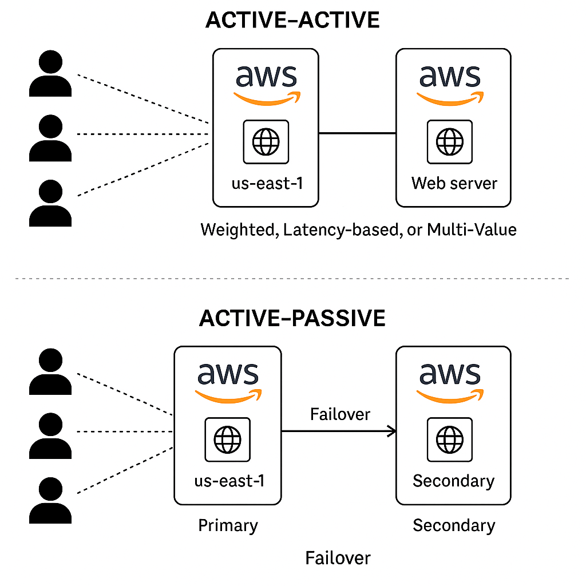
---
Amazon **Route 53 (R53)** is a **scalable and highly available Domain Name System (DNS)** web service provided by AWS. It translates domain names into IP addresses to route end-user requests to internet applications hosted in AWS or elsewhere. R53 also offers **domain registration**, **health checking**, and **routing policies** to control traffic flow based on different business requirements.

---

### 🔀 Route 53 Routing Policies (Table Format)

| **Routing Policy**                    | **Description**                                                                                    | **Use Case**                                                                            | **Supports Health Checks** |
| ------------------------------------- | -------------------------------------------------------------------------------------------------- | --------------------------------------------------------------------------------------- | -------------------------- |
| **Simple**                            | Basic routing with one record per name and type.                                                   | Use when you have only one resource (e.g., a single web server) for a domain.           | ❌ No                       |
| **Weighted**                          | Routes traffic based on weights assigned to each record.                                           | Distribute traffic between multiple resources (e.g., 70% to server A, 30% to server B). | ✅ Yes                      |
| **Latency-based**                     | Routes to the region with the lowest network latency for the user.                                 | Improve user experience by minimizing latency (e.g., choose fastest AWS region).        | ✅ Yes                      |
| **Failover**                          | Primary and secondary setup, where traffic is routed to a secondary resource if the primary fails. | Active-passive failover systems.                                                        | ✅ Yes                      |
| **Geolocation**                       | Routes based on the user’s geographic location (e.g., country, continent).                         | Serve localized content (e.g., EU users to EU servers).                                 | ✅ Yes                      |
| **Geo-proximity (Traffic Flow only)** | Routes traffic based on the geographic location and weight (bias) of AWS resources.                | Route based on proximity and shift traffic using bias settings (requires Traffic Flow). | ✅ Yes                      |
| **Multi-Value Answer**                | Returns multiple IP addresses and performs simple health checks.                                   | Basic load balancing without using ELB (up to 8 healthy records returned randomly).     | ✅ Yes                      |

---

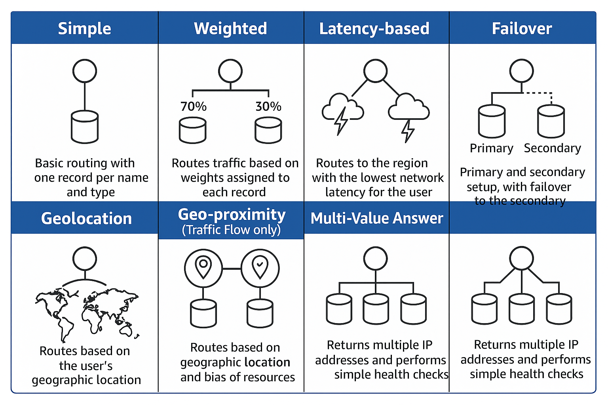

### 📝 Notes:

* **Health checks** can monitor endpoints and automatically reroute traffic if a failure is detected (except in Simple routing).
* **Traffic Flow** is a visual editor in Route 53 that allows combining routing policies (e.g., geo-proximity with failover).
---

## Routing Policy 1: Simple Routing

> *Simple routing lets you configure standard DNS records, with no special Route 53 routing such as weighted or latency. With simple routing, you typically route traffic to a single resource, for example, to a web server for your website.*
> 


## Routing Policy 2: Failover Routing

> *Failover routing lets you route traffic to a resource when the resource is healthy or to a different resource when the first resource is unhealthy
1st of four routing policies*
> 

💡 Create two records of the same name and the same type. One is set to be the primary and the other is the secondary. This is the same as the simple policy except for the response. Route 53 knows the health of both instances. As long as the primary is healthy, it will respond with this one. If the health check with the primary fails, the backup will be returned instead. This is set to implement active - passive failover.


## Routing Policy 3: ****Multi Value Routing****

> *Multivalue answer routing lets you configure Amazon Route 53 to return multiple values, such as IP addresses for your web servers, in response to DNS queries. You can specify multiple values for almost any record, but multivalue answer routing also lets you check the health of each resource, so Route 53 returns only values for healthy resources*
> 

💡 Simple records use one name and multiple values in this record. These will be health checked and the unhealthy responses will automatically be removed. With multi-value, you can have multiple records with the same name and each of these records can have a health check. R53 using this method will respond to queries with any and all healthy records, but it removes any records that are marked as unhealthy from those responses. This removes the problem with simple routing where a single unhealthy record can make it through to your customers. Great alternative to simple routing when you need to improve the reliability, and it's an alternative to failover when you have more than two records to respond with, but don't want the complexity or the overhead of weighted routing.


## Routing Policy 4: Weighted Routing

> *Weighted routing lets you associate multiple resources with a single domain name ([catagram.io](http://catagram.io/)) and choose how much traffic is routed to each resource. This can be useful for a variety of purposes, including load balancing and testing new versions of software.*
> 

💡 Create multiple records of the same name within the hosted zone. For each of those records, you provide a weighted value. The total weight is the same as the weight of all the records of the same name. If all of the parts of the same name are healthy, it will distribute the load based on the weight. If one of them fails its health check, it will be skipped over and over again until a good one gets hit. This can be used for migration to separate servers.


## Routing Policy 5: Latency Routing

> *If your application is hosted in multiple AWS Regions, you can improve performance for your users by serving their requests from the AWS Region that provides the lowest latency.*
> 

💡 Multiple records in a hosted zone can be created with the same name and same type. When a client request arrives, it knows which region the request comes from. It knows the lowest latency and will respond with the lowest latency.


## Routing Policy 6: Geolocation Routing

> *Geolocation routing lets you choose the resources that serve your traffic based on the geographic location of your users, meaning the location that DNS queries originate from.*
> 

💡 Focused to delivering results matching the query of your customers. The record will first be matched based on the country if possible. If this does not happen, the record will be checked based on the continent. Finally, if nothing matches again it will respond with the default response. This can be used for licensing rights. If overlapping regions occur, the priority will always go to the most specific or smallest region. The US will be chosen over the North America record.


- Good for restricting content to a certain location


## Routing Policy 7: Geoproximity Routing

> *Geoproximity routing lets Amazon Route 53 route traffic to your resources based on the geographic location of your users and your resources. You can also optionally choose to route more traffic or less to a given resource by specifying a value, known as a bias. A bias expands or shrinks the size of the geographic region from which traffic is routed to a resource.*
> 
- As close to customers as possible
- Calculate **distance** between customer and records
- Define rules and a bias
    - Bias: + or - bias can be added to rules


## R53 Interoperability

> *This lesson details how Route53 provides Registrar and DNS Hosting features and steps through architectures where it is used for BOTH, or only one of those functions - and how it integrates with other registrars or DNS hosting.*
> 
- R53 normally has two jobs - **Domain registrar** and **Domain Hosting**
- R53 can do **BOTH**, or either registrar or hosting
- R53 Accepts your money (domain registration fee)
- R53 allocates 4 Names Servers (NS) (Domain hosting)
- R53 Creates a zone file (domain hosting) on the above NS
- R53 communicates with the registry of the TLD (Domain Registrar)
    - sets the NS records for the domain to point at the 4 NS above

### R53: Both Roles


### R53: Registrar Only

> “Worst way to manage domains”
> 


### R53: Hosting Only


# 💽 Relational Database Service (RDS)

## ACID vs BASE

💡 **CAP Theorem: Consistency, Availability, Partition Tolerant - *Choose two***

**ACID:** 
- **Atomic:** All or nothing
- **Consistent:** From one valid state to another
- **Isolated:** Transactions don’t interfere with each other
- **Durable:** Stored on non-volatile memory. Resilient to crash.

**BASE**: 
- **Basicly Available:** Read and write available *as much as possible without consistency guarantees*
- **Soft State:** Db doesn’t enforce consistency. Offload onto app/user
- **Eventually:** Eventually consistent (wait long enough)
- **DynamoDB is BASE**

## Database on EC2

- Splitting DB and App into different AZs introduce dependencies between AZs

Reasons to host DB on EC2:

- Access to the DB instance OS
- **Advanced DB Option tuning** (**DBROOT**)
- Vendor demands
- **DB or DB version AWS don’t provide**
- Specific **OS/DB Combination** AWS don’t provide
- Architecture AWS don’t provide (replication/resilience)
- Decision makers who *just want it*

Reasons to NOT host DB on EC2:

- **Admin overhead** - managing EC2 and DBHost
- **Backup** / DR Management
- EC2 is **single AZ**
- **Features -** some of AWS DB products are amazing
- EC2 is **ON** or **OFF** - no serverless, no easy scaling
- **Replication** - skills, setup time, monitoring & effectiveness
- **Performance** - AWS invest time into optimization and features

## Relational Database Service (RDS)

> *The Relational Database Service (RDS) is a Database(server) as a service product from AWS which allows the creation of managed databases instances.*
> 
- ❌ “Database as a Service” (DBaaS)
    - Not completely true
- ✅ **DatabaseServer-as-a-Service!**
- **Managed Database** Instance (1+ Databases)
- Multiple engines **MySQL, MariaDB, PostgresSQL, Oracle, Microsoft SQL Server**
- **Amazon Aurora**
    - Different from the other engines

### RDS Architecture


### RDS Database Instance


## RDS Multi AZ

> *MultiAZ is a feature of RDS which provisions a standby replica which is kept in sync Synchronously with the primary instance.*
> 
> 
> *The **standby replica** cannot be used for any performance scaling ... only availability.*
> 
> *Backups, software updates and restarts can take advantage of MultiAZ to reduce user disruption.*
> 

In case of failure of the primary DB, the CNAME points to the standby DB


- **No Free-tier!** Extra cost for standby replica
- Standby **can’t be directly used**
- **60-120 seconds failover**
- **Same region only** (other AZs in the VPC)
- Backups taken from Standby (removes performance impact)
- AZ Outage, Primary Failure, Manual failover, Instance type change and software patching

## RDS Backups and Restores

> *RDS is capable of performing Manual Snapshots and Automatic backups*
> 
> 
> *Manual snapshots are performed manually and live past the termination of an RDS instance*
> 
> *Automatic backups can be taken of an RDS instance with a 0 (Disabled) to 35 Day retention.*
> 
> *Automatic backups also use S3 for storing transaction logs every 5 minutes - allowing for point in time recovery.*
> 
> *Snapshots can be restored .. but create a new RDS instance*
> 

### RTO vs RPO

**RTO: Recovery Time Objective**

- Time between DR event and full recovery
- Influenced by process, staff, tech and documentation
- Generally lower values cost more

**RPO: Recovery Point Objective**

- Time between last backup and the incident
- Amount of maximum data loss
- Influences technical solution and cost
- Generally lower values cost more

---
**RTO (Recovery Time Objective)** and **RPO (Recovery Point Objective)** are two critical metrics used in **disaster recovery and business continuity planning**. They define your system's tolerance for downtime and data loss, respectively.

---

### 🔄 **RTO – Recovery Time Objective**

* **Definition**: The **maximum acceptable amount of time** a system, application, or process can be down after a failure or disaster before it must be restored.
* **Focus**: **Time to recover**
* **Example**:
  If the RTO for your API service is **2 hours**, then in the event of a failure, your goal is to restore the service within **2 hours**.

---

### 💾 **RPO – Recovery Point Objective**

* **Definition**: The **maximum acceptable amount of data loss** measured in time. It defines how far back in time your data can be restored from backups.
* **Focus**: **Data loss tolerance**
* **Example**:
  If the RPO for a database is **15 minutes**, you must have backups at least every 15 minutes to ensure data loss is within this threshold.

---

### 🔁 Comparison Table

| Metric     | RTO                                  | RPO                                  |
| ---------- | ------------------------------------ | ------------------------------------ |
| Stands For | Recovery Time Objective              | Recovery Point Objective             |
| Focus      | Downtime                             | Data Loss                            |
| Measures   | How quickly systems must be restored | How much data you can afford to lose |
| Units      | Time (minutes, hours)                | Time (seconds, minutes, hours)       |
| Used For   | Planning system recovery timelines   | Planning backup frequency            |

---

### 🎯 Real-World Example

You run an e-commerce platform:

* You set **RTO = 1 hour** → Your site must be back online within 1 hour of an outage.
* You set **RPO = 5 minutes** → You must have data backups no older than 5 minutes to minimize lost transactions.

## 📌 Summary

* **RTO** = How fast you recover → Use **Route 53**, **Auto Scaling**, **DRS**, **ELB**
* **RPO** = How much data you can lose → Use **Backups**, **Snapshots**, **Versioning**
---
### 🛠️ AWS Services Example:

#### 🔄 RTO-Oriented Services:

| Service                                 | Purpose                                                     |
| --------------------------------------- | ----------------------------------------------------------- |
| **Route 53 Failover**                   | Automatically switch to standby endpoints in another region |
| **Elastic Load Balancing (ELB)**        | Distribute traffic across healthy instances                 |
| **Auto Scaling Groups**                 | Launch new EC2s in response to failures                     |
| **EC2 AMIs & Launch Templates**         | Quickly redeploy preconfigured instances                    |
| **Elastic Disaster Recovery (AWS DRS)** | Fast recovery of on-prem or cloud workloads                 |

#### 💾 RPO-Oriented Services:

| Service                   | Purpose                                                            |
| ------------------------- | ------------------------------------------------------------------ |
| **RDS Automated Backups** | Continuous snapshots; configurable retention                       |
| **RDS Multi-AZ**          | Automatic failover to standby in another AZ                        |
| **EBS Snapshots**         | Backup EBS volumes regularly                                       |
| **AWS Backup**            | Centralized backup management across services                      |
| **S3 Versioning**         | Retain versions to recover from accidental deletions or corruption |

---

### RDS Backups

**Automatic Backups**

- Delete after 0 to 35 days
    - Restore to any point in time in this window

**Manual Snapshots**

- Don’t expire - manual deletion

AWS Managed S3 Bucket → Region Resilient

First snap is FULL → Next incremental (only diff is size)

RDS Backups are snapshots of the entire RDS - not only one database

Every 5 minutes Transaction Logs is written to S3

### RDS Restores

- Creates a **NEW RDS Instance** - new address
- Snapshots = **single point in time**, creation time
- Automated = any 5 minute point in time
- Backup is restores and transaction logs are *replayed* to bring DB to desired point in time
- Restores **aren’t fast** - Think about *RTO*

## RDS Read-Replicas

> *RDS Read Replicas can be added to an RDS Instance - 5 direct per primary instance.*
> 
> 
> *They can be in the same region, or cross-region replicas.*
> 
> *They provide read performance scaling for the instance, but also offer low RTO recovery for any instance failure issues*
> 
> *N.B they don't help with data corruption as the corruption will be replicated to the RR.*
> 

### Read-Replica Architecture


Writes to replica after primary write is complete. ***Can*** be accessed for read operation, unlike Standby Replica. 

### (**read)** Performance Improvements

- **5x** direct read-replicas per DB instance
- Each providing an **additional instance of read performance**
- Read-replicas can have read-replicas - **but lag starts to be a problem**
- **Global** performance improvements

### Availability Improvements

- Snapshots & Backups Improve RPO
- **RTO’s are a problem**
- RR’s offer **nr. 0 RPO**
- RR’s can be **promoted quickly** - low RTO
- **Failure only** - watch for data corruption
- **Read only - until promoted**
    - Not reversible - delete and create new RR
- **Global availability improvements → Global resilience**
- **Scale READS, NOT WRITES**

## Amazon RDS Security

- **SSL/TLS** (in transit) is available for RDS, can be mandatory
- RDS supports **EBS volume** encryption - **KMS**
- Handled by **HOST/EBS**
- AWS or Customer Managed CMK generates **data keys**
- Data keys used for encryption operations
- Storage, logs, snapshots and replicas are encrypted with the same master key
    - encryption can’t be removed
- RDS MSSQL and RDS Oracle Support **TDE**
- **TDE: Transparent Data Encryption**
- Encryption handled within the DB engine
- RDS Oracle supports integration with CloudHSM
- Much stronger key controls (even from AWS)


### Amazon RDS IAM Authentication


## Amazon Aurora Architecture

> *Aurora is a AWS designed database engine officially part of RDS*
> 
> 
> *Aurora implements a number of radical design changes which offer significant performance and feature improvements over other RDS database engines.*
> 

### Aurora Key Differences

- Aurora architecture is **VERY** different from RDS
    - Uses a **Cluster**
- A single **primary** instance + 0 or more **replicas**
    - Replicas can read and be standby
- No local storage - uses **cluster volume**
- Faster provisioning and improved availability and performance

### Aurora Storage Architecture

- Replication happens at storage level
- Primary is the only allowed to write to storage - other nodes can read
- In case of damage or error, data is immediately repaired
- More resilient than normal RDS
- Up to 15 different replicas to failover to
    - Quicker failover


- All SSD Based - **high IOPS, low latency**
- Storage is billed based on **what’s used**
- **High water mark** - billed for the most used
    - Being changed
- Storage which is freed up can be re-used
- Replicas can be added and removed without requiring storage provisioning
- Multiple endpoints
    - Cluster endpoint
    - Reader endpoint
        - Load balance across replicas
    - Custom endpoints

### Cost

- **No free-tier**
- Aurora doesn’t support Micro Instances
- Beyond RDS singleAZ (micro) Aurora offers better value
- Compute - hourly charge, per second, 10 minute minimum
- Storage - GB-month consumed, IO cost per request
- 100% DB size in backups are included

### Aurora Restore, Clone and Backtrack

- Backups in Aurora work in the same way as RDS
- Restores create a **new cluster**
- Backtrack can be used which allow **in-place rewinds** to a previous point in time
- Fast clones make a new database MUCH faster than copying all the data - **copy-on-write**
    - Uses a tiny amount of storage - only stores the data changed since the clone was created

## Aurora Serverless

> *Is to Aurora what Fargate is to EC2*
> 

### Aurora Serverless Concepts

- Scalable - **ACU** : **Aurora Capacity Units**
- Aurora Serverless cluster has a **MIN and MAX ACU**
- Cluster adjusts based on load
- Can go to **0 and be paused**
- Consumption billing per-second basis
- Same resilience as Aurora (6 copies across AZs)

### Aurora Serverless Architecture


### Aurora Serverless: Use Cases

- **Infrequently** used application
- **New** applications
- **Variable** workloads
- **Unpredictable** workloads
- **Development** and **test** databases
- **Multi-tenant** applications

## Aurora Global Database

> *Aurora global databases are a feature of Aurora Provisioned clusters which allow data to be replicated globally providing significant RPO and RTO improvements for BC and DR planning. Additionally global databases can provide performance improvements for customers .. with data being located closer to them, in a read-only form.*
> 
> 
> *Replication occurs at the storage layer and is generally ~1second between all AWS regions.*
> 

### Aurora Global DB Architecture


### Key Concepts

- **Cross-Region DR and BC (Business Continuity)**
    - RPO and RTO low
- **Global Read Scaling -** low latency performance improvements
- **~1s or less** replication between regions
- No impact on DB performance
- Secondary regions can have **16 replicas**
- Currently MAX 5 secondary regions

## Aurora Multi-Master Writes

> *Multi-master write is a mode of Aurora Provisioned Clusters which allows multiple instances to perform reads and writes at the same time - rather than only one primary instance having write capability in a single-master cluster. This lesson steps through the architecture and explains how the conflict resolution works.*
> 
- Default Aurora mode is **single-master**
- **One R/W** and **0+ Read Only** Replicas
- Cluster Endpoint is used to write, read endpoint is used for load balanced reads
- Failover takes time - replica promoted to R/W
- In Multi-Master mode **all instances are R/W**
- *Almost* fault-tolerant
- Faster and much better availability
    - Immediately send writes to other instance in case of crash

### Architecture

- Seems like single-master, but no load balanced endpoint
- App can initiate connection to one or both replicas
- Changes are committed to the other replica in addition to storage


---
Amazon RDS (Relational Database Service) and Amazon Aurora are both managed database services provided by AWS, but they have important differences in terms of performance, scalability, cost, and architecture. Here's a breakdown of the **key differences**:

---

### 🔑 **1. Engine Compatibility**

* **RDS**: Supports multiple database engines:

  * MySQL
  * PostgreSQL
  * MariaDB
  * Oracle
  * SQL Server
* **Aurora**: Compatible with:

  * MySQL (Aurora MySQL)
  * PostgreSQL (Aurora PostgreSQL)
  * **Built by AWS** for better performance and availability.

---

### 🔑 **2. Performance**

* **RDS**:

  * Standard performance based on the underlying engine.
  * Limited read/write throughput.
* **Aurora**:

  * Up to **5x faster than MySQL** and **3x faster than PostgreSQL** on RDS.
  * Uses a **distributed, fault-tolerant, self-healing storage system**.

---

### 🔑 **3. Storage Architecture**

* **RDS**:

  * Storage is tightly coupled with the instance.
  * Scaling storage or IOPS often requires downtime or instance modification.
* **Aurora**:

  * **Decoupled storage**: Automatically scales up to 128 TB.
  * Storage is shared across read replicas.

---

### 🔑 **4. High Availability & Replication**

* **RDS**:

  * Supports **Multi-AZ deployments** for HA.
  * **Read replicas** are separate, and typically only for scaling reads.
* **Aurora**:

  * **High availability is built-in**.
  * **Up to 15 low-latency read replicas**.
  * Automatic failover is much faster (\~30 seconds or less).

---

### 🔑 **5. Cost**

* **RDS**:

  * Cheaper for small to medium workloads.
  * Pay for the database instance and storage separately.
* **Aurora**:

  * More expensive per GB and per vCPU.
  * Better value for high-performance, highly available workloads.

---

### 🔑 **6. Serverless Support**

* **RDS**:

  * Limited to RDS Aurora (MySQL/PostgreSQL) with **Aurora Serverless** for auto-scaling.
* **Aurora**:

  * Aurora Serverless v2 offers **instant autoscaling** based on workload.
  * Ideal for unpredictable or variable workloads.

---

### 🔑 **7. Backup and Restore**

* Both support:

  * Automated backups
  * Manual snapshots
  * Point-in-time recovery

However, **Aurora backups are continuous and don’t impact performance** due to its architecture.

---

### Summary Table:

| Feature           | RDS                             | Aurora                            |
| ----------------- | ------------------------------- | --------------------------------- |
| Engine Support    | MySQL, PostgreSQL, Oracle, etc. | Aurora MySQL, Aurora PostgreSQL   |
| Performance       | Standard                        | Up to 5x (MySQL), 3x (PostgreSQL) |
| Storage Scaling   | Manual/instance-bound           | Auto up to 128 TB                 |
| Read Replicas     | Limited                         | Up to 15, shared storage          |
| High Availability | Multi-AZ                        | Built-in, fast failover           |
| Serverless        | Limited (Aurora only)           | Aurora Serverless v2              |
| Cost              | Lower                           | Higher (but better performance)   |

---

## Database Migration Service (DMS)

> *The Database Migration Service (DMS) is a managed service which allows for 0 data loss, low or 0 downtime migrations between 2 database endpoints.*
> 
> 
> *The service is capable of moving databases INTO or OUT of AWS.*
> 
- A managed database migration service
- Runs using a **replication instance**
- **Source** and **destination endpoints** point at **source and target** databases
- **One endpoint MUST be on AWS!**
    - Safe default option in exam

### Architecture


### Schema Conversion Tool (SCT)

- SCT is used when converting **one database** engine to another
    - Including DB → S3 (Migrations using SNS)
- SCT is **not used when migrating between DB’s of the same type**
    - On-premises MySQL → RDS MySQL
- Works with **OLTP** DB Types (MySQL, MSSQL, Oracle)
- And **OLAP** (Teradata, Oracle, Vertica, Greenplum)
- *E.g. On-premises MSSQL → RDS MySQL*
- *E.g. On-premises Oracle → Aurora*

### (DMS) & Snowball

- Larger migrations might be multi-TB in size
    - moving data over networks takes time and consumes capacity
- DMS can utilize snowball
1. **Use SCT to extract data locally and move to a snowball device**
2. **Ship the device back to AWS. They load onto an S3 bucket.**
3. **DMS migrates from S3 into the target store**
4. **Change Data Capture (CDC) can capture changes, and via S3 intermediary they are also written to the target database**


# 🧬 Network Storage & Data Lifecycle

## Elastic File System (EFS) Architecture

> *The Elastic File System (EFS) is an AWS managed implementation of NFS which allows for the creation of shared 'filesystems' which can be mounted within multi EC2 instances.*
> 
> 
> *EFS can play an essential part in building scalable and resilient systems.*
> 

### Elastic File System

- **EFS** is an implementation of **NFSv4**
- EFS Filesystems can be **mounted in Linux**
    - Use POSIX permissions
- **Shared** between many EC2 instances
    - Exist separate from EC2 instances
- Private service, via **mount targets** inside a VPC
- Can be accessed from on-premises - **VPN** or **DX**
- **LINUX ONLY**
- **General Purpose** and **Max I/O** performance modes
    - **General Purpose** = default for 99,9% of uses
- **Bursting** and **Provisioned** Throughput Modes
- **Standard** and **Infrequent Access (IA)** Classes
    - Like S3
    - Lifecycle policies can be used with classes


## AWS Backup

> *Use AWS Backup to centralize and automate data protection across AWS services and hybrid workloads. AWS Backup offers a cost-effective, fully managed, policy-based service that further simplifies data protection at scale. AWS Backup also helps you support your regulatory compliance or business policies for data protection. Together with AWS Organizations, you can use AWS Backup to centrally deploy data protection policies to configure, manage, and govern your backup activity across your company’s AWS accounts and resources.*
> 
- **Fully managed** data-protection (backup/restore) service
- **Consolidate** management into one place across **accounts** and across **regions**
- Supports a **wide range** of AWS products
- **Backup Plans** - frequency, window, lifecycle, vault, region copy
- **Resources** - What resources are backed up
- **Vaults** - Backup **destination** (container) - assign KMS key for encryption
- Vault **Lock** - write-once, read-many (**WORM)**, 72 hour cool off, then even AWS can’t delete
- **On-demand** - manual backups created
- **PITR**  - Point in time recovery
---
### 🔍 **Core Features of AWS Backup**

| Feature                    | Description                                                                 |
| -------------------------- | --------------------------------------------------------------------------- |
| **Centralized Management** | Unified dashboard to manage backups across AWS services.                    |
| **Policy-Based Backups**   | Automate backup schedules via backup plans and lifecycle policies.          |
| **Cross-Region Backup**    | Automatically copy backups to other AWS Regions for disaster recovery.      |
| **Cross-Account Backup**   | Backup and restore across AWS accounts using AWS Organizations.             |
| **Lifecycle Management**   | Transition backups from warm to cold storage (e.g., Glacier) automatically. |
| **Backup Vaults**          | Logical container for backups with encryption and access control.           |
| **Compliance Monitoring**  | Track backup activity using AWS Backup Audit Manager.                       |

---

### 🧱 **Supported AWS Services**

* **Amazon EC2** (via EBS volumes)
* **Amazon RDS** (including Aurora)
* **Amazon DynamoDB**
* **Amazon EFS**
* **Amazon FSx** (Windows, Lustre, NetApp ONTAP)
* **AWS Storage Gateway**
* **Amazon S3** (via AWS Backup integration; limited functionality)
* **VMware workloads** (via AWS Backup Gateway)

---

### 🔐 **Security & Compliance**

* **Encryption**: Supports KMS-managed keys.
* **Access Control**: Integrated with AWS IAM for fine-grained permissions.
* **Audit Logging**: Logs activities to **AWS CloudTrail**.
* **Compliance Reports**: Generate backup activity reports for audits.

---

### 📅 **Backup Plans & Lifecycle**

A backup plan defines:

* **Backup frequency**: (hourly, daily, weekly, monthly)
* **Retention period**: (e.g., 35 days warm, then 1 year cold)
* **Resource assignment**: Tag or explicitly assign resources to plans.
* **Copy actions**: Automatically replicate backups to other regions/accounts.

---

### 💲 **Pricing Overview**

* Charges are based on:

  * Amount of data backed up
  * Duration stored (standard or cold storage)
  * Cross-region data transfer
  * Restore operations
* Pricing varies by **resource type and storage tier**.

---

### ✅ **Use Cases**

* Disaster recovery and cross-region backup
* Long-term retention for compliance (HIPAA, GDPR, SOC)
* Centralized backup strategy across AWS workloads
* Secure backup automation with auditability

---


# ⚖️ High Availability (HA) & Scaling

## Regional and Global AWS Architecture

- Global **Service Location & Discovery**
- Content Delivery (**CDN**) and optimization
- Global **health checks** and **Failover**
- Regional **entry point**
- **Scaling & Resilience**
- Application services and **components**


### Tiers

- Web Tier
- Compute Tier
- Storage
- Caching
- DB Tier
- App Services


## Evolution of Elastic Load Balancers (ELB)

> *The Elastic Load Balancer (ELB) was introduced in 2009 with the 'now called' Classic Load Balancer*
> 
> 
> *Two new versions the v2 Application and v2 Network load balancers are now the recommended solutions.*
> 
- Three types of load balancers (ELB) available within AWS
- Split between v1 (**avoid/migrate)** and **v2** (prefer)
- Classic Load Balancer (**CLB**) - **v1** - Introduced in 2009
- Not really layer 7, lacking features, **1 SSL per CLB**
- Application Load Balancer (**ALB)** - v2 - HTTP/S/WebSocket
- Network Load Balancer (NLB) - v2 - TCP, TLS, UDP
- V2 = faster, cheaper, support target groups and rules

## Elastic Load Balancer Architecture (ELB)

> *Elastic Load Balancers are a core part of any scaling architecture within AWS. Accept and distribute connections.*
> 

### ELB Architecture

- IPv4 only or dual-stack (include IPv6)
- Pick AZ load balancer will use
    - Subnets in two or more AZs
        - Pick only one subnet in each AZ


### Cross-Zone LB

Equally distribute load to instances across AZs


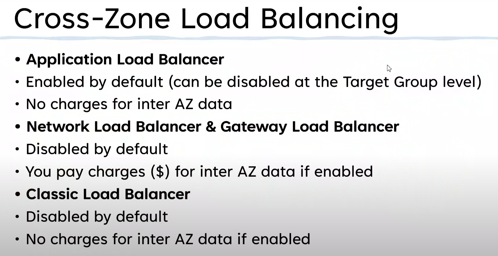

### Key Points

- ELB is a **DNS A** Records pointing at **1+** Nodes per AZ
- Nodes (in one subnet per AZ) can scale
- **Internet-facing** means nodes have **public IPv4 IPs**
- **Internal** is **private only IPs**
- EC2 **doesn’t need to be public to work with a LB**
- **Listener** configuration controls **WHAT** the LB does
- **8+** free IPs per subnet, and **/27** subnet to allow scaling

## Application Load Balancing (ALB) vs Network Load Balancing (NLB)

### Load Balancer Consolidation

> CLBs bad
> 


### Application Load Balancer (ALB)

- **Layer 7** load balancer
    - Listens on **HTTP/HTTPS**
- **No other Layer 7 protocols (**SMTP, SSH, Gaming)
    - And **NO TCP/UDP/TLS Listeners**
- L7 content type, cookies, custom headers, user location and app behaviour
- HTTP HTTPS (SSL/TLS) always terminated on the ALB - **no unbroken SSL** (security teams!)
    - **A new connection is made to the application**
- ALBs **MUST** have **SSL** certs if **HTTPS** is used
- ALBs are **slower** than **NLB**. More levels of the networks stack to process
- Health checks **evaluate application health**
    - Layer 7

### ALB Rules

- Rules **direct connections** which arrive at a listener
- Processed in **priority order**
- **Default rule = catchall**
- **Rule Conditions:** host-header, http-header, http-request-method, path-pattern, query-string and source-ip
- **Actions:** forwards, redirects, fixed-response, authenticate-oids & authenticate-cognito


### Network Load Balancer (NLB)

- Layer 4 load balancer
    - TCP, TLS, UDP, TCP_UDP
- **No visibility** or **understanding** of HTTP/HTTPS
- **No headers, no cookies, no sessions stickiness**
- Really really really fast (**millions of rps, 25% of ALB latency)**
- SMTP, SSH, Game Servers, financial apps (not http/s)
- Health checks JUST check ICMP / TCP Handshake
    - **Not app aware**
- NLBs can have **static IPs** useful for whitelisting
- **Forward TCP** to instances
    - **Unbroken encryption**
- Used with private link to provide services to other VPCs

### ALB vs NLB

- Default to ALB
- Unbroken encryption? NLB
- Static IP for whitelisting? NLB
- The fastest performance? NLB
- Protocols not HTTP or HTTPS? NLB
- Private link? NLB
- Otherwise? **ALB!**
---
**Elastic Load Balancers (ELB)** in AWS automatically distribute incoming application traffic across multiple targets (like EC2 instances, containers, IP addresses), improving **availability**, **fault tolerance**, and **scalability**.

---

### 🧭 **Types of Elastic Load Balancers**

| Load Balancer Type         | Best For                                   | Protocols Supported   |
| -------------------------- | ------------------------------------------ | --------------------- |
| **Application (ALB)**      | HTTP/HTTPS traffic at Layer 7              | HTTP, HTTPS           |
| **Network (NLB)**          | High-performance TCP/UDP traffic at L4     | TCP, UDP, TLS         |
| **Gateway Load Balancer**  | Third-party virtual appliances (firewalls) | GENEVE (port 6081)    |
| **Classic (CLB)** (legacy) | Basic L4/L7 load balancing (older apps)    | HTTP, HTTPS, TCP, SSL |

---

### 🔍 **Key Differences**

| Feature             | ALB                         | NLB                                  | Gateway LB                      |
| ------------------- | --------------------------- | ------------------------------------ | ------------------------------- |
| **OSI Layer**       | Layer 7 (Application)       | Layer 4 (Transport)                  | Layer 3/4 (Network)             |
| **Target Types**    | EC2, IP, Lambda, containers | EC2, IP, containers                  | EC2 (virtual appliances)        |
| **TLS Termination** | Yes                         | Yes                                  | No                              |
| **Sticky Sessions** | Yes (based on cookies)      | Yes (based on source IP)             | No                              |
| **Health Checks**   | HTTP/HTTPS                  | TCP/HTTP/HTTPS                       | TCP                             |
| **Performance**     | Good for web apps           | Extremely low latency (millions TPS) | Routing through appliances      |
| **Use Case**        | Microservices, web apps     | Gaming, IoT, real-time systems       | Security inspection & filtering |

---

### 🔐 **Security and Integration**

* Integrated with **AWS Certificate Manager (ACM)** for HTTPS/TLS.
* Works with **AWS WAF** (only ALB supports WAF).
* Supports **Security Groups**, **Access Logs**, and **CloudWatch Metrics**.
* Load balancers are placed in **public subnets**; targets can be in private ones.

---

### 💲 **Pricing Model**

* **Charged per hour** or **per Load Balancer Capacity Unit (LCU)**.
* **Data processed (GBs)** and **number of new connections/sec** affect pricing.
* NLBs tend to be more cost-effective for very high throughput and low latency needs.

---

### 🚀 **Typical Use Cases**

* **ALB**: Web and API routing with path- or host-based routing rules.
* **NLB**: High-speed backend apps (e.g., game servers, payment gateways).
* **Gateway LB**: Security tools (firewalls, intrusion detection) in the network path.

---
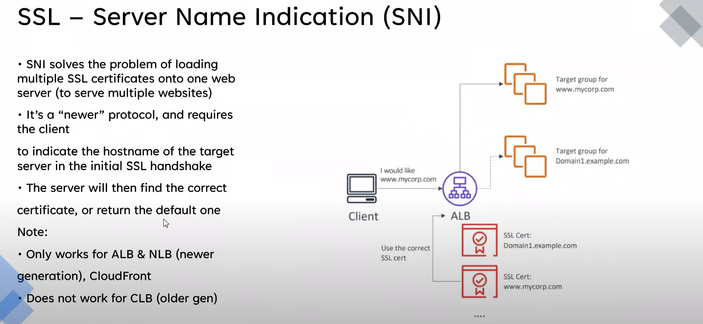
---
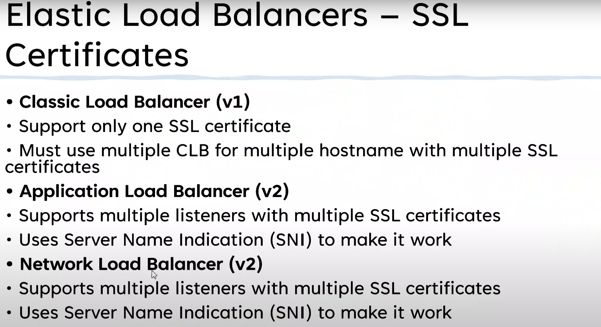
---
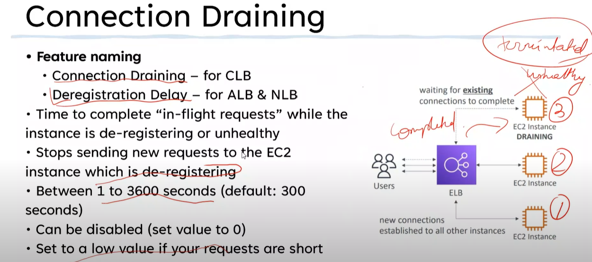
---

## Launch Configuration and Templates

> *Launch Configurations and Launch Templates provide the **WHAT** to Auto scaling groups.*
> 
> 
> *They define WHAT gets provisioned*
> 
> *The AMI, the Instance Type, the networking & security, the key pair to use, the user data to inject and IAM Role to attach.*
> 

### LC (Launch Configuration) and LT (Lanch Templates) Key Concepts

- Allow you to define the configuration of an EC2 instance **in advance**
- AMI, Instance Type, Storage & Key pair
- Networking and Security Groups
- User data & IA Role
- Both are NOT editable - defined once. LT has versions.
    - Must create a new one
- LT provide **newer features** - including T2/T3 Unlimited, Placement Groups, Capacity Reservations, Elastic Graphics

### LC and LT Architecture


 

## Auto Scaling Groups

> An *Auto Scaling group* contains a collection of Amazon EC2 instances that are treated as a logical grouping for the purposes of automatic scaling and management. An Auto Scaling group also enables you to use Amazon EC2 Auto Scaling features such as health check replacements and scaling policies. Both maintaining the number of instances in an Auto Scaling group and automatic scaling are the core functionality of the Amazon EC2 Auto Scaling service.
> 
- **Automatic Scaling** and **Self-Healing** for EC2
- Uses **Launch Templates** or **Launch Configurations**
- Has a **Minimum,** **Desired** and **Maximum Size** ( e.g. 1:2:4)
- Keep running instances at the **Desired capacity** by provisioning or **terminating** instances
- **Scaling Policies** automate based on metrics


### ASG Architecture


### Scaling Policies

- **Manual Scaling** - Manually adjust the desired capacity
- **Scheduled Scaling** - Time based adjustment - e.g. Sales
- **Dynamic Scaling**
    - **Simple:** “CPU above 50% +1”, “CPU Below 50 -1”
        - Memory, Disk, I/O etc. metrics also available
    - **Stepped Scaling:** Bigger +/- based on difference
    - **Target Tracking**: Desired Aggregate CPU = 40% - ASG handle it
- **Cooldown Periods:** How long to wait before provisioning

### ASG + Load Balancers


### Scaling Processes

- **Launch** and **Terminate:** SUSPEND and RESUME
- **AddToLoadBalancer:** Add to LB on launch
- **AlarmNotification:** Accept notification from CW
- **AZRebalance:** Balances instances evenly across all of the AZs
- **HealthCheck:** Instance health checks on/off
- **ReplaceUnhealthy:** Terminate unhealthy and replace
- **ScheduledActions:** Scheduled on/off
- **Standby:** Use this for instances ‘InService vs Standby’

### Final Points

- Autoscaling Groups are free
- Only the resources created are billed
- Use cool downs to avoid rapid scaling
- Think about **more, smaller** instances - **granularity**
- Use with ALB’s for elasticity - **abstraction**
- ASG defines **WHEN** and **WHERE**. LT defines **WHAT**
- **Auto Scaling Default Termination Policy:** ❗
    1. AZ with the most running instances
    2. Instance that was launched from the oldest launch template
    3. Instance closest to the next billing hour and terminates

## ASG Scaling Policies

> *With step scaling and simple scaling, you choose scaling metrics and threshold values for the CloudWatch alarms that trigger the scaling process. You also define how your Auto Scaling group should be scaled when a threshold is in breach for a specified number of evaluation periods.*
> 
> 
> *Step scaling policies and simple scaling policies are two of the dynamic scaling options available for you to use. Both require you to create CloudWatch alarms for the scaling policies. Both require you to specify the high and low thresholds for the alarms. Both require you to define whether to add or remove instances, and how many, or set the group to an exact size.*
> 
> *The main difference between the policy types is the step adjustments that you get with step scaling policies. When step adjustments are applied, and they increase or decrease the current capacity of your Auto Scaling group, the adjustments vary based on the size of the alarm breach.*
> 
- ASGs don’t NEED scaling policies - they can have none
- Manual: Min, max & desired - Testing & Urgent
- Simple Scaling
    - Add 1 if CPU is above X %
    - Not that efficient
- Step scaling
    - Upper and lower bounds of CPU level
    - 50 < CPU < 60 - do nothing
    - 60 < CPU < 70 - add 1
    - Always better than simple - adjust better
    - AWS recommends
- Target tracking
    - Define ideal value, e.g. 50% CPU usage
    - Add/remove to stay at ideal value
- Scaling based on **SQS - ApproximateNumberOfMessagesVisible**

### ASG - Simple Scaling


### ASG - Step Scaling


## ASG Lifecycle Hooks

> Lifecycle hooks enable you to perform custom actions by *pausing* instances as an Auto Scaling group launches or terminates them. When an instance is paused, it remains in a wait state either until you complete the lifecycle action using the **complete-lifecycle-action** command or the `CompleteLifecycleAction` operation, or until the timeout period ends (one hour by default).
> 
- **Custom Actions** on instances during ASG actions
    - Instance launch or instance terminate transitions
- Instances are paused within the flow - they wait
    - until a time (then either CONTINUE or ABANDON)
    - or you resume the ASG process CompleteLifeCycleAction
- EventBridge or SNS Notifications


## ASG Health Check Comparison - EC2 vs ELB

> *Amazon EC2 Auto Scaling can determine the health status of an instance using one or more of the following:*
> 
> - *Status checks provided by Amazon EC2 to identify hardware and software issues that may impair an instance. The default health checks for an Auto Scaling group are EC2 status checks only.*
> - *Health checks provided by Elastic Load Balancing (ELB). These health checks are disabled by default but can be enabled.*
> - *Your custom health checks.*
- Three types of Health Checks:
    - EC2 (Default)
    - ELB (can be enabled)
    - Custom
- **EC2** - Stopping, Stopped, Terminated, Shutting Down or Impaired (not 2/2/ status) = **UNHEALTHY**
- **ELB** - **HEALTHY** = Running & passing ELB health check
    - can be more **application aware** (layer 7)
- **Custom** - Instances marked **healthy** & **unhealthy** by external system
- Health check grace period (Default **300s**) - **Delay before starting checks**
    - allows **system launch**, **bootstrapping** and **application start**

## SSL Offload & Session Stickiness

> *SSL Bridging, SSL Pass Through, SSL Offloading*
> 

### SSL Offload

- Bridging
- Pass-through
- Offload
    - HTTP from ELB to EC2 instances


### Connection Stickiness


## Gateway Load Balancers (GWLB)

> *Gateway Load Balancers enable you to deploy, scale, and manage virtual appliances, such as firewalls, intrusion detection and prevention systems, and deep packet inspection systems. It combines a transparent network gateway (that is, a single entry and exit point for all traffic) and distributes traffic while scaling your virtual appliances with the demand.*
> 

### Why do we need GWLB?


### What is GWLB

- Help you **run and scale** 3rd party appliances
    - things like **firewalls, intrusion detection** and **prevention** systems
- **Inbound** and **Outbound** traffic (transparent inspection and protection)
- **GWLB endpoints:** Traffic enters/leaves via these endpoints
- GWLB balances across multiple backend appliances
- Traffic and metadata is tunnelled using **GENEVE**

### How it works


### GWLB Architecture


# 🌈 Serverless and Application Services

## Architecture Deep Dive

### Monolith

- All in one instance
- Bad
- Prone to error

### Tiered Architecture

- Can be running on different HW, but still tightly coupled
- Can vertically scale individually
- Can have internal LB between them so we can scale each tier horizontally
- Bad because tiers are still coupled
    - Each tier has to be running something for app to function

### Evolving with Queues

> System that accepts messages
> 
- Queue-based decoupled architecture
    - Queues decouple two tiers
- Async communication
- ASG based on Queue Length
    - E.g. numbers of videos to process

### Microservice Architecture


### Event Driven Architecture

- **No constant running** or waiting for things
- **Producers** generate events when something happens
    - clicks, error, criteria met, uploads, actions
- Events are delivered to **consumers** with **event router**
    - **actions are taken** and the system returns to waiting
- Mature event-driven architecture **only consumes resources while handling events** (serverless)


## AWS Lambda

- Function-as-a-Service (**FaaS) -** short running & focused
- Lambda **function** - a **piece of code** lambda runs
- Functions use a **runtime** (e.g. Python 3.8)
- Functions are loaded and run in a **runtime environment**
- The environment has a **direct memory** (**indirect CPU) allocation**
- You are billed for the **duration that a function runs**
- A key part of **serverless** architectures
- **Stateless** - brand new env each time
- **900s (15 min) function timeout**

> *Exam tip: Docker - not lambda*
> 


### Common Uses

> *Common architectures*
> 
- **Serverless applications** (S3, API Gateway, Lambda)
- File processing (S3, S3 Events, Lambda)
- Database Triggers **(DynamoDB, Streams, Lambda)**
- **Serverless CRON** (EventBridge/CWEvents + Lambda)
- Realtime Stream data Processing (Kinesis + Lambda)


### Public Lambda Architecture

- **By default** lambda function are given public networking. They can access **public AWS services** and the **public internet**


### Private Lambda Architecture


### Security

- Resource policies can only be changed via CLI or API


### Logging

- Lambda uses **CloudWatch, CloudWatch Logs & X-Ray**
- Logs from **Lambda executions** - CloudWatchLogs
- **Metrics** - invocation success/failure, retries, latency… stored in **CloudWatch**
- Lambda can be integrated with **X-Ray** for **distributed tracing**
- CloudWatch Logs requires **permissions via Execution Role**


## Invocation

> Three types: Synchronous, asynchronous and Event Source mappings
> 

### Synchronous

- **Handle errors or retries on client-side**


### Asynchronous


### Event Source Mapping


### Versions

- Lambda have versions - v1, v2, v3
- A version is the **code** + the **configuration** of the lambda function
- Its **immutable** it never changes once published & has its own **Amazon Resource Name (ARN)**
- **$Latest** points at the latest version
- **Aliases** (DEV, STAGE, PROD) point at a version - **can be changed**

### Startup Times


---

### ⚙️ **Key Features of AWS Lambda**

* **Event-driven**: Triggered by AWS services like S3, DynamoDB, API Gateway, EventBridge, etc.
* **Automatic scaling**: Scales automatically based on request volume.
* **Subsecond billing**: Pay only for the execution time, rounded to the nearest millisecond.
* **Built-in fault tolerance**: Retries, timeouts, and monitoring are integrated.
* **Runtime support**: Supports multiple languages (Python, Node.js, Java, .NET, Go, Ruby, and custom runtimes via Lambda Runtime API).

---

### 🔧 **Types / Invocation Models of Lambda**

While Lambda itself is a single service, it can be **invoked in different ways**, each with unique use cases and behavior:

#### 1. **Synchronous Invocation**

* Caller waits for Lambda to complete.
* Use case: APIs (via **API Gateway**, **ALB**).
* Services: API Gateway, ALB, AWS SDKs

#### 2. **Asynchronous Invocation**

* Lambda is queued and executed later.
* Use case: Background jobs, file processing (e.g., **S3 uploads**, **SNS notifications**).
* Services: S3, SNS, CloudWatch Events, SES

#### 3. **Event Source Mapping**

* Lambda polls streams and processes records automatically.
* Use case: Stream processing.
* Services: **DynamoDB Streams**, **Kinesis**, **MSK (Kafka)**

#### 4. **Function URLs**

* Built-in HTTPS endpoint for direct function access without API Gateway.
* Use case: Simple HTTP triggers with minimal configuration.

#### 5. **Scheduled (Cron)**

* Lambda triggered on a schedule (e.g., every hour).
* Use case: Maintenance tasks, regular jobs.
* Services: **Amazon EventBridge (CloudWatch Events)**

#### 6. **Lambda\@Edge**

* Lambda functions deployed to **CloudFront edge locations**.
* Use case: Modify requests/responses at CDN edge (e.g., security headers, redirects).
* Note: Must be written in **Node.js or Python**.

#### 7. **Container Image Support**

* Deploy Lambda using **Docker images** (up to 10 GB).
* Use case: Complex dependencies or larger packaging requirements.

---

### 🧱 Lambda Function Components

* **Handler**: Entry point function
* **Trigger**: What causes the Lambda to run
* **Runtime**: Language execution environment
* **Execution Role**: IAM role that defines permissions
* **Environment Variables**: Custom configs
* **Layers**: Share libraries/dependencies across functions

---


## CloudWatchEvents and EventBridge

> *CloudWatch Events and EventBridge have visibility over events generated by supported AWS services within an account.*
> 
> 
> *They can monitor the default account event bus - and pattern match events flowing through and deliver these events to multiple targets.*
> 
> *They are also the source of scheduled events which can perform certain actions at certain times of day, days of the week, or multiple combinations of both - using the Unix CRON time expression format. Both services are one way how event driven architectures can be implemented within AWS.*
> 

💡 **EventBridge** is replacing **CloudWatchEvents**


### Key Concepts

- If X happens, or at Y time(s), do Z
- EventBridge is sort of CloudWatch Events v2
    - **Use EventBridge!**
- A **default** Event bus for the account
    - In CloudWatch Events this is the only bus (**implicit)**
    - **EventBridge can have additional busses**
- Rules match incoming events (or schedules)
    - Schedules sort of like CRON jobs
- Route the events to **1+ Targets**, e.g. Lambda

### EventBridge / CloudWatch Events


---
**Amazon EventBridge** is a **serverless event bus service** that helps you build **event-driven applications** by connecting your applications with data from your own services, AWS services, or SaaS applications — **without writing custom polling or glue code**.

---

## 🚦 **Key Concepts**

| Concept             | Description                                                                    |
| ------------------- | ------------------------------------------------------------------------------ |
| **Event Bus**       | A pipeline for events. Default, custom, and partner event buses are available. |
| **Event**           | A JSON object that represents a change in state (e.g., "order placed").        |
| **Rule**            | Defines which events to match and where to send them (targets).                |
| **Target**          | The destination for matched events (e.g., Lambda, SQS, Step Functions).        |
| **Schema Registry** | Stores event structure metadata for easier integration and discovery.          |

---

## 📦 **Event Structure Example**

```json
{
  "source": "myapp.orders",
  "detail-type": "OrderCreated",
  "detail": {
    "orderId": "12345",
    "amount": 99.99
  }
}
```

---

## 🛠️ **Common Event Sources**

* AWS services (e.g., EC2 state change, S3 object created, CodePipeline updates)
* Your own custom events (using `PutEvents`)
* SaaS partners (e.g., Datadog, Zendesk, Segment)

---

## 🎯 **Target Examples**

* AWS Lambda
* Step Functions
* SNS / SQS
* Kinesis Data Streams
* EventBridge Pipes (for advanced filtering and enrichment)
* EC2 Run Command

---

## 🔄 **Use Case: E-commerce Order Events**

### **Flow:**

1. Order is placed → Custom app emits an event to EventBridge.
2. EventBridge Rule matches `OrderPlaced` events.
3. Target: Sends event to a Lambda that starts order fulfillment.

---

## ✨ **Benefits**

* **Loose coupling**: Services don't need to know about each other.
* **Scalable and serverless**: Handles millions of events with automatic scaling.
* **Flexible routing**: Send the same event to multiple targets.
* **Built-in filtering**: Rules can match on exact values or use pattern matching.
* **Replay and Archive (optional)**: You can archive events and replay them later.

---

## 💰 **Pricing**

* Charged based on the number of events published and matched.
* Additional cost for **archive** and **event replay** features.

---

### 📌 **Example Rule (in JSON)**

```json
{
  "EventPattern": {
    "source": ["myapp.orders"],
    "detail-type": ["OrderCreated"]
  },
  "Targets": [
    {
      "Arn": "arn:aws:lambda:us-east-1:123456789012:function:StartFulfillment",
      "Id": "StartFulfillmentLambda"
    }
  ]
}
```

---

## Serverless Architecture

> *The Serverless architecture is a evolution/combination of other popular architectures such as event-driven and microservices.*
> 
> 
> *It aims to use 3rd party services where possible and FAAS products for any on-demand computing needs.*
> 
> *Using a serverless architecture means little to no base costs for an environment - and any cost incurred during operations scale in a way with matches the incoming load.*
> 
> *Serverless starts to feature more and more on the AWS exams - so its a critical architecture to understand.*
> 

### What is serverless

- Serverless isn’t one single thing
- Software architecture
- You manage few, if any servers - low overhead
- Applications are a collection of small & specialized functions
- **Stateless** and **Ephemeral** environments - duration billing
- **Event-driven** - consumption only when being used
- **FaaS** is used where possible for compute functionality
- **Managed services** are used where possible

### Serverless Architecture Example


## Simple Notification Service (SNS)

> *The Simple Notification Service or SNS .. is a PUB SUB style notification system which is used within AWS products and services but can also form an essential part of serverless, event-driven and traditional application architectures.*
> 
> 
> *Publishers send messages to TOPICS*
> 
> *Subscribers receive messages SENT to TOPICS.*
> 
> *SNS supports a wide variety of subscriber types including other AWS services such as LAMBDA and SQS.*
> 
- **Public AWS Service** - network connectivity with Public Endpoint
- Coordinates the sending and delivery of **messages**
- Messages are ≤ **256 KB payloads**
- **SNS Topics** are the base entity of SNS - **permissions and configuration**
- A **Publisher** sends messages to a **TOPIC**
- **TOPICS** have **Subscribers** which **receive** messages
    - e.g. HTTP(S), Emails(-JSON), SQS, Mobile Push, SMS Messages & Lambda
- SNS used across AWS for notifications - e.g. CloudWatch and CloudFormation
- **Delivery Status** (including HTTP, Lambda, SQS)
- **Delivery Retries** - Reliable Delivery
- **HA** and **Scalable** (Region)
- Server Side Encryption (**SSE**)
- Cross-Account via **TOPIC Policy**


## Step Functions

> *Step functions is a product which lets you build long running serverless workflow based applications within AWS which integrate with many AWS services.*
> 

### Some problems with Lambda (Limitations)

- Lambda is FaaS
- Never put a full application inside lambda (15 min timeout)
    - Lambda can be chained together - gets messy at scale
- Runtime Environments are **stateless**

### State Machines

- Serverless workflow: **Start → States → End**
- States are **THINGS** which occur
- Maximum Duration **1 year**
- **Standard Workflow** and **Express Workflow**
- Started via API Gateway, IOT Rules, EventBridge, Lambda …
- Amazon States Language (**ASL)** - JSON Template
- **IAM Role** is used for permissions

### States

- **SUCCED & FAIL**
- **WAIT**
    - Period of time or to specific time
- CHOICE
- PARALLEL
- MAP
- TASK (Lambda, Batch, DynamoDB, ECS, SNS, SQS, Glue, SageMaker, EMR, Step Functions)


---

**AWS Step Functions** is a serverless orchestration service that lets you **coordinate multiple AWS services** into **serverless workflows** using **state machines**. It’s ideal for automating business processes, building ETL pipelines, microservice orchestration, and error-handling logic.

---

### 🧭 **Key Concepts**

| Concept           | Description                                                                |
| ----------------- | -------------------------------------------------------------------------- |
| **State Machine** | A workflow definition (in JSON/YAML) that defines a series of steps.       |
| **States**        | Steps in the workflow (Task, Choice, Wait, Fail, Succeed, Parallel, etc.). |
| **Task**          | A unit of work — usually invokes a Lambda, ECS, or other AWS service.      |
| **Transitions**   | Define how control moves from one state to another.                        |
| **Execution**     | A runtime instance of a state machine.                                     |

---

### 🔧 **Types of Workflows**

| Workflow Type | Description                                                                               |
| ------------- | ----------------------------------------------------------------------------------------- |
| **Standard**  | Long-running, durable workflows (up to 1 year). Supports retries, error handling, audit.  |
| **Express**   | High-throughput, short-duration workflows (up to 5 minutes). Lower cost, faster response. |

---

### 🧱 **Common State Types**

| State Type | Purpose                                                        |
| ---------- | -------------------------------------------------------------- |
| `Task`     | Performs a unit of work (e.g., invoke Lambda, ECS, Glue, etc.) |
| `Choice`   | Branching logic based on input data                            |
| `Wait`     | Pause for a specific time or duration                          |
| `Parallel` | Run multiple branches in parallel                              |
| `Map`      | Iterate over an array and run steps for each item              |
| `Pass`     | Pass data through without modifying                            |
| `Fail`     | Stops execution with a failure                                 |
| `Succeed`  | Stops execution successfully                                   |

---

### 🔌 **Integrated AWS Services**

Step Functions natively integrates with over **200 AWS services**, including:

* **AWS Lambda**
* **Amazon S3**
* **Amazon DynamoDB**
* **Amazon ECS / Fargate**
* **Amazon SNS / SQS**
* **AWS Glue**
* **SageMaker**
* **EventBridge**

---

### 🎯 **Use Cases**

* **ETL pipelines** using Glue, Lambda, and S3
* **Order processing systems**
* **Serverless microservice orchestration**
* **Approval workflows**
* **ML model training pipelines**
* **Retry/error handling for workflows**

---

### 🔐 **Security & Monitoring**

* IAM roles define execution permissions.
* Integrated with **CloudWatch Logs**, **X-Ray**, and **AWS Audit Logs** for observability.
* Supports encryption at rest (KMS).

---

### 💲 **Pricing Overview**

| Workflow Type | Pricing Model                                      |
| ------------- | -------------------------------------------------- |
| **Standard**  | Per state transition                               |
| **Express**   | Based on number of requests and execution duration |

---
Here's a **sample AWS Step Function** that simulates a **real-time order processing workflow** — something commonly seen in e-commerce or online service applications.

---

## 🛒 **Use Case: Order Processing Workflow**

### 📋 **Workflow Steps**

1. Validate the order.
2. Check inventory.
3. Charge the customer.
4. Send confirmation email.
5. If any step fails, handle the error gracefully.

---

## 🔁 **Step Function Diagram (Simplified)**

```plaintext
Start
  ↓
[Validate Order]
  ↓
[Check Inventory]
  ↓
[Charge Customer]
  ↓
[Send Confirmation Email]
  ↓
Success
```

---

## 🧾 **JSON Definition of the State Machine**

```json
{
  "Comment": "Order Processing Workflow",
  "StartAt": "ValidateOrder",
  "States": {
    "ValidateOrder": {
      "Type": "Task",
      "Resource": "arn:aws:lambda:us-east-1:123456789012:function:ValidateOrder",
      "Next": "CheckInventory",
      "Catch": [{
        "ErrorEquals": ["States.ALL"],
        "Next": "FailState"
      }]
    },
    "CheckInventory": {
      "Type": "Task",
      "Resource": "arn:aws:lambda:us-east-1:123456789012:function:CheckInventory",
      "Next": "ChargeCustomer",
      "Catch": [{
        "ErrorEquals": ["States.ALL"],
        "Next": "FailState"
      }]
    },
    "ChargeCustomer": {
      "Type": "Task",
      "Resource": "arn:aws:lambda:us-east-1:123456789012:function:ChargeCustomer",
      "Next": "SendConfirmationEmail",
      "Catch": [{
        "ErrorEquals": ["States.ALL"],
        "Next": "FailState"
      }]
    },
    "SendConfirmationEmail": {
      "Type": "Task",
      "Resource": "arn:aws:lambda:us-east-1:123456789012:function:SendEmail",
      "End": true
    },
    "FailState": {
      "Type": "Fail",
      "Error": "OrderProcessingFailed",
      "Cause": "An error occurred while processing the order."
    }
  }
}
```

---

## 🔧 **Lambda Function Roles (Examples)**

* `ValidateOrder`: Check if order data is complete and valid.
* `CheckInventory`: Confirm if items are in stock.
* `ChargeCustomer`: Call a payment gateway and charge the card.
* `SendEmail`: Send a confirmation email using SES.

---

## 🚀 **How to Deploy**

1. Write and deploy each Lambda function.
2. Go to **AWS Step Functions Console** → Create state machine.
3. Choose **"Author with code snippets"**.
4. Paste the JSON above.
5. Assign IAM role with Lambda invoke permissions.
6. Start execution with sample input like:

```json
{
  "orderId": "ORD-1001",
  "items": ["item1", "item2"],
  "paymentInfo": {
    "cardNumber": "**** **** **** 1234"
  }
}
```

---
## API Gateway

> *API Gateway is a managed service from AWS which allows the creation of API Endpoints, Resources & Methods.*
> 
> 
> *The API gateway integrates with other AWS services - and can even access some without the need for dedicated compute.*
> 
> *It serves as a core component of many serverless architectures using Lambda as event-driven and on-demand backing for methods.*
> 
> *It can also connect to legacy monolithic applications and act as a stable API endpoint during an evolution from a monolith to microservices and potentially through to serverless.*
> 

### Refresher

- Create and manage APIs
- Endpoint/entry-point for applications
- Sits between applications & integrations (services)
- Highly available, scalable, handles authorization, throttling, caching, CORS, transformations, OpenAPI spec, direct integration and much more
- Can connect to services/endpoints in AWS or on-premises
- HTTP APIs, REST APIs and Websocket API

### OVERVIEW


### Authentication


### Endpoint Types

- **Edge-Optimized:** Routed to the nearest CloudFront POP
- **Regional**: Clients in the same region
- **Private:** Endpoint only accessible within a VPC via interface endpoint

### Stages


### Errors

💡 **Remember these!**


- **4XX - Client Error** - Invalid request on **client** side
- **5XX - Server Error** - Valid request, **backend issue**
- **400** - Bad Request - Generic
- **403 -** Access Denied - Authrorizer denies… WAF Filtered
- **429** - API Gateway can throttle - this means you’ve exceeded that amount
- **502** - Bad Gateway Exception - bad output returned by lambda
- **503 -** Service Unavailable - backing endpoint offline? Major service issues
- **504** - Integration Failure/Timeout - 29 s limit

https://docs.aws.amazon.com/apigateway/latest/api/CommonErrors.html 

### Caching

- TTL Default 300 seconds (min 0, max 3600)
- Can be encrypted


## Simple Queue Service (SQS)

> *SQS queues are a managed message queue service in AWS which help to decouple application components, allow Asynchronous messaging or the implementation of worker pools.*
> 
- Public, fully managed, highly-available queues - **Standard or FIFO**
    - **Standard** = **at-least-one**
    - **FIFO = exactly-once**
    - FIFO Performance: 3000 messages per second with batching, or up to 300 messages per seconds without
        - Billed on “requests”
        - 1 request = 1-10 messages up to 256KB total
- **Short** (immediate) vs **Long** (**waitTimeSeconds)** Polling
- Encryption at rest (**KMS)** & in-transit
- Messages up to **256KB** in size - **link** to large data
- Received messages are **hidden (VisibilityTimeout)**
    - then either reappear (retry) or are explicitly deleted
- **Dead-Letter Queues** can be used for problem messages
- ASGs can scale and Lambdas invoke based on queue length
- Queue policy
    - Like resource policy
- ❗Default 4 days, max 14 days ❗


## SQS Standard vs FIFO

### FIFO

- Single Lane Highway
- 300 TPS w/o Batching
- 3000 TPS with batching
- Exactly once processing
    - Duplicates are removed
- Message order is **strictly** preserved

### Standard

- Multi Lane Highway
- Scalable, as wide as required
- Near unlimited TPS
- Best-effort ordering, no rigid preservation of message order
- At least once delivery, can be more than one copy of a message
- Decoupling, worker pools, batch for future processing
- 

## SQS Delay Queues

> *Delay queues provide an initial period of invisibility for messages. Predefine periods can ensure that processing of messages doesn't begin until this period has expired.*
> 


## SQS Dead-Letter Queues

> *Dead letter queues allow for messages which are causing repeated processing errors to be moved into a dead letter queue in this queue, different processing methods, diagnostic methods or logging methods can be used to identity message faults*
> 


---
**Amazon SQS (Simple Queue Service)** is a fully managed **message queuing service** that enables **decoupling and scaling** of microservices, distributed systems, and serverless applications.

---

## 📨 **Why Use SQS?**

* Decouples producers and consumers.
* Improves fault tolerance and resiliency.
* Supports delayed processing, retries, and dead-letter queues.

---

## 🔀 **Types of SQS Queues**

| Queue Type         | Description                                                             | Use Cases                                          |
| ------------------ | ----------------------------------------------------------------------- | -------------------------------------------------- |
| **Standard Queue** | High throughput, at-least-once delivery, possible out-of-order messages | Most applications (e.g., order processing, emails) |
| **FIFO Queue**     | First-In-First-Out ordering, exactly-once processing guarantees         | Payment processing, inventory management           |

---

## 🆚 **Standard vs FIFO Queues**

| Feature           | Standard Queue   | FIFO Queue                                   |
| ----------------- | ---------------- | -------------------------------------------- |
| **Message Order** | Best-effort      | Strict (first in, first out)                 |
| **Delivery**      | At least once    | Exactly once                                 |
| **Throughput**    | Nearly unlimited | 300 msg/s (with batching: 3,000/s)           |
| **Deduplication** | Not supported    | Built-in (based on `MessageDeduplicationId`) |
| **Cost**          | Lower            | Slightly higher                              |

---

## 🧾 **Basic Workflow**

1. **Producer** sends messages to the queue.
2. **SQS stores** the messages redundantly across multiple AZs.
3. **Consumer** polls the queue and processes the message.
4. **Message is deleted** once processed successfully.

---

## 🛠️ **Key Features**

* **Dead-letter queues**: Catch failed messages for analysis.
* **Visibility timeout**: Prevent multiple consumers from processing the same message simultaneously.
* **Delay queues**: Delay the delivery of all messages by up to 15 minutes.
* **Long polling**: Reduce costs by waiting for messages to arrive (vs. frequent polling).

---

## 📦 **Message Structure**

```json
{
  "MessageBody": "Order #1234 created",
  "MessageAttributes": {
    "orderType": {
      "StringValue": "priority",
      "DataType": "String"
    }
  }
}
```

---

## 💡 Common Use Cases

* Order processing systems
* Background job queues
* Email/SMS sending pipelines
* Workflow triggers with AWS Lambda or Step Functions
---

## 🔴 **Dead Letter Queue (DLQ)**

A **DLQ** is a **secondary SQS queue** that stores messages that **can't be processed successfully** after a configured number of attempts.

### 🛠️ **Key Configuration**

* You set a **redrive policy** on the primary queue:

  * **MaxReceiveCount**: Number of times a message can be received before being sent to the DLQ.
  * **Target DLQ ARN**: The ARN of the DLQ to send failed messages.

### ✅ **Benefits**

* Isolates failed messages for analysis or reprocessing.
* Prevents retries from blocking newer messages.
* Essential for debugging and fault-tolerant systems.

### 📦 **Use Case**

A payment processor where failed transactions go to a DLQ after 5 retry attempts, so developers can investigate the root cause.

---

## ⏳ **Delay Queue**

An SQS queue where **delivery of all messages** is delayed by a set amount of time (up to **15 minutes**).

### 🔧 Configuration

* Set `DelaySeconds` on the queue (default for all messages).
* Can also override per message during send.

### 📦 Use Case

Throttle email campaigns by introducing a delay, or add wait time before processing resource-heavy operations.

---

## 🟨 **Priority Queues** (Not Natively Supported)

SQS **does not support priority-based delivery natively**, but you can simulate it:

### 🔄 **Workaround**

* Create multiple queues (e.g., `high-priority`, `medium-priority`, `low-priority`)
* Have consumers poll `high` first, then `medium`, then `low`

### 📦 Use Case

Urgent tasks (e.g., alert notifications) get processed before background analytics jobs.

---

## 🧾 Summary Table

| Queue Type                   | Description                                         | Key Config Field         |
| ---------------------------- | --------------------------------------------------- | ------------------------ |
| **Dead Letter Queue**        | Captures failed messages after retries              | `RedrivePolicy`          |
| **Delay Queue**              | Delays all messages by a fixed time before delivery | `DelaySeconds`           |
| **Priority Queues** (custom) | Simulate by using multiple queues & polling order   | App-level implementation |
| **FIFO Queue**               | Ensures message order and exactly-once delivery     | `FifoQueue = true`       |

---

## Amazon Kinesis Data Streams

> *Kinesis data streams are a streaming service within AWS designed to ingest large quantities of data and allow access to that data for consumers.*
> 
> 
> *Kinesis is ideal for dashboards and large scale real time analytics needs.*
> 
> *Kinesis data firehose allows the long term persistent storage of kinesis data onto services like S3*
> 
- Kinesis is a **scalable streaming** service
- Producers **send** data into a kinesis **stream**
- Streams can scale from low to near infinite data rates
- Public service & highly available by design
- Streams store a **24-hour** moving window of data
    - can be increased to a maximum of **365 days** (additional cost)
- Multiple consumers access data from that moving window
    
    
    

### SQS vs Kinesis

- Ingestion of data - Kinesis
- Else: SQS
- SQS 1 production group, 1 consumption group
- **SQS:** Decoupling and Async communication
- **SQS:** No persistence of messages, no window
- **Kinesis:** Designed for **huge scale ingestion, multiple consumers and rolling window**
- **Kinesis:** Data ingestion, analytics, monitoring, app click

## Amazon Kinesis Data Firehose

> *Kinesis Data Firehose is a stream based delivery service capable of delivering high throughput streaming data to supported destinations in near realtime.*
> 
> 
> *Its a member of the kinesis family and for the PRO level exam it's critical to have a good understanding of how it functions in isolation and how it integrates with AWS products and services.*
> 
- **Fully managed** service to load data for **data lakes,** **data stores** and analytics services
- **Automatic scaling** - fully serverless, resilient
- **Near Real Time** delivery (~60 seconds)
- Supports **transformation** of data on the fly (Lambda)
- **Billing - volume** through firehose
- Can deliver data to: Redshift, ElasticSearch, Destination Bucket, Splunk
- Can be integrated with Kinesis Data Stream
- When? E.g. when you want to store data from a data stream past the rolling window


## Amazon Kinesis Data Analytics

> *Amazon Kinesis Data Analytics is the easiest way to analyze streaming data, gain actionable insights, and respond to your business and customer needs in real time.*
> 
> 
> *it is part of the kinesis family of products and is capable of operating in realtime on high throughput streaming data.*
> 
- **Real time processing of data**
- Using **SQL**
- Ingests from **Kinesis Data Streams** or **Firehose**
- Destinations
- **Firehose** (S3, Redshift, ElasticSearch & Splunk)
- AWS Lambda
- Kinesis Data Streams


### When and Where

- Streaming data needling **real-time SQL processing**
- Time-series analytics
    - Elections / e-sports
- Real-time dashboards - **leaderboards** for games
- Real-time metrics - **Security and Response** teams

## Amazon Kinesis Video Streams

> *Amazon Kinesis Video Streams makes it easy to securely stream video from connected devices to AWS for analytics, machine learning (ML), playback, and other processing. Kinesis Video Streams automatically provisions and elastically scales all the infrastructure needed to ingest streaming video data from millions of devices*
> 
- Ingest live video data from producers
- Security cameras, smartphones, cars, drones, time-serialized audio, thermal, depth and RADAR
- Consumers can access data **frame-by-frame** or as need
- Can **persist** and **encrypt** (in-transit and at rest) data
- **Can’t access directly via storage - only via APIs**
- Integrates with other AWS services e.e.g **Rekognition** and **Connect**


---

## 🚀 **Amazon Kinesis Overview**

Kinesis lets you **ingest, buffer, and analyze streaming data** (e.g., logs, IoT data, video, social media feeds) in real-time, enabling near-instant insights.

Kinesis has 4 major components:

---

## 1. 📊 **Kinesis Data Streams (KDS)**

> A scalable and durable real-time data streaming service.

### 🔹 Features:

* Real-time ingestion of data (millions of records per second).
* Stores data in **shards** (each shard supports 1 MB/s input & 2 MB/s output).
* Data is **available for 24 hours** (can extend up to 7 days).
* Consumers use **Kinesis SDK, Lambda, or KCL** to process data.

### 📦 Use Cases:

* Real-time log processing
* Clickstream analytics
* Fraud detection
* Sensor/IoT stream handling

---

## 2. 🔥 **Kinesis Data Firehose**

> A fully managed service to **load streaming data into AWS destinations** — **no coding or provisioning required**.

### 🔹 Features:

* Auto-scales to match throughput.
* Supports data delivery to:

  * S3
  * Redshift
  * OpenSearch
  * Splunk
* Allows optional **data transformation using Lambda**.

### 📦 Use Cases:

* Real-time ETL (Extract, Transform, Load)
* Log storage & analytics
* Data lake ingestion

---

## 3. 🎥 **Kinesis Video Streams (KVS)**

> Used for **real-time video ingestion, processing, and storage**.

### 🔹 Features:

* Streams video from connected devices (e.g., cameras, drones).
* Supports real-time **ML-based processing** (e.g., object detection).
* Data is stored durably and can be replayed.

### 📦 Use Cases:

* Smart surveillance
* Live video streaming
* Industrial automation (machine vision)

---

## 4. 📈 **Kinesis Data Analytics (KDA)**

> Enables **real-time data analysis** on data from **Kinesis Data Streams or Firehose** using **SQL or Apache Flink**.

### 🔹 Features:

* Run SQL queries on streaming data.
* Detect anomalies, aggregates, filters in real-time.
* Integrates with Lambda and Firehose for downstream actions.

### 📦 Use Cases:

* Real-time dashboards
* Alerting systems
* Time-series aggregations

---

## 🧩 How They Work Together

**Example Workflow:**

```text
IoT Device ➜ Kinesis Data Streams ➜ Kinesis Data Analytics ➜ Firehose ➜ S3/Redshift
```

---

## 🔄 Summary Table

| Service            | Purpose                                     | Destinations/Consumers           |
| ------------------ | ------------------------------------------- | -------------------------------- |
| **Data Streams**   | Real-time ingest & buffering                | Lambda, KCL, Analytics           |
| **Data Firehose**  | Fully managed ETL pipeline                  | S3, Redshift, OpenSearch         |
| **Video Streams**  | Video ingestion & storage                   | SageMaker, ML models, apps       |
| **Data Analytics** | Real-time SQL/Flink-based stream processing | Firehose, Lambda, custom actions |

---
---

## 🔁 **Kinesis vs SQS – High-Level Comparison**

| Feature                  | **Amazon Kinesis**                                       | **Amazon SQS**                                                |
| ------------------------ | -------------------------------------------------------- | ------------------------------------------------------------- |
| **Purpose**              | Real-time **data streaming and processing**              | **Message queuing** to decouple microservices                 |
| **Processing Model**     | **Stream-based** (multiple consumers can read same data) | **Queue-based** (each message is processed once per consumer) |
| **Message Retention**    | Default 24 hours (up to 7 days for KDS)                  | 1 minute to 14 days                                           |
| **Ordering**             | FIFO possible in **Kinesis** (via shard ordering)        | Native FIFO queues available                                  |
| **Throughput**           | Extremely high (1000s of records/sec per shard)          | Moderate (depends on message size, batching)                  |
| **Replayability**        | Yes (can reprocess from past timestamp)                  | No (once deleted, messages are gone)                          |
| **Latency**              | Milliseconds (for real-time data)                        | Seconds (due to polling, unless long polling is used)         |
| **Integration**          | Analytics, Lambda, Firehose, S3, Flink                   | Lambda, Step Functions, EC2, containers                       |
| **Data Size per Record** | Up to **1 MB** per record                                | Up to **256 KB** per message                                  |
| **Delivery Semantics**   | At least once (or exactly once with Flink)               | At least once; exactly-once with FIFO                         |
| **Cost Model**           | Based on shards & PUT payload units                      | Based on number of requests and payload size                  |

---

## 🧾 Example Use Cases

| Scenario                        | Use **Kinesis**                       | Use **SQS**                   |
| ------------------------------- | ------------------------------------- | ----------------------------- |
| Real-time log aggregation       | ✅                                     | ❌ (batch-based)               |
| Video or sensor data processing | ✅ (Kinesis Video Streams)             | ❌                             |
| Email or notification queuing   | ❌                                     | ✅                             |
| Background job scheduling       | ❌                                     | ✅                             |
| Decoupling microservices        | ⚠️ (Possible, but overkill)           | ✅ (primary use case)          |
| Stream analytics / windowing    | ✅ (Kinesis Data Analytics or Flink)   | ❌                             |
| One-to-many data delivery       | ✅ (multiple consumers read same data) | ❌ (each message handled once) |

---

## 🧠 When to Use What?

| If You Need...                        | Use          |
| ------------------------------------- | ------------ |
| Real-time processing with replay      | **Kinesis**  |
| Simple point-to-point async messaging | **SQS**      |
| Message ordering with deduplication   | **SQS FIFO** |
| High-throughput data ingestion        | **Kinesis**  |
| Retry/failure handling with DLQ       | **SQS**      |

---


## Amazon Cognito - User and Identity Pools

> *A user pool is a user directory in Amazon Cognito. With a user pool, your users can sign in to your web or mobile app through Amazon Cognito. Your users can also sign in through social identity providers like Google, Facebook, Amazon, or Apple, and through SAML identity providers. Whether your users sign in directly or through a third party, all members of the user pool have a directory profile that you can access through a Software Development Kit (SDK).*
> 
> 
> *Amazon Cognito identity pools (federated identities) enable you to create unique identities for your users and federate them with identity providers. With an identity pool, you can obtain temporary, limited-privilege AWS credentials to access other AWS services.*
> 
- Cognito has terrible naming
- **Authentication, authorization and user management** for web/mobile apps
- Two parts of Cognito: User Pools an identity pools
- **USER POOLS:** **Sign-in** and get a JSON Web Token **(JWT)**
- User directory management and profiles, sign-up and sign-in (customizable web UI), MFA and other security features
- **IDENTITY POOLS:** Allow you to offer access to **Temporary AWS Credentials**
- **Unauthenticated Identities:** Guest Users
- **Federated Identities:** SWAP -  Google, Facebook, Twitter, SAML2.0 & User Pool for short term AWS Credentials to access AWS Resources
- Identity pools assume an IAM role

### Architecture: User Pools


### Architecture: Identity Pools


### Architecture: User & Identity Pools


---
### 🔐 **Amazon Cognito** – Overview

**Amazon Cognito** is a fully managed **user authentication, authorization, and user management** service provided by AWS. It is often used in mobile and web applications to add **sign-up, sign-in, and access control** functionality.

---

## 🧱 **Core Components**

### 1. **User Pools (Authentication)**

* **Purpose**: User directory for handling user registration and sign-in.
* **Supports**:

  * Email/Phone + password
  * Social logins (Google, Facebook, Apple)
  * SAML/OpenID Connect identity providers
* **MFA, email/phone verification**, password policies
* Tokens: **ID token**, **Access token**, **Refresh token**

### 2. **Identity Pools (Authorization)**

* **Purpose**: Grants **temporary AWS credentials** to access AWS services (via IAM roles).
* Federates identities from:

  * Cognito User Pools
  * Social logins (Facebook, Google, etc.)
  * SAML providers
  * Anonymous guest users

> 🔄 Identity Pools use **STS** to provide access to AWS services based on user identity.

---

## 🔐 **How It Works Together**

```text
User signs in ➜ Cognito User Pool authenticates ➜ Token issued ➜ Identity Pool exchanges token for temporary AWS credentials ➜ Access AWS services securely
```

---

## ✅ **Key Features**

| Feature                         | Description                                               |
| ------------------------------- | --------------------------------------------------------- |
| **Secure Authentication**       | Sign-up/sign-in, password policies, 2FA (SMS or TOTP)     |
| **Federated Identities**        | Login with Google, Facebook, SAML, OIDC                   |
| **User Directory**              | Fully managed user profile store                          |
| **Token-based Access**          | JWT tokens (ID, access, refresh) for secure API access    |
| **Custom Attributes/Triggers**  | Customize sign-in, pre/post auth with **Lambda triggers** |
| **User Pools + Identity Pools** | Combine for both auth and AWS resource access             |

---

## 📦 **Example Use Case**

A **React web app** with:

* Cognito **User Pool** for registration/login
* **Identity Pool** to give authenticated users **temporary access to S3** and DynamoDB
* **Cognito Triggers** (Lambda) to verify emails, log signups

---

## 🧠 Cognito vs Alternatives

| Feature         | Cognito                   | Auth0 / Firebase / Okta         |
| --------------- | ------------------------- | ------------------------------- |
| Managed by AWS  | ✅                         | ❌ (third-party)                 |
| IAM Integration | ✅ (temporary credentials) | ❌ (custom backend logic needed) |
| Federated Id    | ✅                         | ✅                               |
| Customization   | Lambda Triggers           | Webhooks / Rules                |
| Cost            | Free tier + pay-as-you-go | Often higher or usage-tiered    |

---

## AWS Glue

> *AWS Glue is a fully managed extract, transform, and load (ETL) service that makes it easy for customers to prepare and load their data for analytics. You can create and run an ETL job with a few clicks in the AWS Management Console. You simply point AWS Glue to your data stored on AWS, and AWS Glue discovers your data and stores the associated metadata (e.g. table definition and schema) in the AWS Glue Data Catalog. Once cataloged, your data is immediately searchable, queryable, and available for ETL.*
> 
- Serverless ETL (Extract, Transform, Load)
    - vs data pipeline (which can do ETL) and users servers (EMR)
- Moves and transforms data between source and destination
- **Crawls** data sources and generates the **AWS Glue Data catalog**
- **Data source: Stores:** S3, RDS, JDBC Compatible and DynamoDB
- **Data source: Streams:** Kinesis Data Stream & Apache Kafka
- **Data Targets:** S3, RDS, JDBC Databases

### Data Catalog

- **Persistent metadata** about data sources in region
- **One catalog** per region per accont
- **Avoids data silos**
- Amazon Athena, Redshift Spectrum, EMR & AWS Lake Formation all use Data Catalog
    - configure **crawlers** for data sources

### AWS Glue


---
### 🧪 **Amazon Glue** – Overview

**AWS Glue** is a fully managed **ETL (Extract, Transform, Load)** and **data integration** service that helps you prepare and move data for analytics, machine learning, and application development.

It automates much of the effort involved in:

* **Discovering** data
* **Transforming** it
* **Preparing** it for analytics (e.g., in Redshift, S3, Athena)

---

## 🔧 **Key Components**

### 1. 🔍 **Data Catalog**

* Central metadata repository to store **schema**, **data source**, and **table** info.
* Integrated with **Athena, Redshift Spectrum, EMR, and Lake Formation**.
* Tables and partitions are automatically discovered via **crawlers**.

---

### 2. 🧹 **Glue ETL Jobs**

* Code-based or visual (no-code) **ETL workflows**.
* Jobs can be written in **Python or Scala** using **Apache Spark** under the hood.
* Serverless: No provisioning needed, just submit jobs.

---

### 3. 🕷️ **Glue Crawlers**

* Automatically scan data sources (S3, JDBC, DynamoDB) and infer schema.
* Creates or updates tables in the Data Catalog.

---

### 4. 🔁 **Glue Workflows**

* Orchestrate multiple jobs, crawlers, triggers in a **dependency graph**.
* Helps build **end-to-end ETL pipelines** with error handling and retry logic.

---

### 5. 📊 **Glue DataBrew**

* Visual, no-code tool for **data wrangling and transformation**.
* Ideal for business analysts and data scientists who don’t want to write code.

---

### 6. 💡 **Glue Studio**

* Visual editor to create, run, and monitor ETL jobs.
* Drag-and-drop transformations for a **low-code experience**.

---

## 🚀 Common Use Cases

| Use Case                              | How Glue Helps                                      |
| ------------------------------------- | --------------------------------------------------- |
| Data lake preparation (S3 → Redshift) | Crawlers + ETL Jobs                                 |
| Schema discovery                      | Crawlers auto-detect schemas                        |
| Log processing                        | Clean, enrich, and structure raw logs for analytics |
| Machine learning pipelines            | Preprocess and transform training datasets          |
| Cross-source data integration         | Combine and join from RDS, S3, and DynamoDB         |

---

## 📦 Sample Workflow

```text
Raw Data in S3
   ⬇ (Crawler)
AWS Glue Data Catalog (schema created)
   ⬇ (ETL Job)
Cleaned & Transformed Data
   ⬇
Output to S3 / Redshift / Athena
```

---

## 🔄 Glue vs Other Tools

| Feature               | AWS Glue              | AWS Data Pipeline / Lambda ETL | Apache Airflow |
| --------------------- | --------------------- | ------------------------------ | -------------- |
| Serverless            | ✅                     | ❌ (Data Pipeline) / ✅ (Lambda) | ❌              |
| Code-Free Option      | ✅ (DataBrew / Studio) | ❌                              | ❌              |
| Auto Schema Discovery | ✅ (Crawlers)          | ❌                              | ❌              |
| Job Orchestration     | ✅ (Workflows)         | Partial                        | ✅              |

---

## Amazon MQ

> *AmazonMQ is an AWS implementation of Apache ActiveMQ*
> 
> 
> *It supports open standards such as JMS, AMQP, MQTT, OpenWire and STOMP*
> 
> *If you need to support any of these, and use queues and topics - AmazonMQ is the tool to use.*
> 
- SNS and SWS are AWS Services - using AWS APIs
- SNS provides TOPICS and SQS provides QUEUES
- Public services - highly scalable - AWS integrated
- Many ORGS already use topics and queues and want to migrate into AWS
    - SNS and SQS won’t work out of the box
- We need a **standards compliant** solution for migration

### MQ

- **NOT A PUBLIC SERVICE - you need a private network connection between on-prem**
- Open-source message broker
- Based on Managed Apache ActiveMQ
- JMS API - protocols such as AMQP, MQTT, OpenWire and STOMP
- Provides QUEUES and TOPICS
- One-to-one or one-to-many
- **Single instance** (test, dev, cheap) or HA Pair (Active/standby)
- VPC Based - Not a public service - Private networking required
- No AWS native integration - delivers activeMQ product which you manage


- SNS or SQS for most **new** implementations (default)
- SNS or SQS if AWS integration is required (logging, permissions encryptions, service integration)
- MQ if you need to migrate from an existing system with little to no application change
- MQ if APIs such as JMS or protocols such as AMQP, MQTT, OpenWite and STOMP are needed
- **Remember you ned private networking for MQ**

## Amazon AppFlow

> *Amazon AppFlow is a fully managed integration service that enables you to securely transfer data between Software-as-a-Service (SaaS) applications like Salesforce, SAP, Zendesk, Slack, and ServiceNow, and AWS services like Amazon S3 and Amazon Redshift, in just a few clicks. With AppFlow, you can run data flows at enterprise scale at the frequency you choose - on a schedule, in response to a business event, or on demand. You can configure data transformation capabilities like filtering and validation to generate rich, ready-to-use data as part of the flow itself, without additional steps. AppFlow automatically encrypts data in motion, and allows users to restrict data from flowing over the public Internet for SaaS applications that are integrated with AWS PrivateLink, reducing exposure to security threats.*
> 
- Fully-managed **integration** service
- Exchange data between applications (connectors) using flows
- Syns data across applications
- Aggregate data from different sources
- Public endpoints, but works with PrivateLink (privacy)
- AppFlow Custom Connector SDK (build your own)
- E.g.
    - Contact records from Salesforce → Redshift
    - Support Tickets from Zendesk → S3


---
### 🔁 **Amazon AppFlow** – Overview

**Amazon AppFlow** is a **fully managed integration service** that enables you to **securely transfer data between SaaS applications (like Salesforce, Zendesk, Google Analytics, etc.) and AWS services (like S3, Redshift, and Snowflake)** — without writing code.

---

## 🧱 **Core Features**

| Feature                 | Description                                                                |
| ----------------------- | -------------------------------------------------------------------------- |
| **No-code setup**       | Point-and-click UI for setting up flows between services                   |
| **Bi-directional flow** | Move data **to and from** AWS and SaaS apps                                |
| **Data transformation** | Built-in **filtering, mapping, validation**, and **masking** capabilities  |
| **Event-driven**        | Trigger flows **on demand, schedule**, or via **event** (e.g., new record) |
| **Encryption**          | All data encrypted in transit and at rest (KMS support)                    |
| **Data destinations**   | S3, Redshift, Snowflake, Salesforce, etc.                                  |

---

## 🔌 **Supported Sources and Destinations**

| SaaS Sources                | AWS Destinations           |
| --------------------------- | -------------------------- |
| Salesforce                  | Amazon S3                  |
| Google Analytics 4 / Looker | Amazon Redshift            |
| Zendesk, ServiceNow, Slack  | Amazon EventBridge         |
| SAP, Marketo, Facebook Ads  | Amazon AppFlow (loop-back) |

> You can also move data between **two SaaS platforms** (e.g., Salesforce → Zendesk) via AppFlow.

---

## 🛠️ **How It Works**

1. **Choose source and destination**
2. **Select trigger**: On-demand, event, or scheduled
3. **Apply filters and mappings**
4. **Run and monitor the flow** via AppFlow dashboard

---

## 📦 **Example Use Case**

### 🔄 *Sync Salesforce data to Amazon Redshift for analytics*

* **Source**: Salesforce
* **Destination**: Redshift
* **Trigger**: Every hour
* **Transform**: Rename `ContactName` → `CustomerName`, filter inactive users
* **Use**: BI tools like QuickSight or Athena for reporting

---

## 🔍 AppFlow vs Glue vs Step Functions

| Feature             | **AppFlow** | **Glue**           | **Step Functions**    |
| ------------------- | ----------- | ------------------ | --------------------- |
| No-code data sync   | ✅           | ❌ (code-heavy)     | ❌ (for orchestration) |
| Built-in connectors | ✅           | Limited            | ❌                     |
| Trigger-based flow  | ✅           | Partial (via jobs) | ✅                     |
| Complex workflows   | ❌           | ✅                  | ✅                     |

---

## ✅ When to Use AppFlow

* You want to sync **Salesforce, Zendesk, or Google Analytics data to AWS** easily.
* You want to set up a flow with **no infrastructure or coding**.
* You need **near real-time** SaaS → AWS movement for BI, ML, or backups.
---
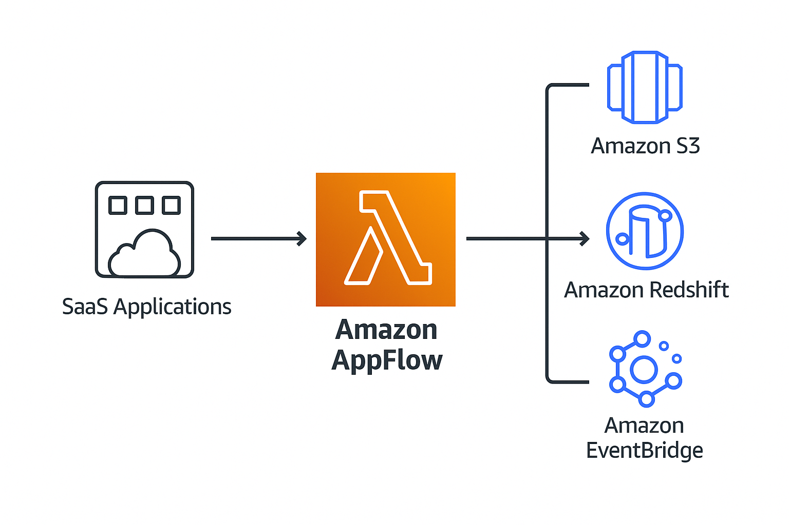
---


# 🌍 **GLOBAL CONTENT DELIVERY AND OPTIMIZATION**

## CloudFront Architecture

> *CloudFront is a Content Delivery network (CDN) within AWS.*
> 
> 
> *This lesson steps through the basic architecture*
> 

### CloudFront Terms

- **Origin:** The source location of your content
    - Used by behaviours as content sources
- **S3 Origin** or **Custom Origin**
- **Distribution:** The ‘**configuration**’ unit of CloudFront
- **Edge Location:** Local cache of your data
- **Regional Edge Cache**: Larger version of an edge location. Provides another layer of caching.
- **Behaviour:** Sits between origin and distribution
    - private (img/*)
    - default (*)
    - Part of distribution?

### CloudFront Architecture


## CloudFront Behaviors

> *CloudFront Behaviours control much of the TTL, protocol and privacy settings within CloudFront*
> 
- A distribution can have multiple behaviors, but have one default
    - Default used when nothing else matches

## CF TTL and Invalidations

- More frequent cache hits = lower origin load
- Default TLT (behavior) = **24 hours (validity period)**
- You can set Min TTL and Max TTL
- Per object TTL
    - Origin Header: **Cache-Control max-age** (seconds)
    - Origin Header: **Cache-Control s-maxage** (seconds)
    - Origin Header: **Expires** (Date & Time)
    - Custom Origin or S3 (Via **Object metadata**)
    - Default if not specified

### Cache Invalidations

- Cache invalidation - performed on a **distribution**
    - Applies to all edge locations - **take time**
- /images/whiskers1.jpg
- /images/whickers*
- /images/*
- /*
- Cache invalidations has the same cost regardless of number of hits
- **Versioned file names**: whiskers1_v1.jpg // _v2.jpg // _v3.jpg
    - Not S3 object versioning
    - **More cost effective!**
- 

## AWS Certificate Manager (ACM)

> *The AWS certificate Manager is a service which allows the creation, management and renewal of certificates. It allows deployment of certificates onto supported AWS services such as CloudFront and ALB.*
> 
- HTTP: Simple and Insecure
- HTTPS: SSL/TLS Layer of Encryption added to HTTP
    - Data is encrypted in-transit
- Certificates prove identity
- **Chain of trust** - Signed by a **trusted authority**
- ACM lets you run a **public** or **private** Certificate Authority (CA)
- **Private CA:** Applications need to trust your private CA
- **Public CA**: Browsers trust a list of providers, which can trust other providers (chain of trust)
- AVM can **generate** or **import** certifications
- If generated it can automatically renew
- If imported **you are responsible for renewal**
- Certificates can be deployed out to **supported services**
- Supported AWS Services ONLY (E.g. CloudFront and ALBs… NOT EC2)
- ACM is a **regional service**
- Certs **cannot leave the region they are generated or imported in**
- To use a cert with an ALB in ap-southeast-2 you need a cert in ACM in ap-southeast-2
- Global Services such as CloudFront **operate as though within us-east-1**

### Architecture


## CloudFront and SSL/TLS

💡 **❗Generate or import in ACM in us-east-1 to use with CloudFront❗**


- CloudFront Default Domain Name (CNAME)
- SSL supported by default - ***.cloudfront.net** cert
- **Alternate Domain Names** (CNAMES) e.g. cdn.catagram…
- Verify Ownership (optionally HTTPS) using a matching certificate
- HTTP or HTTPS, HTTP → HTTPS, HTTPS Only
- Two SSL Connections: Viewer → CloudFront and CloudFront → Origin
    - Both need valid public certifications (and intermediate certs)

### CloudFront and SNI

- Historically every SSL enabled site needed its own IP
- Encryption starts at the TCP connection
- Host headers happens after that: Layer 7 // Application
- Used to need multiple IPs for multiple sites if SSL enabled
- **SNI** is a **TLS extension**, allowing host to be included
- Resulting in many SSL Certs/Hosts using a shared IP
- **Old browsers don’t support SNI**: CF charges extra for dedicated IP
    - 600$ / month


## Origin Types and Architecture

> *CloudFront origins store content distributed via edge locations.*
> 
> 
> *The features available differ based on using S3 origins vs Custom origins*
> 

## Securing CF and S3 using OAI

> *Origin Access Identities are a feature where virtual identities can be created, associated with a CloudFront Distribution and deployed to edge locations.*
> 
> 
> *Access to an s3 bucket can be controlled by using these OAI's - allowing access from an OAI, and using an implicit DENY for everything else.*
> 
> *They are generally used to ensure no direct access to S3 objects is allowed when using private CF Distributions.*
> 
> *This lesson covers the main ways to secure origins from direct access (bypassing CloudFront)*
> 
> - *Origin Access identities (OAI) - for S3 Origins*
> - *Custom Headers - For Custom Origins*
> - *IP Based FW Blocks - For Custom Origins.*

### Origin Access Identity (OAI)

- An OAI is a type of identity
- It can be associated with CloudFront Distributions
- CloudFront ‘**becomes’** that OAI
- That OAI can be used in S3 Bucket Policies
- DENY all BUT one or more OAI’s


### Securing Custom Origins


## CloudFront Private Distributions & Behavior -  Signed URLs & Cookies

### Private Distributions (*behaviors)

- Public - Open Access to objects
- Private - Requests require Signed Cookie or URL
- 1 behavior - Whole Distribution PUBLIC or PRIVATE
- Multiple behaviors- each is PUBLIC or PRIVATE
- OLD way: A CloudFront Key is created by an Account Root User
    - Then account is added as a **TRUSTED SIGNER**
- **NEW:** **Trusted Key Groups** added

### CloudFront Signed URLs vs Cookies

- Signed URLs provides access to **one object**
- Historically RTMP distributions couldn’t use cookies
- Use URLs if your client doesn’t support cookies
- Cookies provides access to groups of objects
- Use for groups of files/all files of a type - e.g. all cat gifs
- Or if maintaining application URL’s is important

### Private Distributions


## ****Lambda@Edge****

> *Lambda@Edge allows cloudfront to run lambda function at CloudFront edge locations to modify traffic between the viewer and edge location and edge locations and origins.*
> 
- You can run **lightweight** Lambda at **edge locations**
- **Adjust** data between the **viewer** and **origin**
- Currently supports Node.js and Python
- Run in the AWS Public Space (Not VPC)
- **Layers** are not supported
- Different limits vs normal Lambda functions


### Lambda@Edge Use Cases

- A/B testing - **Viewer Request**
    - Modify image URL
- Migration between S3 Origins - **Origin Request**
- Different Object based on Device - **Origin Request**
- Content by Country - **Origin Request**

## AWS Global Accelerator

> *AWS Global Accelerator is designed to improve global network performance by offering entry point onto the global AWS transit network as close to customers as possible using ANycast IP addresses*
> 

### The Problem

- Starts in one area, grows popular and then receive lots of users from far-off locations
    - Latency
    - Multiple “hops”
    - Low quality connection

### Global Accelerator

- ❗When to use CF and when to use GA
- 2x **anycast** IP Addresses
    - 1.2.3.4 & 4.3.2.1
- **Anycast IPs** allow a single IP to be in multiple locations. Routing moves traffic to closest location
- Traffic initially uses **public internet** and enters a Global Accelerator edge location
- From the edge, data transits globally across the AWS global backbone network. Less hops, directly under AWS control, significantly better performance

### Key Concepts

- Moves the AWS network closer to customers
- **Connections enter at edge using anycast IPs**
- Transit over AWS backbone to 1+ locations
- Can be used for NON hTTP/S (TCP/UDP) - **DIFFERENCE FROM CLOUDFRONT**


---

## 🌐 **AWS Global Accelerator**

### ✅ Use Case:

* Improves performance for **TCP/UDP applications** over the public internet (e.g., APIs, web apps, gaming).
* Uses **static IPs** for global traffic distribution and failover.

### 🔑 Key Features:

* **Anycast IPs**: Single static IP routes user traffic to nearest AWS edge location.
* **Supports TCP/UDP**: Works for non-HTTP(S) workloads (e.g., gaming, VoIP, APIs).
* **Global failover**: Automatically reroutes to healthy endpoints in different Regions.
* **Regional endpoint routing**: Routes to ALBs, NLBs, EC2 instances, or EIPs.

---

## 📦 **Amazon CloudFront**

### ✅ Use Case:

* **Content delivery network (CDN)** for **HTTP/HTTPS static and dynamic content** (e.g., images, videos, HTML, APIs).
* Optimizes **caching** and latency for web applications.

### 🔑 Key Features:

* **Edge caching**: Reduces latency by serving cached content close to the user.
* **Origin servers**: S3, ALB, EC2, or custom origins.
* **SSL termination** and **WAF support**.
* Supports **signed URLs/cookies** for restricted access.

---

## 🆚 Comparison Table

| Feature                  | **Global Accelerator**             | **CloudFront**                    |
| ------------------------ | ---------------------------------- | --------------------------------- |
| **Primary purpose**      | Network performance optimization   | Content delivery (static/dynamic) |
| **Protocol support**     | TCP, UDP                           | HTTP, HTTPS                       |
| **Caching**              | ❌ No                               | ✅ Yes                             |
| **Use case example**     | Gaming server, global API gateway  | Video streaming, website assets   |
| **Latency optimization** | ✅ Yes (routing via edge locations) | ✅ Yes (caching at edge)           |
| **Static IPs**           | ✅ Yes                              | ❌ No                              |
| **Security**             | IAM, Shield, WAF (via ALB/NLB)     | IAM, CloudFront WAF, OAC/OAI      |
| **Geo routing**          | ✅                                  | ✅ (limited; mostly via Route 53)  |

---

## 📝 Summary

* Use **Global Accelerator** to **accelerate non-HTTP traffic**, ensure **global failover**, and use **static IPs** for your apps.
* Use **CloudFront** when serving **web content** (like images, JS, CSS, videos, APIs) and benefit from **caching** and **origin shielding**.

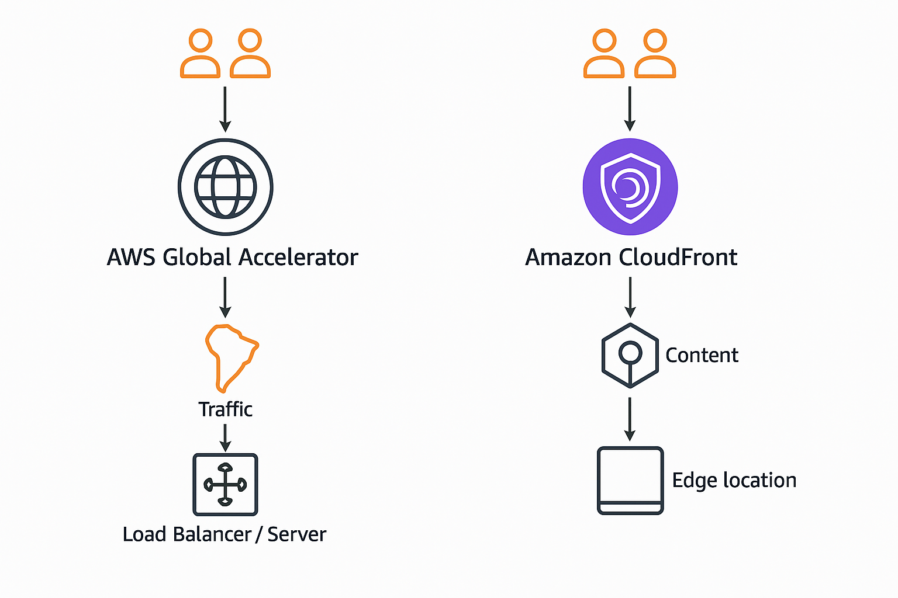
---
An **Origin Access Identity (OAI)** is a feature in Amazon CloudFront that enhances the security of your Amazon S3 content by restricting direct public access. Instead of allowing users to access your S3 bucket directly, OAI ensures that only CloudFront can retrieve content from your S3 origin.([Orca Security][1], [CloudDefense.AI][2])

---

### 🔐 What Is an Origin Access Identity (OAI)?

An OAI is a special CloudFront user that you associate with your distribution. By updating your S3 bucket policy to grant read permissions solely to this identity, you prevent users from bypassing CloudFront and accessing your content directly via S3 URLs. This setup ensures that all access to your S3 content goes through CloudFront, allowing you to leverage its caching, logging, and access control features .([Scaler][3])

---

### ✅ Benefits of Using OAI

* **Enhanced Security**: Blocks unauthorized direct access to your S3 bucket.
* **Access Control**: Ensures that only CloudFront can fetch content from your S3 origin.
* **Prevention of Hotlinking**: Stops others from embedding your assets directly via S3 URLs.
* **Improved Content Delivery**: Leverages CloudFront's caching and distribution capabilities for faster content delivery.([Orca Security][1])

---

### ⚠️ Transition to Origin Access Control (OAC)

While OAI has been instrumental in securing S3 origins, AWS has introduced **Origin Access Control (OAC)** as its successor. OAC offers enhanced security features and broader functionality:([Amazon Web Services, Inc.][4])

* **Support for All AWS Regions**: Including newer opt-in regions.
* **Integration with SSE-KMS**: Supports Amazon S3 server-side encryption with AWS KMS.
* **Dynamic Request Support**: Handles HTTP methods like PUT, POST, and DELETE.
* **Improved Security Practices**: Utilizes short-term credentials and frequent rotations .([AWS Documentation][5], [Amazon Web Services, Inc.][4])

AWS recommends migrating from OAI to OAC to take advantage of these features and to future-proof your content delivery setup .

---


# 🪐 ADVANCED VPC Networking

## VPC Flow Logs

> *VPC Flow logs is a feature allowing the monitoring of traffic flow to and from interfaces within a VPC*
> 
> 
> *VPC Flow logs can be added at a VPC, Subnet or Interface level.*
> 
> *Flow Logs DON'T monitor packet contents ... that requires a packet sniffer.*
> 
> *Flow Logs can be stored on S3 or CloudWatch Logs*
> 
- Capture **metadata** (not content)
    - Source/dest IP, ports, protocol, action (e.g. ACCEPT), etc…
- Attached to a VPC/Subnet/ENI - All ENIs in that VPC
- Subnet - All ENIs in that subnet
- ENIs directly
- Flow Logs are NOT realtime
- Log Destinations - S3 or CloudWatch Logs
- Or Athena for querying

### Architecture


## Egress-Only Internet Gateway

> *Egress-Only internet gateways allow outbound (and response) only access to the public AWS services and Public Internet for IPv6 enabled instances or other VPC based services.*
> 
- With IPv4 addresses are private or public
- **NAT** allows **private IPs** to access public networks
    - without allowing externally initiated connections (IN)
- With IPv6 all IPs are public
- Internet Gateway (IPv6) allows all IPs IN and OUT
- Egress-Only is **outbound-only** for **IPv6**

### Architecture


## VPC Endpoints (Gateway)

> *Gateway endpoints are a type of VPC endpoint which allow access to S3 and DynamoDB without using public addressing.*
> 
> 
> *Gateway endpoints add 'prefix lists' to route table, allowing the VPC router to direct traffic flow to the public services via the gateway endpoint.*
> 
- Provide **private access** to **S3** and **DynamoDB**
- **Prefix List** added to **route table** → Gateway Endpoint
- Highly Available across all AZs in a region by default
- Endpoint policy is used to control what it can access
- Regional - **can’t access cross-region services**
- **Prevent Leaky Buckets** - S3 Buckets can be set to private only by allowing access ONLY from a gateway endpoint


### Architecture


## ****VPC Endpoints (Interface)****

> *Interface endpoints are used to allow private IP addressing to access public AWS services.*
> 
> 
> *S3 and DynamoDB are handled by gateway endpoints - other supported services are handled by interface endpoints.*
> 
> *Unlike gateway endpoints - interface endpoints are not highly available by default - they are normal VPC network interfaces and should be placed 1 per AZ to ensure full HA.*
> 
- Provide **private access** to AWS Public Services
- Historically anything NOT S3 and DDB - but S3 is now supported
- Added to **specific subnets** - an ENI - not HA
- For HA - add one endpoint, to one subnet, per AZ used in the VPC
- Network access controlled via **Security Groups**
- **Endpoint Policies** - restrict what can be done with the endpoint
- **TCP** and **IPv4** Only
- Uses **PrivateLink**
- **Interface endpoints use DNS**
- Endpoint provides a NEW service endpoint DNS
    - e.g. vpce-123-xyz.sns.us-east-1.vpce.amazonaws.com
- Endpoint **regional DNS**
- Endpoint **Zonal DNS**
- Applications can optionally use these or
- **PrivateDNS overrides** the **default DNS for services**
---
**VPC Endpoints** in AWS allow private connections between your Virtual Private Cloud (VPC) and supported AWS services or VPC endpoint services **without requiring an internet gateway, NAT device, VPN connection, or AWS Direct Connect**. They improve security and reduce exposure to the internet.

There are **two main types of VPC endpoints**:

---

### 1. **Interface Endpoint**

* **Definition**: An elastic network interface (ENI) with a private IP from your subnet that serves as an entry point.
* **Use case**: For services like **S3**, **DynamoDB**, **Secrets Manager**, **SSM**, etc.
* **Traffic**: Stays entirely within AWS using **PrivateLink**.
* **Supports**: Most AWS services and custom services.

**Example**:

```bash
aws ec2 create-vpc-endpoint \
  --vpc-id vpc-12345678 \
  --service-name com.amazonaws.us-east-1.secretsmanager \
  --vpc-endpoint-type Interface \
  --subnet-ids subnet-abc123 subnet-def456 \
  --security-group-ids sg-7890abcd
```

---

### 2. **Gateway Endpoint**

* **Definition**: A gateway target that is routed via route tables.
* **Use case**: Only for **Amazon S3** and **DynamoDB**.
* **Traffic**: Handled at the VPC level using route table entries.
* **Cost-effective**: No per-hour charges.

**Example**:

```bash
aws ec2 create-vpc-endpoint \
  --vpc-id vpc-12345678 \
  --service-name com.amazonaws.us-east-1.s3 \
  --vpc-endpoint-type Gateway \
  --route-table-ids rtb-1234abcd
```

---

### Benefits of VPC Endpoints

* No need for NAT gateways or internet gateways.
* More secure access to AWS services.
* Reduced latency and cost.
---

### Architecture


## VPC Peering

> *VPC peering is a software define and logical networking connection between two VPC's*
> 
> 
> *They can be created between VPCs in the same or different accounts and the same or different regions.*
> 
> *In this lesson I step through the architectural key points which you'll need to understand for the exam and real world usage.*
> 
- Direct encrypted network link between **two VPCs (ONLY TWO!)**
- Works **same/cross-region** and **same/cross-account**
- **Optional: Public hostnames resolve to private IPs**
- Same region SG’s can reference peer SG’s
- VPC Peering does NOT support transitive peering
    - If A→B and B→C, NOT A→C
- Routing configuration is needed, SG’s & NACLs can filter

### Architecture


---
**VPC Peering** in AWS enables you to **connect two Virtual Private Clouds (VPCs)** to route traffic between them privately using AWS’s internal network.

---

### 🔧 **Key Characteristics**

* **Private communication**: No public internet; traffic stays within AWS.
* **One-to-one relationship**: Peering is between **two VPCs** only.
* **Same or different AWS accounts/regions**.
* **Transitive routing not supported**: If VPC-A is peered with VPC-B, and B with C, A **cannot** access C.
* **Uses route tables**: You must update route tables in both VPCs to enable communication.

---

### ✅ **Use Cases**

* Connecting microservices across different VPCs.
* Accessing shared resources (databases, APIs) from another VPC.
* Isolating environments (dev/stage/prod) while enabling secure communication.

---

### 🔒 **Security**

* No overlapping CIDR blocks allowed.
* Security groups and NACLs still apply.
* No DNS resolution across VPCs by default (can be enabled for intra-region peering).

---

### 🔄 **Alternatives**

* **Transit Gateway** (hub-and-spoke model, supports thousands of VPCs).
* **PrivateLink** (for exposing services across VPCs without full peering).

---
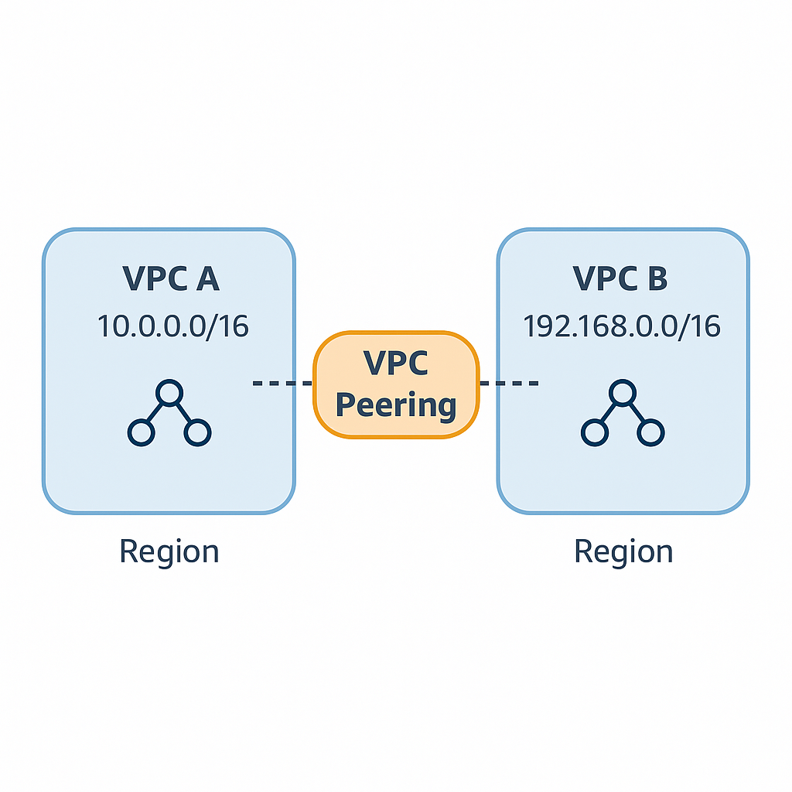
---


# 🏞️ Hybrid Environments and Migration

## Border Gateway Protocol 101

> *This lesson provides a high level introduction to the Border Gateway Protocol (BGP) which is used by some AWS services such as Direct Connect and Dynamic Site to Site VPNs.*
> 
- Autonomous System (**AS**) - Routers controlled by one entity - a network in BGP
- **ASN** are unique and allocated by IANA (0-65535), 64512-65534 are private
- BGP operates over tcp/179 - it’s reliable
- **Not automatic** - peering is **manually configured**
- BGP is a **path-vector protocol** it exchanges the **best path** to a destination between **peers** - the path is called the **ASPATH**
- **iBGP** = Internal BGP - Routing within an AS
- **eBGP** = External BGP - Routing between AS


## IPSec VPN Fundamentals

> *IPsec VPN negotiation occurs in two phases. In Phase 1, participants establish a secure channel in which to negotiate the IPsec security association (SA). In Phase 2, participants negotiate the IPsec SA for authenticating traffic that will flow through the tunnel.*
> 
- IPSEC is a group of protocols
- It sets up **secure tunnels** across **insecure networks** between **two peers** (local and remote)
- Provides authentication and encryption


- Remember - **symmetric encryption** is fast, but it’s a challenge to exchange keys securely
- **Asymmetric encryption** is slow, but you can easily exchange public keys
- IPSEC har two main phases
    - **IKE PHASE 1** (Slow and heavy)
        - Authenticate: Pre-shared key (password) / cert
        - Using asymmetric encryption to agree on, and create a shared symmetric key
        - IKE SA Created (phase 1 tunnel)
    - **IKE PHASE 2** (Fast and agile)
        - Uses the keys agreed in phase 1
        - Agree encryption method, and keys used for bulk data transfer
        - Create IPSEC SA - phase 2 tunnel (architecturally running over phase 1)

### Policy-Based VPNs

- **Rele sets** match traffic → a pair of SAa
- Different rules/security settings

### Route-Based VPNs

- Target matching (prefix)
- Matches a single pair of SA’a

### IKE Phase 1 Architecture


### IKE Phase 2 Architecture


### Route vs Policy Based


## AWS Site-to-Site VPN

> *AWS Site-to-Site VPN is a hardware VPN solution which creates a highly available IPSEC VPN between an AWS VPN and external network such as on-premises traditional networks. VPNs are quick to setup vs direct connect, don't offer the same high performance, but do encrypt data in transit.*
> 
- A logical connection between a VPC and on-premises network encrypted using IPSec, running over the **public internet**
- Full HA - if you design and implement it correctly
- ❗Quick to provision - **less than an hour!**
- Virtual Private Gateway (**VGW**)
- Customer Gateway (**CGW**)
- VPN Connection between the **VGW** and **CGW**

### VPN Considerations

- Speed Limitations ~**1.25 Gbps**
- Latency - **inconsistent, public internet**
- Cost - AWS hourly cost, GB out cost, data cap (on premises)
- Speed of setup - **hours** - all software configuration
- Can be used as a backup for Direct Connect (**DX**)
- Can be used with Direct Connect

### Static vs Dynamic VPN (BGP)

- Dynamic VPN uses BGP


### Architecture Partial HA


### Architecture HA


## Direct Connect (DX) Concepts

> *AWS Direct Connect links your internal network to an AWS Direct Connect location over a standard Ethernet fiber-optic cable. One end of the cable is connected to your router, the other to an AWS Direct Connect router. With this connection, you can create virtual interfaces directly to public AWS services (for example, to Amazon S3) or to Amazon VPC, bypassing internet service providers in your network path. An AWS Direct Connect location provides access to AWS in the Region with which it is associated. You can use a single connection in a public Region or AWS GovCloud (US) to access public AWS services in all other public Regions.*
> 
- A physical connection (1, 10 or 100 Gbps)
- Business Premises → DX Location → AWS Region
- Port Allocation at a DX Location
- Port hourly cost & outbound data transfer (inbound is free of charge)
- Provisioning time - physical cables & no resilience
- Low & consistent latency + High speeds ⚡
- AWS Private Services (VPCs) and AWS Public Services - **NO INTERNET**
- **❗DX is NOT ENCRYPTED ❗**

### DX Architecture


## Direct Connect (DX) Resilience

> *This lesson steps through the architecture of a few resilient implementations of direct connect, starting with an overview of why the default implementation architecture of direct connect provides no resilience.*
> 

💡 **DX is a physical technology!**


### Good


### GREAT


---
**AWS Direct Connect** is a **dedicated network connection** that links your on-premises infrastructure directly to AWS, bypassing the public internet.

---

### 🚀 **Key Features**

* **Private Connectivity**: Secure, consistent performance—avoids internet congestion.
* **High Bandwidth**: Supports connections from **50 Mbps up to 100 Gbps**.
* **Low Latency**: Ideal for real-time, high-throughput workloads.
* **Hybrid Cloud Integration**: Seamless integration with AWS VPCs, Transit Gateways, etc.

---

### 🧩 **Components**

* **Direct Connect Location**: AWS-owned colocation facility where your router connects to AWS router.
* **Virtual Interface (VIF)**:

  * **Public VIF**: Access AWS services (S3, DynamoDB, etc.).
  * **Private VIF**: Access your VPCs directly.
* **Link Aggregation Group (LAG)**: Combine multiple connections for increased bandwidth and redundancy.

---

### ✅ **Use Cases**

* Consistent performance for **financial services**, **media streaming**, or **large data transfers**.
* Securely connect **on-prem data centers** to AWS for hybrid cloud setups.
* Compliance-sensitive workloads requiring **private network paths**.

---

### 🆚 Compared to VPN:

| Feature     | **AWS Direct Connect**  | **VPN over Internet**          |
| ----------- | ----------------------- | ------------------------------ |
| Performance | High, consistent        | Variable                       |
| Latency     | Low                     | Higher                         |
| Security    | Physical isolation      | Encrypted over public internet |
| Setup Time  | Longer (physical setup) | Quick                          |
| Cost        | Higher (dedicated line) | Lower                          |
---
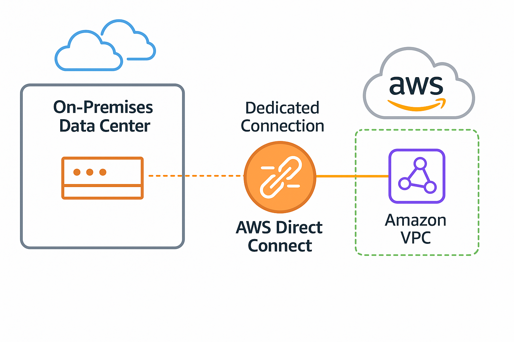
---
## AWS Transit Gateway (TGW)

> *The AWS Transit gateway is a network gateway which can be used to significantly simplify networking between VPC's, VPN and Direct Connect.*
> 
> 
> *It can be used to peer VPCs in the same account, different account, same or different region and supports transitive routing between networks.*
> 
- **Network Transit Hub** to connect VPCs to on premises networks
- Significantly reduces network complexity
- Single network object - HA and Scalable
- **Attachments** to other network types
- **VPC, Site-to-Site VPN** & **Direct Connect Gateway**

### TGW Considerations

- ❗**Supports transitive routing!**
- Can be used to create global networks
- Share **between accounts using AWS RAM**
- Peer with different regions - same or cross account
- **Less complexity** vs without TGW

### Architecture


---
**AWS Transit Gateway** is a networking service that enables you to **connect multiple VPCs and on-premises networks** through a central hub.

---

### 🚦 **Key Features**

* **Centralized Hub**: Acts as a transit router to simplify network architecture.
* **Scalable**: Connect thousands of VPCs and VPNs.
* **High Performance**: Uses AWS backbone, ensuring high throughput and low latency.
* **Resource Sharing**: Supports cross-account VPC attachments using Resource Access Manager (RAM).
* **Multicast Support**: Useful for streaming, video, and real-time use cases.

---

### 🧩 **Core Components**

* **Attachments**: Connects to VPCs, Direct Connect gateways, or VPNs.
* **Route Tables**: Determines how traffic flows between attachments.
* **Transit Gateway Peering**: Connects TGWs across AWS Regions.

---

### ✅ **Use Cases**

* **Centralized routing** between thousands of VPCs.
* **Hybrid cloud** setups (e.g., VPC + on-prem).
* **Multi-account architecture** in large enterprises.
* Replacement for complex **VPC peering mesh**.

---

### 🆚 Transit Gateway vs VPC Peering

| Feature            | **Transit Gateway**       | **VPC Peering**                   |
| ------------------ | ------------------------- | --------------------------------- |
| Scalability        | Thousands of VPCs         | 1:1 peering only                  |
| Management         | Centralized               | Decentralized (manual per VPC)    |
| Transitive Routing | Supported                 | Not supported                     |
| Cost               | Additional charges per GB | No additional data processing fee |
---
## Direct Connect, VPC Peering, Transit Gateway
| Feature                   | **AWS Direct Connect**             | **VPC Peering**                          | **Transit Gateway**                           |
| ------------------------- | ---------------------------------- | ---------------------------------------- | --------------------------------------------- |
| **Purpose**               | Dedicated line from on-prem to AWS | Connect 2 VPCs privately                 | Centralized hub to connect many VPCs/VPNs     |
| **Connectivity Type**     | On-prem → AWS (Layer 2)            | VPC ↔ VPC (1-to-1)                       | VPCs, VPNs, DX Gateways (many-to-many)        |
| **Transitive Routing**    | Not applicable                     | ❌ Not supported                          | ✅ Supported                                   |
| **Scalability**           | 1:1 or via Direct Connect Gateway  | Low (manual setup for each pair)         | High (thousands of VPCs)                      |
| **Performance**           | Very high (low latency, dedicated) | Good (within AWS network)                | High (uses AWS backbone)                      |
| **Cross-Region Support**  | ✅ Yes (via Direct Connect Gateway) | ✅ Yes (but manual and limited)           | ✅ Yes (via TGW peering)                       |
| **Encryption**            | ❌ No (needs VPN or IPsec on top)   | ✅ Yes (optional with VPN/IPSec)          | ✅ Yes (via VPN attachments if needed)         |
| **Management Complexity** | Moderate (requires physical setup) | High (many connections for full mesh)    | Low (centralized management)                  |
| **Cost**                  | High (physical line charges)       | No extra charges (beyond normal traffic) | Per-GB data processing cost + attachment fees |
---
## Storage Gateway - Volume

> *Storage gateway is a product which integrates local infrastructure and AWS storage such as S3, EBS Snapshots and Glacier.*
> 
- **Virtual machine** (or **hardware appliance**)
- Presents storage using **iSCSI, NFS or SMB**
- Integrates with **EBS, S3 and Glacier** within AWS
- **Migrations, extensions, storage tiering, DR** and replacement of **backup systems**
- For the exam: Picking the right mode

### Storage GW Volume: Stored

- Primary location of data is on-prem


### Storage GW Volume: Cached

- Primary location of data is AWS (S3)

## Storage Gateway Tape - VTL Mode

> *Storage gateway in VTL mode allows the product to replace a tape based backup solution with one which uses S3 and Glacier rather than physical tape media.*
> 
- Large backups → Tape
    - LTO-9 Media can hold 24TB Raw data (up to 60GB compressed)
- 1 tape drive can use 1 tape at a time
- **Loaders** (Robots) can swap tapes
- A **library** is 1+ **drive(s),** 1+ **loader(s)** and **slots**
- Drive - library - shelf (anywhere but the library)


## Storage Gateway - File Mode

> *File gateway bridges local file storage over NFS and SMB with S3 Storage.*
> 
> 
> *It supports multi site, maintains storage structure, integrates with other AWS products and supports S3 object lifecycle Management*
> 
- Bridges on-premises **file** storage and **S3**
- Mount Points (shares) available via **NFS or SMB**
- Map directly onto an **S3 bucket**
- **Files stored** into a **mount point**, are visible as objects in an **S3 bucket**
- Read and Write Caching ensure LAN-like performance

### Architecture: Two-side


### Architecture: Multiple Contributors


### Architecture: Multiple Contributors and Replication


---
**AWS Storage Gateway** is a hybrid cloud storage service that enables your **on-premises applications** to access **AWS cloud storage seamlessly**, using industry-standard protocols.

---

### 🧩 **Types of Storage Gateways**

| Gateway Type       | Purpose                                                              | Use Case Example                             |
| ------------------ | -------------------------------------------------------------------- | -------------------------------------------- |
| **File Gateway**   | Store files as objects in S3, accessible via **NFS/SMB**             | Backup NAS to S3, archive documents          |
| **Tape Gateway**   | Virtual tape library that stores data in **S3 Glacier/Deep Archive** | Replace physical tape backups                |
| **Volume Gateway** | Cloud-backed iSCSI block storage. Two modes:                         |                                              |
| - Cached Volumes   | Frequently accessed data is local, rest in AWS                       | Expand on-prem storage with cloud elasticity |
| - Stored Volumes   | All data stored locally, with backups to AWS                         | On-prem performance, cloud durability        |

---

### ⚙️ **Key Features**

* **Local caching**: Reduces latency for active data.
* **Integrated with AWS Backup**: Centralized backup management.
* **Encrypted and compressed** data transfer.
* **Seamless failover** for disaster recovery.

---

### ✅ **Use Cases**

* Hybrid cloud backups.
* Offsite archiving and compliance.
* Extending local storage capacity without buying hardware.
* Simplifying legacy tape-based workflows.

---
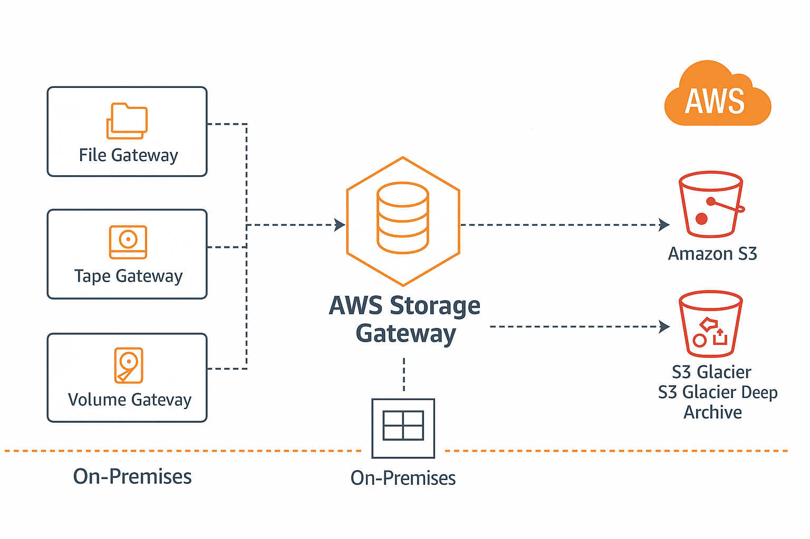
---
## Snowball & Snowmobile

> *Snowball, Snowball Edge and Snowmobile are three parts of the same product family designed to allow the physical transfer of data between business locations and AWS.*
> 

### Key Concepts

- Move large amount of data **IN & OUT** of AWS
- Physical storage - **suitcase** or **truck**
- Ordered from AWS **Empty, Load up, Return**
- Ordered from AWS **with data, empty & Return**
- For exam: Which to use!

### Snowball

- Ordered from AWS, Log a Job, Device Delivered (not instant)
- Data Encryption uses KMS
- **50TB or 80TB capacity**
- 1 Gbps (RJ45 GBase-TX) or 10Gbps (LR/SR) Network
- **10TB to 10PB** economical range (**multiple devices**)❗
- Multiple devices to **multiple premises** ❗
- Only storage ❗

### Snowball Edge

- Both **storage and compute** ❗
- **Larger capacity** vs Snowball
- 10Gbps (RJ45), 10/25 (SFP), 45/50,100 Gbps (QSFP+)
- **Storage Optimized** (with EC2) - 80TB, 24 vCPU, 32 Gib RAM, 1TB SSD
- **Compute Optimized** - 100TB + 7.68 NVME, 52 vCPU and 208 GiB RAM
- **Compute with GPU -** As above - **with GPU!**
- Ideal for remote sites or where data processing on ingestion is needed

### Snowmobile

- Portable DC within a shipping container on a **truck** ❗
- Special order
- Ideal for single location when **10PB+** is required ❗
- Up to **100PB per snowmobile**
- Not economical for **multi-site** (unless huge) or sub **10PB** ❗
- LITERALLY A TRUCK
---
| Feature     | Snowball      | Snowball Edge           | Snowmobile         |
| ----------- | ------------- | ----------------------- | ------------------ |
| Capacity    | \~80 TB       | Up to 210 TB            | Up to 100 PB       |
| Compute     | ❌             | ✅ (EC2, Lambda)         | ❌                  |
| Use Case    | Bulk transfer | Edge compute, migration | Data center move   |
| Form Factor | Device        | Device with compute     | Shipping container |
| Delivery    | Courier       | Courier                 | Semi-truck         |

---
## AWS Directory Service

> *The Directory service is a product which provides managed directory service instances within AWS*
> 
> 
> *it functions in three modes*
> 
> - *Simple AD - An implementation of Samba 4 (compatibility with basics AD functions)*
> - *AWS Managed Microsoft AD - An actual Microsoft AD DS Implementation*
> - *AD Connector which proxies requests back to an on-premises directory.*

### What’s a Directory?

- Stores **objects** (e.g. Users, Groups, Computers, Servers, File Shares) with a **structure** (domain/tree)
- Multiple trees can be grouped into a **forest**
- Commonly used in **Windows Environments**
- Sign-in to multiple devices with the same username/password provides centralized management for assets
    - Microsoft Active Directory Domain Services (**AD DS**)
- AF FD most popular, open-source alternatives (**SAMBA)**

### What is Directory Service?

- **AWS Managed** implementation
- Runs within a **VPC**
- To implement **HA** - deploy into **multiple AZs**
- Some AWS services NEED a directory, e.g. **Amazon Workspaces**
- Can be **isolated** or **integrated** with existing **on-premises system**
    - Or act as a ***proxy*** back to on-premises

### Simple AD Mode Architecture

- Simple AD ↔ SAMBA 4


### AWS Managed Microsoft AD Architecture


### AD Connector Architecture


### Picking Between Modes

- ❗ **Simple AD should be default** ❗
- **Microsoft AD** - Applications in AWS which need **MS AD DS**, or you need to **TRUST AD DS**
- **AD Connector** - Use AWS Services which need a directory **without storing any directory info in the cloud** - proxy to your on-premises Directory
---
| **Directory Type**           | **Description**                                                                                                                 | **Key Features**                                                                                   | **Use Cases**                                                    |
| ---------------------------- | ------------------------------------------------------------------------------------------------------------------------------- | -------------------------------------------------------------------------------------------------- | ---------------------------------------------------------------- |
| **AWS Managed Microsoft AD** | Fully managed Microsoft Active Directory in the cloud, similar to on-premises AD. AWS handles setup, patching, and maintenance. | - Supports full AD features like group policies, organizational units, domain trust relationships. | - Extending on-prem AD to the cloud.                             |
|                              |                                                                                                                                 | - Seamless integration with AWS services like Amazon WorkSpaces, RDS, FSx.                         | - Running applications requiring AD features.                    |
| **Simple AD**                | Managed, cost-effective directory service based on Samba 4, offering basic AD capabilities for smaller environments.            | - Compatible with AWS services like Amazon WorkSpaces, Amazon RDS.                                 | - Small-scale environments or simpler directory needs.           |
|                              |                                                                                                                                 | - Lower cost compared to AWS Managed Microsoft AD.                                                 | - Basic Active Directory requirements.                           |
| **AD Connector**             | A proxy service that connects your AWS resources to an existing on-premises Microsoft AD.                                       | - No directory replication, acts as a proxy.                                                       | - Integrating AWS resources with on-premises AD.                 |
|                              |                                                                                                                                 | - Provides authentication to AWS applications using on-premises AD credentials.                    | - Hybrid environments where you want to keep the AD on-premises. |

---
## AWS DataSync

> *AWS DataSync is a product which can orchestrate the movement of large scale data (amounts or files) from on-premises NAS/SAN into AWS or vice-versa*
> 
- Data Transfer service **TO/FROM** AWS
- **Migrations, Data Processing Transfers, Archival/Cost Effective Storage or DR/BC**
- Designed to work at **huge scale**
- Keeps **metadata** (e.g. permissions/timestamps)
- Built in **data validation**

### Key Features

- **Scalable** - 10Gbps per agent (~100TB per day)
- **Bandwidth Limiters** (avoid link saturation)
- **Incremental** and **scheduled** transfer options
- **Compression** and **encryption**
- **Automatic recovery** from transit errors
- AWS **Service integration** - S3, EFS, FSx
- Pay as you use - per GB cost for data moved

### Architecture


### DataSync Components

- **Task** - A “job” within DataSync. Defines what is being synced, how quickly, FROM where and TO where
- **Agent** - Software used to **read/write** to on-premises data stores using **NFS** or **SMB**
- **Location** - every task has two locations (TO/FROM). E.g. NFS, Server Message Block (SMB), Amazon EFS, Amazon FSx and S3
---
AWS DataSync is a fully managed data transfer service designed to automate and accelerate the movement of large amounts of data between on-premises storage and AWS storage services, or between different AWS services. It supports both file-based and object-based data transfers.

Here's a table summarizing the key features and use cases for AWS DataSync:

| **Feature**                     | **Description**                                                                                    | **Supported Data Sources/Targets**                                | **Use Cases**                                                 |
| ------------------------------- | -------------------------------------------------------------------------------------------------- | ----------------------------------------------------------------- | ------------------------------------------------------------- |
| **Automated Data Transfer**     | Simplifies and automates large-scale data migrations.                                              | - On-premises storage (e.g., NFS, SMB, HDFS)                      | - Data migrations to AWS (e.g., to Amazon S3, EFS, FSx).      |
| **High-speed Transfer**         | Optimized for high-speed data transfers, typically 10x faster than traditional methods like rsync. | - Amazon S3, Amazon EFS, Amazon FSx, Amazon S3 Glacier            | - Disaster recovery and backup scenarios.                     |
| **File and Object Transfer**    | Supports both file-based (NFS, SMB) and object-based (S3) data transfer.                           | - On-premises servers, AWS S3, Amazon EFS, Amazon FSx             | - Data archiving and moving large datasets.                   |
| **Data Synchronization**        | Can continuously sync data between your on-premises systems and AWS storage.                       | - Continuous synchronization between on-premises and AWS targets. | - Hybrid cloud environments with real-time or scheduled sync. |
| **Security and Encryption**     | Supports encryption in transit and at rest, ensuring secure data transfers.                        | - AES-256 encryption for data in transit and at rest.             | - Secure data migrations and transfers.                       |
| **Data Integrity & Validation** | Includes built-in data integrity checks to ensure accurate transfers.                              | - Validates file integrity during transfer.                       | - Ensuring data consistency during migrations.                |
| **Cost-effective**              | Pay only for the amount of data transferred and the duration of the transfer.                      | - No upfront fees, charges based on data volume.                  | - Cost-efficient large data migrations and backups.           |
| **Scheduling & Monitoring**     | Allows for scheduling, monitoring, and logging of transfers for visibility and auditing.           | - AWS CloudWatch integration for monitoring.                      | - Automated data migration with monitoring and logging.       |

### **Common Use Cases**:

1. **Data Migration**: Migrate large volumes of data from on-premises storage to AWS (e.g., Amazon S3, EFS, FSx).
2. **Backup and Disaster Recovery**: Sync data from on-premises systems to AWS storage to ensure it’s always backed up and ready for recovery.
3. **Data Archiving**: Move large datasets to cost-effective storage solutions like Amazon S3 Glacier.
4. **Hybrid Cloud**: Synchronize and manage data between on-premises and cloud environments for hybrid cloud use cases.

### **Supported Storage Services**:

* **On-premises**: NFS, SMB, HDFS.
* **AWS Cloud**: Amazon S3, Amazon EFS, Amazon FSx, Amazon S3 Glacier.
---
## FSx for Windows File Server

> *FSx for Windows Servers provides a native windows file system as a service which can be used within AWS, or from on-premises environments via VPN or Direct Connect*
> 
> 
> *FSx is an advanced shared file system accessible over **SMB(Server Message Block)**, and integrates with Active Directory (either managed, or self-hosted).*
> 
> *It provides advanced features such as VSS, Data de-duplication, backups, encryption at rest and forced encryption in transit.*
> 
- Fully managed **native windows** file servers/shares
- Designed for **integration** with **windows environments**
- Integrates with **Directory Service or Self-Managed AD**
- **Single** or **Multi-AZ** within a VPC
- **On-demand** and **Scheduled** backups
- Accessible using **VPC, Peering, VPN, Direct Connect**
- ❗Exam job: When to use FSx and when to use EFS ❗
---
### Common Use Cases:

* **Lift-and-Shift Windows-based Applications**: Migrate on-premises Windows workloads to AWS without needing to rewrite applications.
* **Shared File Storage for Windows Applications**: Provide shared file storage for applications running on Windows instances.
* **Backup and Disaster Recovery**: Create backups of your file systems and use them for disaster recovery purposes.
---
Here's a comparison of **Amazon FSx for Windows File Server** (FSx) and **Amazon Elastic File System** (EFS) (**When to use FSx and when to use EFS**):
---

| Feature/Aspect                     | **Amazon FSx for Windows File Server (FSx)**                                                                 | **Amazon Elastic File System (EFS)**                                                                     |
| ---------------------------------- | ------------------------------------------------------------------------------------------------------------ | -------------------------------------------------------------------------------------------------------- |
| **Protocol Support**               | SMB (Server Message Block), compatible with Windows-based applications                                       | NFS (Network File System), compatible with Linux-based applications                                      |
| **Operating System Compatibility** | Primarily for **Windows** workloads                                                                          | Primarily for **Linux**, but can be mounted by Windows and macOS clients                                 |
| **Performance & Scalability**      | High performance with configurable throughput and IOPS                                                       | Elastic scalability, automatically scales with usage                                                     |
| **Use Cases**                      | - Windows file shares<br>- Active Directory integration<br>- High-performance Windows workloads              | - Shared file system for Linux workloads<br>- Web servers, CMS<br>- Containerized applications (ECS/EKS) |
| **Active Directory Integration**   | Native AD integration for file access control                                                                | No native AD support (can integrate with AWS Managed AD for access control)                              |
| **Data Protection & Availability** | - Multi-AZ high availability<br>- Automated backups<br>- Data replication                                    | - Multi-AZ high availability<br>- Cross-region replication<br>- Backup support                           |
| **Cost Considerations**            | Higher cost, based on storage capacity and performance options                                               | Cost-effective, based on storage usage with two storage classes (Standard & IA)                          |
| **Security**                       | - Windows-style ACLs for security<br>- KMS encryption at rest and in transit                                 | - IAM for access control<br>- KMS encryption at rest and in transit                                      |
| **Performance Features**           | Configurable throughput, high IOPS, ideal for large Windows workloads                                        | Best suited for applications needing high concurrency and elasticity                                     |
| **Typical Applications**           | - Windows enterprise applications<br>- Database-driven workloads<br>- File-sharing for Windows EC2 instances | - Web hosting<br>- Content management systems<br>- Big data/analytics<br>- Containerized applications    |
| **Integration with AWS Services**  | Works with AWS services but optimized for Windows workloads                                                  | Works seamlessly with ECS, EKS, Lambda, and Linux-based workloads                                        |
| **Backup & Disaster Recovery**     | Supports backup, snapshots, and disaster recovery configurations                                             | Supports backup, snapshots, and cross-region replication for resilience                                  |
| **Access Control**                 | Managed via **Active Directory** and Windows ACLs                                                            | Managed via **IAM** and NFS permissions                                                                  |
---
### When to Use **FSx**:

* Windows-based applications that require **SMB protocol** and **Active Directory** integration.
* **High-performance Windows workloads** needing high throughput and low-latency file access.

### When to Use **EFS**:

* **Linux-based applications** or workloads that require a **shared file system**.
* Scalable storage needs, particularly for **web servers**, **containerized applications**, or workloads with high concurrency.

---
### Architecture


### FSx Key Features and Benefits

- **VSS**: User-Driven Restores
- ❗Native file system accessible over **SMB** ❗
- ❗**Windows permission model**❗
- Supports **DFS** - scale-out file share structure
- Managed - no file server admin
- ❗Integrates with **DS** AND **your own** directory ❗

## FSx for Lustre

> *FSx for Lustre is a managed file system which uses the FSx product designed for high performance computing*
> 
> 
> *It delivers extreme performance for scenarios such as Big Data, Machine Learning and Financial Modeling*
> 
- Managed **Lustre** - Designed for **HPC - Linux** clients (**POSIX)**
- **Machine Learning, Big Data, Financial Modeling**
- 100’s **GB/s** throughput and sub millisecond latency
- Deployment types: **Persistent** or **Scratch**
- **Scratch:** Highly optimized for **short term** no replication & fast
- **Persistent:** **Longer term, HA (in one AZ), self-healing**
- Accessible over **VPN** or **Direct Connect**
- Metadata stored on Metadata Targets (**MST**)
- Objects are stored on called object storage target s(**OSTs**) (**1.17TiB**)
- **Baseline** performance based on size
- Size - min **1.2TiB** then increments of **2.4TiB**
- For **Scratch:** Base **200 MB/s** per **TiB** of storage
- **Persistent** offers **50 MB/s, 100MB/s and 200 MB/s per TiB** of storage
- Burst up to **1300 MB/s** per TiB (credit system)

### Key Points

- Scratch is designed for **pure performance**
    - **Short term or temp workloads**
    - NO HA - NO REPLICATION
    - **Larger file systems** means **more servers, more disks and more chance of failure**
- Persistent has **replication** within ONE AZ only
- **Auto-heals** when hardware failure occurs
- You can **backup to S3** with **BOTH** (manual or automatic 0-35 day retention)
- ❗SMB/Windows → FSx for Windows ❗
- ❗POSIX / High Performance → FSx for Lustre ❗

### Conceptually


### Architecture


## AWS Transfer Family

> *AWS Transfer Family is a secure transfer service that enables you to transfer files into and out of AWS storage services.*
> 
> 
> *AWS Transfer Family supports transferring data from or to the following AWS storage services.*
> 
> - *Amazon Simple Storage Service (Amazon S3) storage.*
> - *Amazon Elastic File System (Amazon EFS) Network File System (NFS) file systems.*
> 
> *AWS Transfer Family supports transferring data over the following protocols:*
> 
> - *Secure Shell (SSH) File Transfer Protocol (SFTP)*
> - *File Transfer Protocol Secure (FTPS)*
> - *File Transfer Protocol (FTP)*
> - *Applicability Statement 2 (AS2)*
- Managed file transfer service - Supports transferring TO or FROM S3 and EFS
- Provides managed “servers” which supports **protocols**
- File Transfer Protocol (FTP) - Unencrypted file transfer - Legacy
- FTPS - FTP with TLS
- Secure Shell (SSH) File Transfer Protocol (SFTP) File transfer over SSH
- Applicability Statement 2 (AS2) - Structured B2B Data
- Identities - **Service** managed, directory service, custom (Lambda/APIGW)
- Managed File Transfer Workflows (**MFTW)** - serverless file workflow engine
- **Multi-AZ**: Resilient and Scalable
- Provisioned **Server per hours** + data transferred
- FTP and FTPS - Directory Service or Custom IDP only
- FTP - VPC only (cannot be public)
- AS2 VPC Internet/internal Only
    - If you need to access S3/EFS, but with **existing protocols**
    - integrating with existing workflow
    - or using **MFTW** to create new ones

### Architecture


### Endpoint Type


# 🔐 Security, Deployment & Operations

## AWS Secrets Manager

> *AWS Secrets manager is a product which can manage secrets within AWS. There is some overlap between it and the SSM Parameter Store - but Secrets manager is specialised for secrets.*
> 
> 
> *Additionally Secrets managed is capable of automatic credential rotation using Lambda.*
> 
> *For supported services it can even adjust the credentials of the service itself.*
> 
- It does share functionality with Paramter Store
- ❗Designed for **secrets (passwords, API KEYS…)**❗
- Usable via **console, CLI, API** or **SDK’s** (integration)
- ❗Supports **automatic rotation** - this uses Lambda❗
- ❗Directly integrates with some AWS Products (RDS)❗

💡 **RDS, integration, secrets or rotation → Secrets Manager > Parameter Store!**
---
| **Feature/Aspect**                | **AWS Secrets Manager**                                                                                                                   | **AWS Systems Manager Parameter Store**                                                                                                                            |
| --------------------------------- | ----------------------------------------------------------------------------------------------------------------------------------------- | ------------------------------------------------------------------------------------------------------------------------------------------------------------------ |
| **Purpose**                       | Designed for managing and storing **secrets** (e.g., API keys, database credentials)                                                      | Designed for storing configuration data and **parameterized settings** (e.g., passwords, connection strings, custom configurations)                                |
| **Use Cases**                     | - Storing API keys, passwords, database credentials<br>- Managing **rotation** of secrets<br>- Enabling **automatic rotation** of secrets | - Storing application configuration settings<br>- Storing non-sensitive data (e.g., server names, version numbers)<br>- Storing sensitive data with **encryption** |
| **Encryption**                    | Data is **encrypted at rest** using **AWS KMS** by default.                                                                               | Data is **encrypted at rest** using **AWS KMS** (if encrypted) or can be stored as plaintext.                                                                      |
| **Automatic Rotation**            | Built-in support for **automatically rotating secrets** (e.g., RDS credentials, API keys) at scheduled intervals                          | Does not support automatic rotation of values, but can store values with specific versions or stages for reference                                                 |
| **Versioning**                    | Supports **automatic versioning** of secrets, enabling rollbacks if necessary                                                             | Supports **parameter versioning**, allowing multiple versions of parameters to be stored and referenced                                                            |
| **Cost**                          | Higher cost due to advanced features like automatic secret rotation and enhanced management capabilities                                  | Lower cost compared to Secrets Manager. You are charged based on the number of parameters and the type of access required (standard vs advanced parameters)        |
| **Access Control**                | **Fine-grained access control** via IAM policies and resource-based policies                                                              | **Fine-grained access control** via IAM policies, can also apply conditions for encryption                                                                         |
| **Integration with AWS Services** | Deep integration with various AWS services (e.g., Amazon RDS, Lambda, ECS, etc.) for secret management                                    | Integrates with many AWS services, especially those in AWS Systems Manager (e.g., EC2, Lambda, CloudFormation, etc.)                                               |
| **IAM Role Integration**          | Supports direct integration with IAM roles for managing access to secrets in services like EC2 and Lambda                                 | Supports direct integration with IAM roles for managing access to parameters                                                                                       |
| **Access via SDK/CLI**            | Access secrets via **AWS SDK**, **CLI**, or **AWS SDKs** with automatic decryption and access management                                  | Access parameters via **AWS SDK**, **CLI**, or **Systems Manager Console**. Can access parameters directly or through applications                                 |
| **Regional Availability**         | Available in most AWS regions, secrets are stored per region                                                                              | Available in most AWS regions, parameters are stored per region                                                                                                    |
| **Max Item Size**                 | Max size of a secret: **64 KB**                                                                                                           | Max size of a parameter value: **8 KB (standard parameter)** or **36 KB (advanced parameter)**                                                                     |
| **Pricing**                       | Pricing based on the number of **secrets** stored and **API calls** made                                                                  | Pricing based on the number of **parameters** stored and the type of parameters (Standard or Advanced)                                                             |
| **Access Methods**                | **Secrets Manager API**, AWS CLI, SDK, Lambda integration                                                                                 | **AWS Systems Manager API**, AWS CLI, SDK, CloudFormation, Lambda integration                                                                                      |
---
### **Key Differences Between Secrets Manager and Parameter Store**

1. **Secrets Management vs Configuration Management**:

   * **Secrets Manager** is focused on managing sensitive information like API keys, database credentials, and passwords. It includes features like automatic rotation for secrets and fine-grained access control.
   * **Parameter Store** is broader in scope, handling both sensitive and non-sensitive configuration data, making it suitable for managing application settings and configuration parameters, including database credentials but without automatic rotation.

2. **Automatic Rotation**:

   * **Secrets Manager** has built-in support for rotating secrets automatically, which is useful for managing credentials securely without manual intervention. For example, you can rotate database credentials at scheduled intervals.
   * **Parameter Store** does not have automatic rotation capabilities. You can store the credentials but must manually rotate them, or you can build automation around it.

3. **Cost**:

   * **Secrets Manager** is more expensive because it offers advanced features like automatic rotation, fine-grained access control, and version management.
   * **Parameter Store** is more affordable and may be better for use cases where you do not need the advanced features of Secrets Manager.

4. **Data Size Limit**:

   * **Secrets Manager** allows you to store larger secret values, up to **64 KB**.
   * **Parameter Store** limits parameters to **8 KB (Standard)** or **36 KB (Advanced)**, making it less suitable for larger secrets like large certificates.

### When to Use **AWS Secrets Manager**:

* When you need to manage **secrets** like API keys, database credentials, and passwords with built-in **automatic rotation**.
* If you require a service that integrates tightly with other AWS services (like RDS or Lambda) for seamless secret management.
* When you need **fine-grained access control** to secrets and want to ensure **secure** handling of sensitive information.
* If you are willing to trade a higher cost for **advanced secret management features**.

### When to Use **AWS Systems Manager Parameter Store**:

* When you need to manage **application configuration** settings (e.g., environment variables, server names, versions).
* For storing **sensitive data**, but where automatic rotation and advanced secret management features are not required.
* If you're looking for a **lower-cost option** for storing a limited number of parameters.
* When you need to store smaller, **less sensitive data** in a simple, scalable manner.

### **Which One to Choose?**

* Choose **AWS Secrets Manager** if your primary need is managing sensitive data like passwords, API keys, or credentials with automatic rotation and high security.
* Choose **AWS Systems Manager Parameter Store** if you're looking to manage configuration settings, less sensitive data, or need a lower-cost option for secrets and parameters.
---
### Architecture


## Application Layer (L7) Firewall

> *Application Layer, known as Layer 7 or L7 firewalls are capable of inspecting, filtering and even adjusting data up to Layer 7 of the OSI model. They have visibility of the data inside a L7 connection. For HTTP this means content, headers, DNS names .. for SMTP this would mean visibility of email metadata and for plaintext emails the contents.*
> 

### Normal Firewalls (Layer 3/4/5)


### Application (Layer 7) Firewalls


## Web Application Firewall (WAF)

> *AWS WAF is a web application firewall that helps protect your web applications or APIs against common web exploits and bots that may affect availability, compromise security, or consume excessive resources.*
> 
- AWS Layer 7 Firewall

### Architecture


### Web Access Control lists (WEBACL)

- WEBACL Default Action (ALLOW or BLOCK) - Non matching
- Resource Type - **CloudFront** or **Regional Service (ALB, AP GW, AppSync)**
- Add **Rule Groups** or **Rules** - processed in order
- Web ACL Capacity Units (**WCU)** - Default 1500
    - can be increased via **support ticket**
- WEBACL’s are associated with resources (this can take time)
    - **adjusting** a WEBACL takes **less time** than associating one

### Rule Groups

- Rule groups contain rules
- They don’t have default actions - that’s defined when **groups** or **rules** are added to WEBACLs
- **Managed** (AWS or Marketplace), **Yours, Service** Owned (i.e Shield & Firewall Manager)
- **Rule Groups** can be referenced by multiple WEBACL
- Have a WCU capacity (defined upfront, max 1500*)

### WAF Rules

- **Type, Statement, Action**
- Type:
    - **Regular**
    - **Rate-Based**
- Statement:
    - (WHAT to match)
    - or (Count ALL)
    - or (WHAT & COUNT)
    - origin country, IP, label, header, cookies, query parameter, URI path, query string, body (**first 8292 bytes only)**, HTTP method
    - **Single, AND, OR, NOT**
- Action: **ALLOW*, BLOCK, COUNT, CAPTCHA -** Custom **Response (x-amzn-waf-), Label**
- Labels can be referenced later in the same WEBACL - multi-stage flows
- **ALLOW** and **BLOCK** stop processing, Count/Captcha actions continue

### Pricing

- **WEBACL** - Monthly ($5 month) (remember can be reused)
- **RULE** on WEBACL - Monthly ($1 /month*)
- **REQUESTS** per WEBACL - Monthly ($0.60 / 1 million*)
- Intelligent Threat Mitigation
- Bot Control - $10/month & $1/1mil reqs
- Captcha - $0.40 / 1000 challenge attempts
- Fraud control/account takeover ($10 month) & $1 / 1000 login attempts
- Marketplace Rule Groups - Extra costs
---
AWS WAF (Web Application Firewall) is a security service that helps protect your web applications from common web exploits and attacks that can compromise security, availability, and the user experience. It's designed to allow you to create custom rules to protect your web applications from threats such as SQL injection, cross-site scripting (XSS), and other vulnerabilities.

### Key Features of AWS WAF:

1. **Custom Rules**:

   * **Allow, Block, or Count Requests**: You can define rules to either allow, block, or count web requests based on conditions you specify (e.g., IP address, query string, URI, headers, body, etc.).
   * **Rate-based Rules**: You can define rate-based rules to block requests if the number of requests exceeds a defined threshold within a 5-minute period. This helps protect against DDoS (Distributed Denial-of-Service) attacks.
   * **Managed Rule Groups**: AWS provides pre-configured rule sets for common web attacks. You can enable these rules to protect against SQL injection, XSS, and other common attacks.

2. **Bot Control**:

   * AWS WAF provides bot mitigation capabilities to detect and block bad bots while allowing legitimate traffic to pass through. This helps protect against scraping, credential stuffing, and other bot-related attacks.

3. **Logging and Monitoring**:

   * AWS WAF integrates with AWS CloudWatch, allowing you to log requests that match your rules and monitor the traffic that is being blocked or allowed. This helps with troubleshooting and understanding the effectiveness of your security policies.

4. **IP Set and Geo-blocking**:

   * You can configure rules to block or allow traffic based on the IP address, or by specifying countries using Geo-blocking.

5. **AWS Shield Integration**:

   * AWS WAF is integrated with AWS Shield for additional DDoS protection. AWS Shield Advanced provides enhanced protections against large-scale DDoS attacks.

6. **Rate Limiting**:

   * You can define rules to limit the rate at which requests can be made from a particular IP address. This helps prevent abuse of your services from high-frequency requests.

7. **Web ACL (Access Control List)**:

   * AWS WAF uses Web ACLs to associate rules with the resources you want to protect, such as an Amazon CloudFront distribution, an Application Load Balancer, or an API Gateway.

### Common Use Cases for AWS WAF:

1. **Protect Web Applications from Attacks**:

   * Protect against common OWASP Top 10 vulnerabilities like SQL injection, cross-site scripting (XSS), and other exploits.
   * Prevent unauthorized access to APIs by filtering traffic based on HTTP headers, body, and query strings.

2. **Rate Limiting**:

   * Protect your application from DDoS attacks by implementing rate-based rules that can block requests from IP addresses that exceed a defined threshold of requests.

3. **Bot Mitigation**:

   * Block or allow traffic based on patterns commonly associated with bots, such as unusual request patterns or signatures.

4. **Geo-blocking**:

   * Block access to your application from specific geographic regions where you don't expect traffic or where attacks may be originating.

5. **Application Load Balancer Protection**:

   * Integrate AWS WAF with an Application Load Balancer to protect web applications behind the load balancer from malicious traffic.

### Pricing:

AWS WAF pricing is based on the number of Web ACLs, rules, and requests. You are charged for:

* **Web ACLs**: The number of Web ACLs you create.
* **Rules**: The number of custom or managed rules you apply.
* **Requests**: The number of requests processed by the WAF.

---

## AWS Shield

> *AWS Shield is a managed Distributed Denial of Service (DDoS) protection service that safeguards applications running on AWS. AWS Shield provides always-on detection and automatic inline mitigations that minimize application downtime and latency, so there is no need to engage AWS Support to benefit from DDoS protection.*
> 
- AWS Shield Standard & Advanced — **DDOS Protection** ❗
- Shield Standard is free - Advanced has a cost
- Network Volumetric Attacks (L3) - Saturate Capacity
- Network Protocol Attacks (L4) - TCP SYN Flood
    - Leave connections open, prevent new ones
    - L4 can also have volumetric component
- Application Layer Attacks (L7) - e.g. web request floods
    - query.php?search=all_the_cat_images_ever

### Shield Standard

- Free for AWS Customers
    - protection at the perimeter
    - region/VPC or the AWS edge
- Common Network (L3) or Transport (L4) layer attacks
- Best protection using R53, CloudFront and AWS Global Accelerator

### AWS Shield Advanced

- $3000 per month (per ORG), 1 year lock-in + data (OUT) / month
- Protects CF, R53, Global Accelerator, Anything Associated with EIPs (EC2), ALBs, CLBs, NLBs
- Not automatic - must be explicitly enabled in Shield Advanced or AWS Firewall Manager Shield Advanced policy
- **Cost protection** (i.e. EC2 scaling) for unmitigated attacks
- Proactive engagement & AWS Shield Response Team (SRT)
- WAF Integration - includes basic AWS WAF fees for web ACLs, rules and web requests
- Application Layer (L7) DDOS protection (uses WAF)
- Real time visibility of DDOS events and attacks
- Health-based detection - application specific health checks, used by proactive engagement team
- Protection groups
---
**AWS Shield** is a managed Distributed Denial-of-Service (DDoS) protection service that helps safeguard AWS applications from a variety of DDoS attacks. It is designed to protect applications hosted on AWS from disruptions that can be caused by malicious actors attempting to flood your service with excessive traffic.

AWS Shield offers two levels of protection: **AWS Shield Standard** and **AWS Shield Advanced**.

### Key Features of AWS Shield:

#### **AWS Shield Standard**

**AWS Shield Standard** provides automatic protection for all AWS customers at no additional charge. It is designed to protect your AWS resources from the most common types of DDoS attacks, such as SYN/ACK floods, DNS query floods, and other volumetric attacks.

* **Protection against Common Attacks**:

  * Protects against network and transport layer attacks, including UDP reflection, SYN floods, and DNS query floods.
  * Automatically defends against attacks like UDP and DNS reflection.

* **Integrated with AWS Global Infrastructure**:

  * Shield Standard is built into the AWS global network, so you get automatic protection without requiring any configuration.
  * Protection is provided at the edge of the AWS network, minimizing the risk of attacks affecting your resources.

* **No Additional Cost**:

  * AWS Shield Standard is free and automatically protects all AWS customers using AWS services like Amazon CloudFront, Elastic Load Balancing (ELB), Amazon Route 53, and Amazon Global Accelerator.

#### **AWS Shield Advanced**

**AWS Shield Advanced** provides enhanced DDoS protection, tailored to applications that need more robust and complex protection. It is a premium service that requires a subscription and offers additional features over Shield Standard.

* **Enhanced DDoS Protection**:

  * Shield Advanced offers protection against larger and more sophisticated attacks, including attacks targeting the application layer (e.g., HTTP floods), as well as attacks at the network and transport layers.

* **24/7 Access to the AWS DDoS Response Team (DRT)**:

  * With Shield Advanced, you get around-the-clock access to the AWS DDoS Response Team, which provides support during an active DDoS attack to help mitigate and respond quickly.

* **Advanced Threat Intelligence**:

  * Shield Advanced customers get detailed attack diagnostics, including real-time alerts and insights into attacks targeting your AWS resources.
  * Access to attack metrics and enhanced logging of DDoS attacks.

* **Protection Against Larger Attacks**:

  * AWS Shield Advanced can handle larger-scale attacks, offering protections against attacks of up to 100 Gbps or higher.

* **Cost Protection**:

  * AWS offers financial protections to Shield Advanced customers in the case of DDoS attacks. If an attack results in extra charges (e.g., from scaling or additional AWS resources), AWS will cover the extra costs.

* **Web Application Firewall (WAF) Integration**:

  * Shield Advanced integrates seamlessly with AWS WAF, which allows you to create custom security rules to filter malicious web traffic (e.g., SQL injections, XSS attacks).

* **Global Threat Environment Dashboard (GTED)**:

  * Provides a centralized view of current threats to your resources globally and can provide insights into ongoing global attacks. It also helps you understand trends in DDoS activity and how to better prepare.

* **Additional Protection for Amazon Elastic Load Balancer (ELB), Amazon CloudFront, and Route 53**:

  * Enhanced protections for these services, making them more resilient to larger and more complex DDoS attacks.

* **Cost**:

  * Shield Advanced comes with an additional subscription cost (pricing is based on resources and data transfer). This service is designed for customers with mission-critical applications that need higher levels of protection.

### Use Cases for AWS Shield:

1. **Protection for Critical Web Applications**:

   * If your business relies on web applications (e.g., e-commerce, financial services, etc.), AWS Shield Advanced can protect your apps from application-layer DDoS attacks such as HTTP floods, as well as volumetric attacks.

2. **Real-time Monitoring and Response**:

   * With Shield Advanced, you get access to real-time attack metrics, attack diagnostics, and immediate support from AWS DRT. This is especially useful for large-scale enterprises that rely heavily on web traffic and need to respond to attacks quickly.

3. **Mitigating Cost Implications of DDoS Attacks**:

   * With Shield Advanced, if a DDoS attack results in additional resource usage (e.g., scaling up of infrastructure due to traffic spikes), AWS will absorb these extra costs under the "DDoS Cost Protection" feature.

4. **Enhanced DDoS Mitigation for Highly Available and Global Applications**:

   * Shield Advanced offers enhanced protection for global applications hosted on AWS, such as those using Amazon CloudFront, Elastic Load Balancers, or Route 53.

5. **Regulatory Compliance and Risk Management**:

   * Organizations that need to meet specific compliance requirements or risk management strategies can benefit from the additional protections and audit trails provided by AWS Shield Advanced.

### Integrating AWS Shield with Other AWS Services:

* **Amazon CloudFront**: AWS Shield integrates seamlessly with CloudFront, AWS's Content Delivery Network (CDN), to protect against both large-scale DDoS attacks and application-layer attacks.
* **Elastic Load Balancing (ELB)**: Shield Advanced provides enhanced protection for ELBs, which are commonly used to distribute traffic among EC2 instances, preventing attacks from impacting your entire infrastructure.
* **Amazon Route 53**: AWS Shield protects Route 53, Amazon's DNS service, from DNS-based attacks, ensuring that DNS queries are resolved without disruption during an attack.

### Pricing:

* **Shield Standard**: Free, with automatic protection for all AWS customers using Amazon CloudFront, Elastic Load Balancing, Route 53, and Global Accelerator.
* **Shield Advanced**: Pricing is based on the usage of AWS resources and services (e.g., the number of protected resources like CloudFront distributions, ELBs, and Route 53 hosted zones). There is also an additional subscription fee for Shield Advanced.

---

### How to Enable AWS Shield:

1. **Shield Standard**: Enabled by default for all AWS customers at no extra charge.
2. **Shield Advanced**:

   * To enable Shield Advanced, you can subscribe to the service through the AWS Management Console.
   * Once subscribed, you can start configuring it to protect your AWS resources, including associating it with Amazon CloudFront, Elastic Load Balancers, or Route 53 hosted zones.

---

### Example Scenario:

If you're running a critical web application on Amazon CloudFront and Amazon ELB, you may choose to subscribe to **AWS Shield Advanced** to protect against both volumetric DDoS attacks and application-layer attacks. AWS Shield Advanced would automatically protect your infrastructure from common attacks, provide detailed attack diagnostics, and enable real-time alerts. In the event of a large-scale attack, you can contact AWS's DDoS Response Team (DRT) for assistance, and the extra scaling costs incurred by the attack would be covered by AWS.

---


## CloudHSM (Cloud Hardware Security Module)

> *CloudHSM is required to achieve compliance with certain security standards such as FIPS 140-2 Level 3*
> 
- With KMS - AWS Manage - Shared but separated
    - **❗Security concern: Shared Service❗**
- True “Single Tenant” **Hardware Security Module** (**HSM)**
- ❗**AWS provisioned - fully customer managed**❗
- ❗FIPS 140-2 Level 3 (KMS is L2 overall, some L3)❗
- Industry Standard APIs - PKCS#11, Java Cryptography Extensions (JCE), Microsoft CryptoNG (CNG) libraries
- KMS can use CloudHSM as a custom key store, CloudHSM integration with KMS

### Architecture


### CloudHSM Use Cases

- No native AWS integration - e.g. no S3 SSE
- Offload the SSL/TLS processing for web servers
- Enable Transparent Data Encryption (TDE) for Oracle Databases
- Protect the Private Keys for an Issuing Certificate Authority (CA)
---
**AWS CloudHSM (Cloud Hardware Security Module)** is a managed service provided by AWS that enables customers to generate and use their own encryption keys in a hardware-based secure environment. CloudHSM provides a cloud-based hardware security module (HSM) that allows users to manage encryption keys for a variety of use cases such as cryptographic key storage, secure key generation, and cryptographic operations.

CloudHSM ensures that your sensitive data, such as private keys and cryptographic operations, is stored and processed in hardware that is tamper-resistant, meeting strict security and compliance standards.

### Key Features of AWS CloudHSM:

1. **FIPS 140-2 Level 3 Compliance**:

   * CloudHSM is FIPS 140-2 Level 3 validated, which is a security standard that defines the minimum security requirements for cryptographic modules used within a security system to protect sensitive data. This level of compliance is often required in regulated industries like finance, healthcare, and government.

2. **Dedicated HSMs**:

   * CloudHSM provides dedicated hardware security modules (HSMs) for each customer, ensuring that your cryptographic keys are isolated from other customers' data. This provides an additional layer of security, as the HSMs are not shared with other customers.

3. **Control over Keys**:

   * With CloudHSM, you control your encryption keys, which are stored and managed inside the hardware module. You can use CloudHSM to generate, store, and manage keys used for encryption, decryption, signing, and verifying data.
   * You can use your own cryptographic keys or migrate existing keys to CloudHSM.

4. **High Availability**:

   * AWS CloudHSM is designed for high availability with multiple HSM instances spread across different Availability Zones in an AWS Region, which ensures that your HSM-based services can continue to function even if one instance becomes unavailable.

5. **Key Management**:

   * AWS CloudHSM integrates with AWS Key Management Service (KMS) for key management and operations, providing a seamless experience for applications requiring cryptographic operations and secure key storage.
   * CloudHSM can also be used independently for cryptographic operations in more advanced or specialized scenarios.

6. **Supports Industry Standard APIs**:

   * CloudHSM supports the **PKCS#11** and **JCE (Java Cryptography Extension)** APIs, as well as the **CNG (Cryptography Next Generation)** API for Microsoft environments. These are widely used standards for interacting with HSMs.
   * You can integrate CloudHSM into your applications using these standards, without needing to modify your application code.

7. **Scalable**:

   * You can add more HSM instances to meet your application's growing demand for cryptographic operations and key storage. CloudHSM automatically scales without manual intervention.

8. **Data Residency and Compliance**:

   * CloudHSM allows you to store your keys in AWS infrastructure, while also ensuring that these keys never leave the region where they are generated. This can help meet regulatory requirements that mandate key residency.

9. **Logging and Auditing**:

   * AWS CloudHSM integrates with **AWS CloudTrail** to provide logging and auditing capabilities. You can track the use of your keys, including key management operations and cryptographic operations, to ensure compliance and detect any unauthorized access.

### Use Cases for AWS CloudHSM:

1. **Data Encryption and Key Management**:

   * Store and manage your encryption keys securely for data at rest or in transit. This is particularly useful for highly sensitive applications such as financial services, healthcare, or government applications.
   * CloudHSM can be used for encrypting data before it’s stored in databases, files, or S3 buckets.

2. **Digital Signing and Verification**:

   * Use CloudHSM to digitally sign documents or data. This is useful for ensuring the integrity and authenticity of sensitive information, such as contracts, legal documents, or software packages.
   * You can also verify digital signatures using CloudHSM, providing a tamper-evident mechanism for verifying data authenticity.

3. **Cryptographic Operations for Compliance**:

   * Many regulatory standards require data to be encrypted and signed using FIPS 140-2 Level 3 validated hardware, and CloudHSM meets these requirements.
   * CloudHSM can help organizations meet the compliance and regulatory requirements for encryption and key management.

4. **Private Key Storage**:

   * Use CloudHSM for securely storing private keys used in public/private key pairs for SSH access, SSL/TLS certificates, or other cryptographic applications.
   * This ensures that private keys are never exposed in plaintext.

5. **Secure Software Development**:

   * Integrate CloudHSM into your software development lifecycle to handle cryptographic operations within a secure hardware environment.
   * Developers can use CloudHSM for cryptographic libraries and secure key storage within their applications.

6. **Custom Cryptographic Algorithms**:

   * CloudHSM allows you to implement your own cryptographic algorithms or use algorithms not supported by other AWS services. This is useful for businesses requiring proprietary encryption methods or non-standard cryptography.

### AWS CloudHSM Pricing:

* AWS CloudHSM pricing is based on the following:

  * **Hourly Usage**: You pay for each HSM instance running in your account on an hourly basis.
  * **Storage**: If you store data in CloudHSM, there may be additional costs based on storage usage.
  * **Data Transfer**: Data transfer into and out of CloudHSM incurs costs, though transfers between AWS services in the same region are typically free.

You can find detailed pricing information on AWS’s pricing page.

### How to Set Up AWS CloudHSM:

1. **Create a CloudHSM Cluster**:

   * You start by creating a **CloudHSM cluster** in an AWS region. This cluster contains one or more HSM instances.
   * You can choose the number of HSMs you want in the cluster, based on your needs for redundancy and availability.

2. **Configure Clients to Use CloudHSM**:

   * After setting up the HSM cluster, you can configure your applications to interact with CloudHSM using the supported APIs (PKCS#11, JCE, or CNG).
   * AWS provides CloudHSM client software to help integrate CloudHSM into your systems.

3. **Key Management**:

   * Use CloudHSM's key management features to create and manage keys inside the hardware module.
   * You can also integrate CloudHSM with AWS KMS for additional management and operations on the keys.

4. **Monitor CloudHSM**:

   * AWS CloudHSM integrates with AWS CloudWatch to allow you to monitor metrics such as the usage and health of your HSM cluster.
   * You can also use CloudTrail to log and audit operations involving your HSM keys.

---

### Example Scenario:

Let’s say your company is developing a financial services application that processes transactions and stores sensitive data. Due to regulatory requirements, you need to ensure that encryption keys are stored securely and that cryptographic operations are performed in a tamper-resistant environment. AWS CloudHSM would be an ideal solution to store and manage these encryption keys, providing a high level of security and compliance for your sensitive operations.

---


## AWS Config

> *AWS Config is a service which records the configuration of resources over time (configuration items) into configuration histories.*
> 
> 
> *All the information is stored regionally in an S3 config bucket.*
> 
> *AWS Config is capable of checking for compliance .. and generating notifications and events based on compliance.*
> 
- Record configuration changes over time on resources
- Auditing of changes, compliance with standards
- Does not prevent changes happening - no protection
- Regional Service - supports cross-region and account aggregation
- Changes can generate SNS notifications and near-real time events via EventBridge & Lambda


---
**AWS Config** is a fully managed service that enables you to **assess**, **audit**, and **evaluate** the configurations of your AWS resources. It helps you track configuration changes, maintain compliance, and troubleshoot operational issues by providing a detailed view of the configuration history and relationships between your resources.

---

### ✅ **Key Features of AWS Config**

1. **Resource Inventory & Configuration History**

   * Automatically records the configuration of supported AWS resources (e.g., EC2, S3, IAM, VPC).
   * Maintains a **historical record** of configurations for audit and change tracking.

2. **Configuration Change Tracking**

   * Detects and logs changes to resource configurations over time.
   * Helps you **answer "who made this change and when?"**

3. **Compliance as Code**

   * Use **AWS Config Rules** to evaluate resource configurations against best practices or organizational policies (e.g., "S3 buckets must not be public").
   * Supports **managed rules** (predefined by AWS) and **custom rules** (written in Lambda).

4. **Relationship Tracking**

   * Shows **relationships between resources**, such as which security group is attached to which EC2 instance.

5. **Snapshot and Timeline View**

   * Visualizes the **timeline of changes** to a resource for troubleshooting or auditing.

6. **Integration with AWS Systems Manager & AWS Organizations**

   * Centrally manage compliance across multiple accounts using **AWS Config Aggregators**.
   * Works with **AWS Systems Manager OpsCenter** for remediation.

---

### 🔍 **Use Cases**

* **Security and Compliance Auditing**: Ensure resources are configured securely and in line with regulatory frameworks (e.g., HIPAA, PCI-DSS).
* **Operational Troubleshooting**: Investigate when and how a resource was changed to diagnose issues.
* **Governance**: Enforce policies (e.g., all IAM users must have MFA enabled).
* **Change Management**: Track changes in DevOps environments for CI/CD pipeline integrity.

---

### 🛠️ **How It Works**

1. **Enable AWS Config** via the Console, CLI, or SDK.
2. Specify:

   * The resources and regions to monitor.
   * The S3 bucket for configuration snapshots.
   * An SNS topic (optional) for notifications.
3. Optionally, define **Config Rules** to evaluate compliance.
4. View configuration snapshots, timelines, compliance dashboards, and rule results.

---

### 🧩 **Examples of AWS Config Rules**

* `s3-bucket-public-read-prohibited`: Ensures S3 buckets are not publicly readable.
* `ec2-instance-no-public-ip`: Checks EC2 instances for public IP addresses.
* `iam-user-mfa-enabled`: Ensures IAM users have multi-factor authentication enabled.

---

### 💵 **Pricing**

AWS Config charges based on:

* **Number of recorded configuration items** per region.
* **Number of evaluations** for Config Rules.
* Aggregators and advanced queries may incur additional charges.

---

### 🚀 Real-World Example

A healthcare company must comply with HIPAA. Using AWS Config:

* They track all IAM users to ensure they have MFA enabled (`iam-user-mfa-enabled`).
* They enforce encrypted EBS volumes (`ebs-encryption-by-default`).
* Any non-compliant resource triggers a Lambda function for auto-remediation.

---


## Amazon Macie

> *Amazon Macie is a fully managed data security and data privacy service that uses machine learning and pattern matching to discover and protect your sensitive data in AWS.*
> 
- Data **Security** and Data **Privacy** Service
- Discover, Monitor and Protect data - stored in S3 buckets
- Automated discovery of data, i.e. PII, PHI, Finance
- Managed Data Identifiers - Built-in - ML/Patterns
- Custom Data Identifiers - Proprietary - Regex Based
- Integrates - With Security Hub & “finding events” to EventBridge
- Centrally manage - either via AWS ORG or one Macie Account Inviting

### Architecture


### Identifiers

- Managed data identifiers - maintained by AWS
    - growing list of common sensitive data types
    - credentials, finance, health, personal identifiers
- Custom data identifiers - created by you
- Regex
- Maximum Match Distance - how close keywords are to regex pattern
- Ignore words - if regex match contains ignore words, it’s ignored

### Findings

- Policy findings or sensitive data findings
- Policy: E.g. public access to s3 bucket
- Sensitive data: credentials, financial etc

## Amazon Inspector

> *Amazon Inspector is an automated security assessment service that helps improve the security and compliance of applications deployed on AWS. Amazon Inspector automatically assesses applications for exposure, vulnerabilities, and deviations from best practices*
> 
- Scans EC2 instances & the instance OS
    - also containers
- Vulnerabilities and deviations against best practice
- Length - 15min, 1 hour, 8/12 hours or 1 day
- Provides a **report of findings** ordered by priority
- Network Assessment (Agentless)
- Network & Host Assessment (Agent)
- Rules packages determine what is checked
- Network Reachability (no agent required)
- Agent can provided additional os visibility
- Check reachability end to end. EC2, ALB, DX, ELB, ENI, IGW, ACLs, RT’s, SG’s, Subnets, VPCs, VGWs and VPC Peering
- RecognizedPortWithListener, RecognizedPortNoListener, UnRecognizedPortWithListener
- Packages (Host assessments, agent required)
- Common vulnerabilities and exposures (CVE)
- Center for Internet Security (CIS) Benchmarks
- Security best practices for Amazon Inspector

## Amazon GuardDuty

> *Guard Duty is an automatic threat detection service which reviews data from supported services and attempts to identify any events outside of the 'norm' for a given AWS account or Accounts.*
> 
- **Continuous** security monitoring service
- Analyses supported Data Sources
    - plus AI/ML, plus threat intelligence feeds
- Identifies unexpected and unauthorized activity
- Notify or event-driven protection/remediation
- Supports multiple accounts (MASTER and MEMBER)

### Architecture


# 👃NoSQL Databases & DynamoDB 🧨

## DynamoDB - Architecture

> *DynamoDB is a NoSQL fully managed Database-as-a-Service (DBaaS) product available within AWS.*
> 
- NoSQL **Public** Database-as-a-Service (**DBaaS**). **Key/Value & Document**
- **No self-managed servers** or infrastructure
- **Manual/automatic** provisioned performance IN/OUT or **on-demand**
- Highly Resilient
    - **Across AZs**
    - ***Optionally GLOBAL***
- **Really fast - single-digit milliseconds (SSD based)**
- Backups, point-in-time recovery, encryption at rest
- Event-Driven integration - do things when data changes

### DynamoDB Considerations

- NoSQL - **Preference** **DynamoDB** in exam
- Relational Data - **Generally NOT DynamoDB**
- Key/value - **Preference DynamoDB** in exam
- Access via console, CLI, API - **“No SQL”**
- Billed based **RCU, WCU, Storage** and **Features**
    - No cost for infrastructure

### DynamoDB Tables

> Database-(table)-as-a-Service
> 


### On-Demand Backups


### Point-in-time Recovery (PITR)

> Not enabled by default
> 


## Operations, Consistency and Performance

### Reading and Writing

- **On-Demand:** Unknown, unpredictable, low admin
- On-Demand: price **per million** R/W units
- **Provisioned** - **RCU** and **WCU** set on a per table basis
- ❗Every operation consumes at least **1 RCU/WCU**❗
- ❗1 RCU is **1 x 4KB** read operation per second ❗
- ❗1 WCU is **1 x 1KB** write operation per second ❗
- Every table has a RCU and WCU burst pool (**300 seconds)**

### Query


### Scan

> Least efficient operation in DynamoDB, but also most flexible
> 


### Consistency Model

> **Eventually** or **strong**/immediate consistency
> 


### WCU Calculation

> If you need  to store **10 ITEMS per second** - **2.5K average size** per ITEM

Calculate **WCU per item** - ROUND UP! ITEM.SIZE / 1 KB (3)

**Multiply** by average **number per second** (30)

= **WCU Required** (30)
> 

### RCU Calculation

> Need to retrieve **10 ITEMS per second** - **2.5K average size**

Calculate **RCU per item** - ROUND UP! ITEM.SIZE / 4KB = 1

**Multiply** by average read ops per second (10)

= Strongly Consistent RCU Required = 10

(50% of strongly consistent) = Eventually consistent RCU required = 5
> 

## DynamoDB Local and Global Secondary Indexes

> *Local Secondary Indexes (LSI) and Global Secondary Indexes (GSI) allow for an alternative presentation of data stored in a base table.*
> 
> 
> *LSI allow for alternative SK's whereas with GSIs you can use alternative PK and SK.*
> 

### DynamoDB Indexes

- Query is the most efficient operation in DDB
- Query can only work on 1 PK value at a time
    - and optionally a single, or range of SK values
- Indexes are **alternative views** on table data
- ❗Different **SK** (**LSI**) or different **PK and SK** (**GSI**)❗
- ❗**Some** or **all attributes** (**projection**) ❗

### Local Secondary Indexes (LSI)

- LSI is an alternative view for a table
- **MUST** be created with a table❗
- **Use when strong consistency is required** ❗
- **5 LSI’s** per base table
- Alternative **SK** on the table❗
- **Shares** the **RCU** and **WCU** with the **table**❗
    - Shared Capacity Settings with the table
- Attributes - ALL, KEYS_ONLY & INCLUDE


### Global Secondary Indexes (GSI)

- Can be created **at any time**❗
- Default limit of **20 per base table**❗
- Use as default, when strong consistency is NOT required ❗
- Alternative **PK** and **SK**❗
- GSI’s have their own **RCU** and **WCU** allocations ❗
- Attributes - ALL, KEYS_ONLY & INCLUDE


### LSI and GSI Considerations

- Careful with projection (KEYS_ONLY, INCLUDE, ALL)
- Queries on attributes NOT projected are expensive
- Use **GSIs** **as default**, LSO only when **strong consistency is required** ❗
- Use indexes for **alternative access patterns**

## Streams and Triggers

> *DynamoDB Streams are a 24 hour rolling window of time ordered changes to ITEMS in a DynamoDB table*
> 
> 
> *Streams have to be enabled on a per table basis , and have 4 view types*
> 
> *KEYS_ONLY*
> 
> *NEW_IMAGE*
> 
> *OLD_IMAGE*
> 
> *NEW_AND_OLD_IMAGES*
> 
> *Lambda can be integrated to provide trigger functionality - invoking when new entries are added on the stream.*
> 

### Stream Concepts

- Time ordered list of **ITEM CHANGES** in a table
- **24-hour** rolling window
- Enabled on a **per table** basis
- Records **INSERTS, UPDATE and DELETES**
- Different **view types** influence what is in the stream
    - KEYS_ONLY
    - NEW_IMAGE
    - OLD_IMAGE
    - NEW_AND_OLD_IMAGES
    
    
    

### Trigger Concepts

> Event-driven architecture - respond to events
> 
- **ITEM changes** generate an **event**
- That event **contains the data** which changed
- An **action is taken** using that data
- **AWS = Streams + Lambda**
- **Reporting & Analytics**
- **Aggregation, Messaging** or **Notifications**


## Global Tables

> *DynamoDB Global Tables provides multi-master global replication of DynamoDB tables which can be used for performance, HA or DR/BC reasons.*
> 
- Global tables provides **multi-master cross-region** replication
- Tables are created in multiple regions and added to the same global table (becoming replica tables)
- **Last writer wins** is used for conflict resolution
- Reads and writes can occur to **any region**
- Generally **sub-second** replication between regions
- Strongly consistent reads **ONLY** in the same region as writes
    - Global **eventual consistency**
- Provides **Global HA and Global DR/BC**

## DynamoDB Accelerator (DAX)

> *DynamoDB Accelerator (DAX) is an in-memory cache designed specifically for DynamoDB. It should be your default choice for any DynamoDB caching related questions.*
> 

### Traditional Caches vs DAX


### DAX Architecture


### DAX Considerations

- **Primary** NODE (**Writes**) and **Replicas** (**Read**)
- Nodes are **HA** - Primary failure = Election
- In-memory cache - Scaling. **Much faster reads, reduced costs**
- Scale **UP** and scale **OUT** (**Bigger** or **More**)
- Supports **write-through**
- DAX Deployed **WITHIN a VPC**
- Bad if strong consistency is required❗

## DynamoDB TTL

> *Amazon DynamoDB Time to Live (TTL) allows you to define a per-item timestamp to determine when an item is no longer needed. Shortly after the date and time of the specified timestamp, DynamoDB deletes the item from your table without consuming any write throughput. TTL is provided at no extra cost as a means to reduce stored data volumes by retaining only the items that remain current for your workload’s needs*
> 


---
Amazon DynamoDB is a fully managed, serverless NoSQL database service provided by Amazon Web Services (AWS). It's designed to offer high performance and scalability, making it suitable for applications that require consistent, low-latency data access at any scale.

---

### 🔑 Key Features

* **Serverless Architecture**: DynamoDB automatically handles infrastructure management tasks such as hardware provisioning, setup, and configuration. This eliminates the need for manual intervention, allowing developers to focus on application development.

* **Flexible Data Model**: It supports both key–value and document data structures. Data is organized into tables, with each table comprising items (analogous to rows) and attributes (analogous to columns).

* **Primary Keys**: Each item in a table is uniquely identified by a primary key, which can be either:

  * **Partition Key**: A single attribute used to distribute data across partitions.
  * **Composite Key**: A combination of a partition key and a sort key, allowing for more complex querying capabilities.

* **Secondary Indexes**:

  * **Global Secondary Index (GSI)**: Allows querying on non-primary key attributes across all partitions.
  * **Local Secondary Index (LSI)**: Enables querying on non-primary key attributes within the same partition.

* **Performance and Scalability**: DynamoDB is built to handle workloads of any size, providing consistent single-digit millisecond response times. It automatically scales up or down to adjust for capacity and maintain performance.

* **Durability and Availability**: Data is automatically replicated across multiple AWS Availability Zones, ensuring high availability and data durability.

* **Integration with AWS Services**: DynamoDB integrates seamlessly with other AWS services like Lambda, S3, and CloudWatch, facilitating the development of serverless applications.

---

### 📚 Use Cases

* **Real-Time Applications**: Ideal for applications requiring real-time data access, such as gaming leaderboards, real-time bidding platforms, and chat applications.

* **IoT Data Storage**: Suitable for storing and querying time-series data generated by IoT devices.

* **E-commerce Platforms**: Can manage product catalogs, user sessions, and shopping cart data efficiently.

* **Mobile and Web Applications**: Supports user profile management, session tracking, and other dynamic content needs.

---

### ⚠️ Considerations

* **Complex Queries**: DynamoDB doesn't support traditional SQL joins or complex transactions natively. Designing for such requirements may necessitate data denormalization or the use of additional AWS services.

* **Cost Management**: While DynamoDB offers on-demand and provisioned capacity modes, it's essential to monitor usage patterns to optimize costs effectively.

* **Data Modeling**: Effective use of DynamoDB often requires careful upfront planning of data models to align with access patterns, which can differ from traditional relational database design.

---
## Amazon Athena

> *Amazon Athena is serverless querying service which allows for ad-hoc questions where billing is based on the amount of data consumed.*
> 
> 
> *Athena is an underrated service capable of working with unstructured, semi-structured or structured data*
> 
- **Serverless** Interactive Querying Service
- Ad-hoc queries on data - pay only **data consumed**
- **Schema-on-read** - table-like translation
- Original data **never changed - remains on S3**
- Schema translates data → relational-like when read
- Output can be sent to **other services**


### Athena Considerations

- Queries where **loading/transformation** **isn’t desired**
- **Occasional / ad-hoc** queries on data in S3
- **Serverless querying** scenarios - **cost conscious**
- Querying **AWS logs** - VPC Flow logs, CloudTrail, ELB logs, cost reports etc…
- AWS **Glue Data Catalog** & **Web Server Logs**
- w/ **Athena Federated Query**  - **other data sources**

## ElastiCache

> *ElastiCache is a managed in-memory cache which provides a managed implementation of the Redis or Memcached engines.*
> 
> 
> *It’s useful for read heavy workloads, scaling reads in a cost effective way and allowing for externally hosted user session state.*
> 
- In-memory database - **high performance**
- Managed **Redis** or **Memcached** - as a serivce ❗
- Can be used to **cache data** - for **READ HEAVY** workloads with **low latency** requirements ❗
- **Reduces database** workloads (expensive)❗
- Can be used to store **Session Data** (**Stateless** Servers)❗
- **Requires application code changes!!**❗


### Session State Data


### Redis vs MemcacheD

**MemcacheD**

- Simple data structures
- No replication
- Multiple Nodes (sharding)
- No backups
- Multi-threaded
    - Utilize CPU

**Redis**

- Advanced Structures
- Multi-AZ
- Replication (Scale reads)
- Backup & Restore
- Transactions
    - More strict consistency requirements

## Redshift Architecture

> *Redshift is a column based, petabyte scale, data warehousing product within AWS*
> 
> 
> *Its designed for OLAP products within AWS/on-premises to add data to for long term processing, aggregation and trending.*
> 
- **Petabyte**-scale **Data warehouse**
- **OLAP** (**Column** based) not OLTP (row/transaction)
- Pay as you use - similar structure to RDS
- Direct Query S3 using **Redshift Spectrum**
- Direct Query other DBs using **federated query**
- Integrates with AWS tooling such as Quicksight
- SQL-like interface JDBC/ODBC

### Architecture

- Server based (*not serverless*)
- **One AZ** in a VPC - network cost/performance
- **Leader node** - Query input, planning and aggregation
- **Compute node** - performing queries of data
- VPC security, **IAM** permissions, **KMS** at rest Encryption, **CW** monitoring
- Redshift **Enhanced VPC Routing** - VPC Networking ❗
    - Routing based on VPC/SG etc


## Redshift Resilience and Recovery


# 🤖Machine Learning📘

## Amazon Comprehend

> *Amazon Comprehend is a natural-language processing (NLP) service that uses machine learning to uncover valuable insights and connections in text.*
> 
- Natural Language Processing (**NLP**)
- Input = Document (conceptually text)
- Output = Entities, phrases, language, PII, sentiments
- Pre-trained models or custom
- Real-time analysis
- Async jobs for larger workloads
- Console & CLI, interactive, or use APIs to build into applications

## Amazon Kendra

> ***Amazon** **Kendra** is an intelligent search service powered by machine learning (ML).*
> 
- **Intelligent search service**
    - designed to **mimic** interacting with a **human expert**
- Supports wide range of question types
- **Factoid** - Who, what, where
- **Descriptive** - How do I get my cat to stop being a jerk?
- **Keyword** - What time is the keynote **address** (**address** can have multiple meaning) - Kendra helps determine **intent**

### Key Concepts

- **Index** - searchable data organized in an efficient way
- **Data Source** - Where your data lives, Kendra connects and indexes from this location
- S3, Confluence, Google Workspace, RDS, OneDrive, Salesforce, Kendra Web Crawler, Workdocs, FSx
- Synchronize with index based on a **schedule**
- **Documents** - Structured (FAQs), Unstructured (HTML, PDFs, text)
- Integrates with AWS Services (IAM, Identity Center (SSO), …)
- 

## Amazon Lex

> ***Amazon** **Lex** is a fully managed artificial intelligence (AI) service with advanced natural language models to design, build, test, and deploy conversational interfaces in applications.*
> 
- Backend-service
- Text or voice conversational interfaces
- Powers the Alexa voice
- Automatic speech recognition (**ASR**) - **speech to text**
- Natural Language Understanding (**NLU**) - **Intent**
- Build **understanding** into your **application**
- Scales, integrates, quick to deploy, Pay as you go pricing
- **Chatbots**, voice assistants, Q&A Bots, Info/Enterprise Bots

### Concepts

- Lex provides BOTS, conversing in 1+ languages
- **Intent** - an **action** the user wants to perform
    - order a pizza, milkshake or fries
    - samle utterances - ways in which an intent might be said “**can I order”** “I want to order” “Give me a”
    - How to fulfil the intent - **lambda integration**
- Slot (parameters… e.g. Size small/medium/large, crust normal or cheesy)

## Amazon Polly

> *Amazon Polly is a service that turns text into lifelike speech, allowing you to create applications that talk, and build entirely new categories of speech-enabled products.*
> 
- Converts **text** into “**life-like**” speech
- Text (language) → Speech (Language) NO translation
- Standard RRS = **Concatenative** (phonemes)
- Neutral TTS = **phonemes → spectrograms → vocoder → audio**
    - MUCH more human/natural sounding but more complex
- Output formats - MP3, Ogg Vorbis, PCM
- Speech Synthesis Markup Language (**SSML**)
    - additional control over **how** Polly generates speech
    - **emphasis**
    - **pronunciation**
    - **whispering**
    - **“newscaster”** speaking style

## Amazon Rekognition

> *Amazon Rekognition offers pre-trained and customizable computer vision (CV) capabilities to extract information and insights from your images and videos.*
> 
- **Deep learning image and video analysis**
- Identify **objects, people, text, activities, content moderation, face detection, face analysis, face comparison, pathing** & much more
- **Per image** or **per minute** (video) pricing
- Integrates with applications & event-driven
- Can even **analyse live video** streams - kinesis video streams
- 

## Amazon Textract

> *Amazon Textract is a machine learning (ML) service that automatically extracts text, handwriting, and data from scanned documents. It goes beyond simple optical character recognition (OCR) to identify, understand, and extract data from forms and tables*
> 
- **Detect and analyze text** contained in **input documents**
- Input = **JPEG, PNG, PDF or TIFF**
- Output = **Extracted text, structure and analysis**
- Most documents = **Synchronous (real-time)**
- **Large documents** (big PDFs) = **Asynchronous**
- **Pay for usage -** custom pricing for large volume

### Use Cases

- Detection of text
    - relationship between text
    - metadata i.e. where text occurs
- Document analysis (names, address, birthdate)
- Receipt analysis (prices, vendor, lite items, dates)
- Identity documents (abstract fields… i.e DocumentID)

## Amazon Transcribe

> *Amazon Transcribe is an automatic speech recognition service that uses machine learning models to convert audio to text. You can use Amazon Transcribe as a standalone transcription service or to add speech-to-text capabilities to any application.*
> 
- Automatic Speech Recognition (**ASR**) service
- Input = Audio, Output = Text
- **Language** customization, **Filters** for privacy, **audience-appropriate** language, **speaker** identification
- Custom **vocabularies** and **language models**
- Pay as you use - **per second** of transcribed audio

### Use Cases

- Full text **indexing** of audio - allow **searching**
- Meeting **notes**
- **Subtitle/captions & transcripts**
- Call **analytics** (characteristics, summarization, categories and sentiment)
- **Integration** with other apps / AWS **ML** services

## Amazon Translate

> *Amazon Translate is a neural machine translation service that delivers fast, high-quality, affordable, and customizable language translation.*
> 
- **Text translation service** - ML based
- Translates text from **native language** to **other languages**  - one word at a time
- **Encoder reads source** → semantic representation (meaning)
- Decoder reads **meaning** → writes **target language**
- Attention mechanisms ensure **meaning** is translated
- **Auto detect** source text language

### Use Cases

- **Multilingual** user experience
    - meeting notes, posts, communications, articles
    - emails, in-game chat, customer **live chat**
- Translate **incoming data** (social media/news/communications)
- **Language-independence** for other AWS services
    - comprehend, transcribe, polly, data stored in S3, RDS, DDB
- **Commonly integrates** with other services/apps/platforms

## Amazon Forecast

> *Amazon Forecast is a fully managed service that uses statistical and machine learning algorithms to deliver highly accurate time-series forecasts.*
> 
- **Forecasting** for **time-series** data
    - retail demand, supply chain, staffing, energy, server capacity, web traffic
- Import **historical & related data**
    - understands what’s **normal**
- Output = **forecast** and forecast **explainability**
- Web Console (visualization), CLI, APIs, Python SDK

## Amazon Fraud Detector

> *Amazon Fraud Detector is a fully managed fraud detection service that automates the detection of potentially fraudulent activities online. These activities include unauthorized transactions and the creation of fake accounts. Amazon Fraud Detector works by using machine learning to analyze your data.*
> 
- Fully managed **Fraud Detection** service
    - new account creations, payments, guest checkout
- Upload **historical data**, choose **model type**
    - **Online Fraud:** Little historical data e.g. new customer account
    - **Transaction Fraud:** Transactional history, identifying suspect payments
    - **Account Takeover:** Identify phishing or another social based attack
- Things are **scored - Rules/Decision** logic allow you to react to a score based on business activity

## Amazon SageMaker

> *Amazon SageMaker is a fully managed machine learning service. With SageMaker, data scientists and developers can quickly and easily build and train machine learning models, and then directly deploy them into a production-ready hosted environment.*
> 
- Collection of ML services
- Fully managed ML service
- Fetch, Clean, Prepare, Train, Evaluate, Deploy, Monitor/Collect
- Sage Maker **Studio** - Build, train, debug and monitor models - IDE for ML lifecycle
- Sage Maker **Domain -** EFS Volume, Users, Apps, Policies, VPCs - isolation
- **Containers** - Docker containers deployed to ML EC2 instance - ML environments (OS, Libs, Tooling)
- **Hosting** - Deploy endpoints for your models
- SageMaker has no cost - the resources it create do
    - **Complex pricing!**

---
* **Amazon Comprehend**: NLP service to extract insights like sentiment, entities, and key phrases from text.
* **Amazon Kendra**: Intelligent search service that uses machine learning to return accurate answers from unstructured data.
* **Amazon Lex**: Service to build conversational chatbots using voice and text.
* **Amazon Polly**: Converts text into lifelike speech using deep learning.
* **Amazon Rekognition**: Analyzes images and videos for object detection, facial recognition, and content moderation.
* **Amazon Textract**: Extracts text, forms, and tables from scanned documents using OCR and AI.
* **Amazon Transcribe**: Converts speech to text for audio and video files.
* **Amazon Translate**: Neural machine translation service for translating text between languages.
* **Amazon Forecast**: Uses machine learning to generate highly accurate time-series forecasts.
* **Amazon SageMaker**: End-to-end service to build, train, and deploy machine learning models at scale.
* **Amazon Fraud Detector**: Detects online fraud using machine learning models customized to your data.
---
Here’s a **comparison table** of the mentioned AWS AI/ML services, focusing on their **primary purpose, input type, and key features**:
---

| **Service**               | **Purpose**                                 | **Input Type**               | **Key Features**                                                              |
| ------------------------- | ------------------------------------------- | ---------------------------- | ----------------------------------------------------------------------------- |
| **Amazon Comprehend**     | Natural language processing (text analysis) | Text                         | Sentiment analysis, entity recognition, key phrase extraction, topic modeling |
| **Amazon Kendra**         | Enterprise search using ML                  | Documents, text              | Natural language query search, relevance tuning, connectors to data sources   |
| **Amazon Lex**            | Conversational interfaces (chatbots)        | Voice/Text                   | Speech recognition, intent recognition, context handling, multi-turn dialogs  |
| **Amazon Polly**          | Text-to-speech                              | Text                         | Lifelike speech synthesis, voice selection, speech marks                      |
| **Amazon Rekognition**    | Image and video analysis                    | Images, video                | Object/facial detection, celebrity recognition, unsafe content moderation     |
| **Amazon Textract**       | Document text extraction                    | Scanned docs (PDF, images)   | OCR, form and table extraction, structured data output                        |
| **Amazon Transcribe**     | Speech-to-text transcription                | Audio/Video                  | Speaker identification, custom vocabulary, timestamps                         |
| **Amazon Translate**      | Language translation                        | Text                         | Neural machine translation, real-time and batch translation                   |
| **Amazon Forecast**       | Time series forecasting                     | Historical data (CSV, etc.)  | ML-powered forecasting, related time series, quantile forecasts               |
| **Amazon SageMaker**      | Full ML lifecycle management                | Structured/unstructured data | Model building, training, tuning, deployment, MLOps integration               |
| **Amazon Fraud Detector** | Real-time fraud detection                   | User activity/event data     | Custom fraud models, rule-based logic, real-time scoring                      |
---
### Summary by Category:

* **Text & Language**: Comprehend, Translate, Lex, Polly, Transcribe
* **Vision**: Rekognition, Textract
* **Conversational AI**: Lex, Polly
* **Forecasting & Detection**: Forecast, Fraud Detector
* **Machine Learning Platform**: SageMaker
* **Search & Discovery**: Kendra
---
## 📍AWS Local Zones

### Key Concepts

- **“1”** zone - so **no built in resilience**
- Think of them **like an AZ**, but **near your locatoin**
- They are **closer** to you - so **lower** latency
- Not all products support them - many are opt in w/ limitations
- DX to a local zone IS support (extreme performance needs)
- Utilize **parent region** - i.e. **EBS Snapshots** are TO parent
- Use Local zones when you need **THE HIGHEST** performance ❗

### AWS w/o Local Zones


### AWS w/ Local Zones


# 📝 Exam

## General AWS Exam Technique

- 25% easy Q’s
- 50% medium Q’s
- 25% hard Q’s

### Phases

> Consider it three phases
> 
- **Phase 1:** Easy questions. Do these first.
- **Phase 2:** Whatever questions is left, go through. Identify hard questions and mark these for later.
- **Phase 3:** In remaining time focus on remaining hard questions. Depending on time, focus or guess.

### Exam Technique

- If it’s your first exam, **assume you will run out of time**
- The way to succeed is to be **efficient**
- 2 minutes to read Q, Answers and make a decision
- **Don’t guess until the end** - later questions may remind you of something **important from earlier**
- Use the **mark for review!!** ❗
- Take **ALL** the practice tests you can
    - aim for **90%+** before you do the real exam

 ****

## Question Technique
> *If you follow a set, logical process of identifying the key elements of questions, removing word fluff (duplicated irrelevant wording) and identifying any self-eliminating answers you can reduce your cognitive load in the exam, and improve your accurate questions per minute rate.*
> 
- Questions are **1-2 lines of preamble (scenario)**
- Then the **question** itself
- **4-5 answers - multi choice** or **multi-select**
- At the associate level - generally answer is simple **right** and **wrong**
- Occasionally **“most suitable”** from some right answers
- There are generally 1 or 2 answers which can be **excluded**
    - **locate those first**
- Most questions have an overall **criteria** or **restriction**
- **Cost** effective
- **Best Practice** Security - Do what AWS want you to do - EC2 instance role to give access
- Highest **Performance**
    - Direct-connect > Site-to-site VPN
- **Timeframe**
- Try and **eliminate any crazy answers**
- Find **what matters** in the question
- Highlight and remove any **question fluff**
- Identify what **matters** in the **answers**
- Eliminate any bad answers now you’ve read the question
- Ideally - what remains is correct
    - worst case, quickly select between what remains
- **DON’T PANIC - mark for review and come back later**

## Services not covered in course

### Elastic Beanstalk

> *AWS Elastic Beanstalk is an easy-to-use service for deploying and scaling web applications and services developed with Java, .NET, PHP, Node.js, Python, Ruby, Go, and Docker on familiar servers such as Apache, Nginx, Passenger, and IIS*
> 

### AWS X-Ray

> *AWS X-Ray provides a complete view of requests as they travel through your application and filters visual data across payloads, functions, traces, services, APIs, and more with no-code and low-code motions.*
> 

### AWS Trusted Advisor

- Best practices
- Costs

### Amazon Neptune

- Graph database

### Amazon DocumentDB

- MongoDB
---
### Amazon Workspaces
**Amazon WorkSpaces** is a fully managed **Desktop-as-a-Service (DaaS)** solution that lets you provision **virtual, cloud-based desktops** for users.

### Real-World Use Case:

A global company provides secure Windows desktops to remote employees and contractors without managing physical hardware, enabling quick onboarding and scalable access.

### Quick Comparison:

| **Feature**      | **Amazon WorkSpaces**                                 |
| ---------------- | ----------------------------------------------------- |
| **Purpose**      | Virtual desktop infrastructure (VDI) in the cloud     |
| **Use Case**     | Secure access to Windows/Linux desktops from anywhere |
| **Input**        | User credentials + cloud apps/data                    |
| **Output**       | Fully functional desktop environment                  |
| **Key Benefits** | Scalable, secure, managed desktops, cost-efficient    |

---

### Amazon EMR (Elastic MapReduce)

> ***Easily run and scale Apache Spark, Hive, Presto, and other big data workloads***
> 
---
### Elastic Network Adapter

- ENA is **a custom network interface optimized to deliver high throughput and packet per second (PPS) performance, and consistently low latencies on EC2 instances**.

**Elastic Network Adapter (ENA)** is a **high-performance network interface** designed by AWS to provide **enhanced networking** capabilities for EC2 instances.

### Real-World Use Case:

A data analytics company uses ENA-enabled EC2 instances to transfer petabytes of data with **high throughput (up to 100 Gbps)** and **low latency**, improving job performance and reducing costs.

### Quick Comparison Table:

| **Feature**             | **Elastic Network Adapter (ENA)**                           |
| ----------------------- | ----------------------------------------------------------- |
| **Purpose**             | High-performance network interface for EC2                  |
| **Use Case**            | Applications needing low-latency, high-throughput network   |
| **Throughput**          | Up to 100 Gbps                                              |
| **Supported Instances** | Nitro-based EC2 instances                                   |
| **Key Benefits**        | Scalable bandwidth, low jitter, kernel bypass (with SR-IOV) |

---
### **Elastic Fabric Adapter**

- Run HPC and ML applications at scale
- Is simply ENA with added capabilities
- OS-bypass capabilities not supported on Windows instances

### AWS Network Firewall

> *AWS Network Firewall is a stateful, managed, network firewall, and intrusion detection and prevention service for your virtual private cloud (VPC). With Network Firewall, you can filter traffic at the perimeter of your VPC. This includes traffic going to and coming from an internet gateway, NAT gateway, or over VPN or AWS Direct Connect. Network Firewall uses Suricata — an open-source intrusion prevention system (IPS) for stateful inspection.*
> 
- VPC-level
- Non HTTP/S traffic - WAF Handles this
- Level 4

### AWS Wavelength

> ***Deliver ultra-low-latency applications for 5G devices***
> 

### AppSync

> *AWS AppSync is a serverless **GraphQL** and Pub/Sub API service that simplifies building modern web and mobile applications.*
> 

### AWS CodePipeline

> ***Automate continuous delivery pipelines for fast and reliable updates***
> 

### Run Command

> *Run Command **allows you to automate common administrative tasks and perform one-time configuration changes at scale**.*
> 

### AWS Proton

> AWS Proton is a deployment workflow tool for modern applications that helps platform and DevOps engineers achieve organizational agility.
> 

### Amazon Simple Workflow Service (SWF)

> The Amazon Simple Workflow Service (Amazon SWF) makes it easy to build applications that coordinate work across distributed components
> 

### AWS Artifact

> *AWS Artifact provides on-demand downloads of AWS security and compliance documents, such as AWS ISO certifications, Payment Card Industry (PCI), and Service Organization Control (SOC) reports.*
> 
