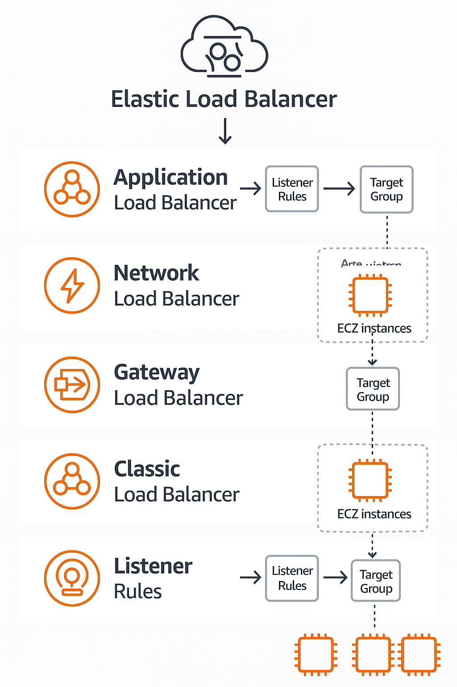

## 🧩 What is AWS Elastic Load Balancer (ELB)?

**AWS Elastic Load Balancer (ELB)** automatically distributes incoming application traffic across multiple targets – such as EC2 instances, containers, IP addresses – in one or more Availability Zones (AZs). It improves fault tolerance, scalability, and availability.

---

## 🔢 Types of ELB

### 1. **Application Load Balancer (ALB)**

* **Layer**: 7 (HTTP/HTTPS)
* **Routing**: Based on URL path, host, headers, query strings.
* **Use Cases**: Microservices, container-based architectures (e.g., ECS), web apps.
* **Features**:

  * Path-based and host-based routing
  * Native WebSocket support
  * Redirects and fixed responses
  * Target groups by service
  * Integration with AWS WAF

---

### 2. **Network Load Balancer (NLB)**

* **Layer**: 4 (TCP/UDP)
* **Routing**: Based on IP protocol data.
* **Use Cases**: High-performance and low-latency apps, real-time games, financial applications.
* **Features**:

  * Handles millions of requests/sec
  * Static IP support or Elastic IP
  * TLS termination
  * Preserves client IP
  * PrivateLink support

---

### 3. **Gateway Load Balancer (GWLB)**

* **Layer**: 3/4 (IP packet-level)
* **Purpose**: Deploy, scale, and manage third-party virtual appliances (firewalls, intrusion detection).
* **Use Cases**: Network inspection, security appliance chaining.
* **Features**:

  * Transparent traffic redirection
  * Combines transparent gateway + load balancer
  * Integrates with VPC endpoint service

---

### 4. **Classic Load Balancer (CLB)** (Legacy)

* **Layer**: 4 and partial Layer 7
* **Use Cases**: Older apps not designed with ALB/NLB in mind
* **Limitations**:

  * Lacks advanced routing (no path-based)
  * Single target group
  * Deprecated for new designs

---

## 🏗️ ELB Architecture

* **Listeners**: Define protocol/port the load balancer listens on (e.g., HTTP:80).
* **Target Groups**: Contain registered targets (EC2s, IPs, Lambda).
* **Health Checks**: Ensure only healthy targets receive traffic.
* **Availability Zones**: Distributes traffic across multiple AZs.
* **Security**: Integrated with **Security Groups**, **ACM**, and **IAM**.

---

## ⭐ Key Features of ELB

| Feature                | ALB             | NLB        | GWLB      | CLB       |
| ---------------------- | --------------- | ---------- | --------- | --------- |
| Load balancing level   | Layer 7         | Layer 4    | Layer 3/4 | Layer 4/7 |
| Path-based routing     | ✅               | ❌          | ❌         | ❌         |
| Host-based routing     | ✅               | ❌          | ❌         | ❌         |
| WebSockets support     | ✅               | ✅          | ❌         | ✅         |
| Static IP / Elastic IP | ❌               | ✅          | ✅         | ❌         |
| TLS termination        | ✅               | ✅          | ❌         | ✅         |
| Preserve client IP     | ✅ (via headers) | ✅ (native) | ✅         | ❌         |
| Container support      | ✅ (ECS/EKS)     | ✅          | ❌         | ❌         |
| WAF integration        | ✅               | ❌          | ❌         | ❌         |

---

## 🧪 Health Checks

* **Purpose**: Verify application health before routing traffic.
* **Configuration**:

  * **Protocol**: HTTP, HTTPS, TCP
  * **Path**: For ALB (e.g., `/health`)
  * **Port**: Can use traffic port or a specific one
* **Thresholds**:

  * **Healthy Threshold**: # of successes before marking as healthy
  * **Unhealthy Threshold**: # of failures before marking as unhealthy

---

## 🎯 Target Groups

* Define how load balancer routes traffic.
* Types of targets:

  * EC2 instances
  * IP addresses
  * Lambda functions (ALB only)
* Can associate one or more target groups with a load balancer listener.

---

## 🛠️ Listener Rules

* **Condition + Action** pattern
* Common rules:

  * Path = `/api/*` → Target Group A
  * Host = `admin.example.com` → Target Group B
* Supported actions:

  * Forward to target group
  * Redirect
  * Return fixed response

---

## 🔐 Security

* Integrated with **Security Groups** (ALB/CLB)
* **ACM** for SSL/TLS certificates
* Supports **IAM roles** and **policies**
* Works with **AWS WAF** (for ALB)
* Enables **access logs** to S3 for audit

---

## 📈 Integration with Auto Scaling

* ELB automatically registers/deregisters EC2 instances launched/terminated by Auto Scaling groups.
* Ensures only healthy, available instances serve traffic.
* Use **Lifecycle Hooks** for graceful connection draining.

---

## 💰 Pricing

* **Based on**:

  * Number of Load Balancer hours
  * GBs of data processed
* **ALB/NLB/GWLB** have different pricing models:

  * **ALB**: Charged per LCU (Load Balancer Capacity Unit)
  * **NLB**: Charged per processed GB and used hours
  * **GWLB**: Charged for GWLB hours and data processed

[Reference: AWS ELB Pricing](https://aws.amazon.com/elasticloadbalancing/pricing/)

---

## 📊 Comparison Summary

| Criteria             | ALB             | NLB                    | GWLB               | CLB         |
| -------------------- | --------------- | ---------------------- | ------------------ | ----------- |
| Layer                | 7               | 4                      | 3/4                | 4/7         |
| Performance          | Moderate        | High                   | Medium             | Low         |
| Use Case             | HTTP/HTTPS apps | Real-time, low latency | Network appliances | Legacy apps |
| Feature-rich routing | Yes             | No                     | No                 | Limited     |
| Container Support    | Yes             | Yes                    | No                 | No          |
| TLS Termination      | Yes             | Yes                    | No                 | Yes         |
| WAF Support          | Yes             | No                     | No                 | No          |

---

## ✅ Best Practices

1. **Use ALB** for web apps, microservices, and path-based routing.
2. **Use NLB** for ultra-low latency or TCP/UDP workloads.
3. **Use GWLB** to chain security appliances transparently.
4. Enable **access logs** for auditing and analytics.
5. Configure **connection draining** for smooth de-registration.
6. Use **Auto Scaling** with health checks for fault tolerance.
7. For HTTPS, **use ACM** with auto-renewing SSL certificates.
8. Enable **cross-zone load balancing** for optimal AZ usage (free for ALB, paid for NLB).
9. **Tag** resources for better cost tracking and organization.

---

## 🌍 Real-World Use Cases

* **ALB**:

  * Load balancing a containerized app (ECS, EKS)
  * Host-based routing for multi-tenant SaaS
* **NLB**:

  * Financial trading platform needing ultra-low latency
  * Proxying traffic to on-prem via VPN/direct connect
* **GWLB**:

  * Deploying Palo Alto/Checkpoint firewalls as VMs
* **CLB**:

  * Legacy monolithic app using HTTP/HTTPS and TCP

---

## 🚀 Performance Optimization

* For NLB:

  * Use **Elastic IPs** for predictable DNS resolution.
  * Enable **Preserve client IP** for analytics.
* For ALB:

  * Use **HTTP/2** and **WebSocket** for improved performance.
  * Use **path-based rules** to minimize over-routing.
* Enable **Connection reuse** to reduce latency.
* Use **CloudWatch metrics** (e.g., `TargetResponseTime`) to monitor.

---

## 🛠️ Troubleshooting Techniques

| Issue                        | Cause                                      | Resolution                                    |
| ---------------------------- | ------------------------------------------ | --------------------------------------------- |
| 504 Gateway Timeout          | Target took too long to respond            | Check app latency, increase idle timeout      |
| 502 Bad Gateway              | Target returned invalid response           | Check app logs, ensure proper response        |
| Target marked unhealthy      | Failing health checks                      | Check health check path, port, and response   |
| No targets receiving traffic | Wrong listener rules or no healthy targets | Review listener rules and health status       |
| SSL certificate errors       | Expired or misconfigured certificate       | Use ACM for auto-renewal, validate cert chain |
| Latency spikes               | Overloaded instances or AZ imbalance       | Enable autoscaling, cross-zone balancing      |

---
