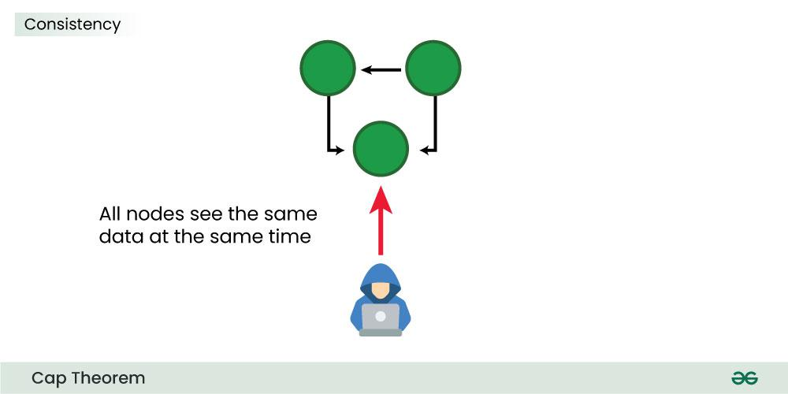
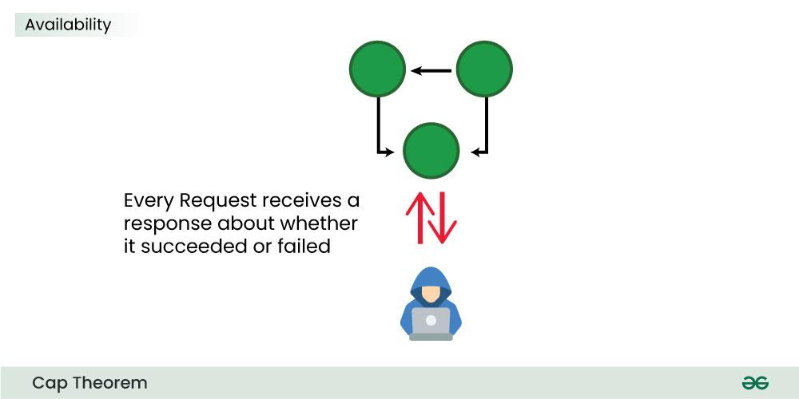
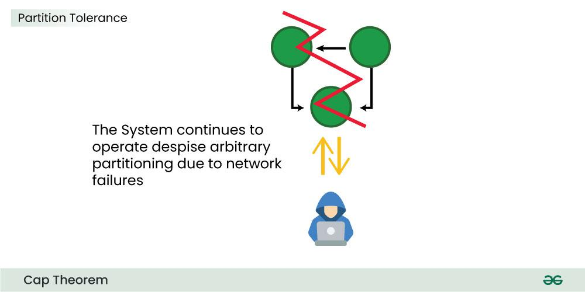

# CAP Theorem in System Design

The **CAP theorem**, also known as **Brewer’s theorem**, is a key concept in distributed system design. 

The CAP Theorem explains the trade-offs in distributed systems. It states that a system can only guarantee **two of three properties: Consistency, Availability, and Partition Tolerance**. This means no system can do it all, so designers must make smart choices based on their needs.


## Properties of CAP Theorem
1. **Consistency (C)**  
   - Every read receives the most recent write or an error.  
   - It defines that all clients see the same data simultaneously, no matter which node they connect to in a distributed system. For eventual consistency, the guarantees are a bit loose. Eventual consistency gurantee means client will eventually see the same data on all the nodes at some point of time in the future.

   **Example:** In a banking system, when you check your account balance, it should show the latest transaction immediately, ensuring consistent data across nodes.

    

2. **Availability (A)**  
   - Every request (read or write) receives a response, even if some nodes are unavailable.  
   - It defines that all non-failing nodes in a distributed system return a response for all read and write requests in a bounded amount of time, even if one or more other nodes are down.

   

   **Example:** Social media platforms like Twitter or Instagram prioritize availability by continuing to show posts even if some servers are down.

3. **Partition Tolerance (P)**  
   - The system continues to function even if there is a network partition (a communication breakdown between parts of the system).  
   - It defines that the system continues to operate despite arbitrary message loss or failure in parts of the system. Distributed systems guranteeing partition tolerance can gracefuly recover from partitions once the partition heals.

   

   **Example:** Online shopping systems like Amazon ensure partition tolerance, so even if one data center loses connectivity, the system remains operational.

---

## CAP Combinations

### 1. **Consistency + Availability (CA)**  
   - The system guarantees consistency and availability but cannot handle network partitions.  
   - **Example:** Single-node systems like traditional relational databases (e.g., MySQL or PostgreSQL running on a single server) ensure consistency and availability as there are no partitions.

### 2. **Consistency + Partition Tolerance (CP)**  
   - The system prioritizes consistency over availability during a network partition. Some requests may be rejected to maintain data integrity.  
   - **Examples:**
     - **Banking Transactions** 
     - **HBase**: A distributed NoSQL database that prioritizes consistent reads and writes.
     - **MongoDB (with majority write concern)**: Ensures data is consistent across nodes, but availability might be impacted.

### 3. **Availability + Partition Tolerance (AP)**  
   - The system remains available despite network partitions but may return stale or inconsistent data.  
   - **Examples:**
     - **Social Media Newsfeed**
     - **Cassandra**: A distributed database that prioritizes availability and partition tolerance.
     - **DynamoDB**: Ensures high availability but may show eventual consistency during partitions.
     - **Couchbase**: Designed for availability and performance, even during partitions.

---

## Practical Implications of CAP Theorem

1. **Real-World Constraints**  
   Network partitions are unavoidable in distributed systems, so systems must choose between **Consistency (C)** and **Availability (A)**.

2. **System Choices**
   - **CP Systems**:  
     Preferred for applications where data correctness is critical, such as financial systems or inventory management.  
     Example: Banking applications ensuring no double-spending.
   - **AP Systems**:  
     Preferred for applications prioritizing availability, such as social media feeds or content delivery.  
     Example: Video streaming platforms like Netflix showing cached content when necessary.

3. **Eventual Consistency**  
   AP systems often rely on eventual consistency, where data becomes consistent after some time but may appear stale temporarily.

---

## CAP Theorem Summary Table

| Property Combination | Description                             | Examples                     |
|-----------------------|-----------------------------------------|------------------------------|
| **CA**               | Consistency and Availability           | Single-node MySQL, PostgreSQL|
| **CP**               | Consistency and Partition Tolerance    | HBase, MongoDB (majority writes) |
| **AP**               | Availability and Partition Tolerance   | Cassandra, DynamoDB, Couchbase |

---

# CAP Theorem Demonstration in C#

This example demonstrates the **CAP theorem** in a distributed system using C#. It simulates the trade-offs between **Consistency**, **Availability**, and **Partition Tolerance** in the presence of a network partition.

---

## Code Example

```csharp
using System;
using System.Collections.Concurrent;
using System.Threading;
using System.Threading.Tasks;

class Program
{
    // Simulate a distributed system with a key-value store
    private static ConcurrentDictionary<string, string> dataStore = new();
    private static bool isPartitioned = false; // Simulate network partition

    static async Task Main(string[] args)
    {
        Console.WriteLine("Starting CAP theorem demonstration...\n");

        // Initialize data
        dataStore["key1"] = "Value1";

        // Simulate requests
        Task writer = SimulateWrites();
        Task reader = SimulateReads();

        // Simulate network partition after 3 seconds
        await Task.Delay(3000);
        Console.WriteLine("\n*** Simulating network partition ***\n");
        isPartitioned = true;

        // Recover network after 6 seconds
        await Task.Delay(6000);
        Console.WriteLine("\n*** Network partition resolved ***\n");
        isPartitioned = false;

        await Task.WhenAll(writer, reader);
    }

    private static async Task SimulateWrites()
    {
        int counter = 1;
        while (true)
        {
            // During a partition, consistency may be sacrificed
            if (isPartitioned)
            {
                Console.WriteLine("Write failed: Network partition detected.");
            }
            else
            {
                string newValue = $"Value{counter++}";
                dataStore["key1"] = newValue;
                Console.WriteLine($"Write successful: Updated 'key1' to {newValue}");
            }
            await Task.Delay(2000);
        }
    }

    private static async Task SimulateReads()
    {
        while (true)
        {
            // During a partition, availability may be prioritized, but data might be stale
            if (isPartitioned)
            {
                Console.WriteLine($"Read during partition: 'key1' = {dataStore["key1"]} (stale)");
            }
            else
            {
                Console.WriteLine($"Read successful: 'key1' = {dataStore["key1"]}");
            }
            await Task.Delay(1500);
        }
    }
}
```
### Output
```
Starting CAP theorem demonstration...

Write successful: Updated 'key1' to Value1
Read successful: 'key1' = Value1
Write successful: Updated 'key1' to Value2
Read successful: 'key1' = Value2

*** Simulating network partition ***

Write failed: Network partition detected.
Read during partition: 'key1' = Value2 (stale)

*** Network partition resolved ***

Write successful: Updated 'key1' to Value3
Read successful: 'key1' = Value3
```
---

## Conclusion

Understanding the CAP theorem helps in making trade-offs when designing distributed systems. Each system prioritizes different properties based on the application's requirements.
