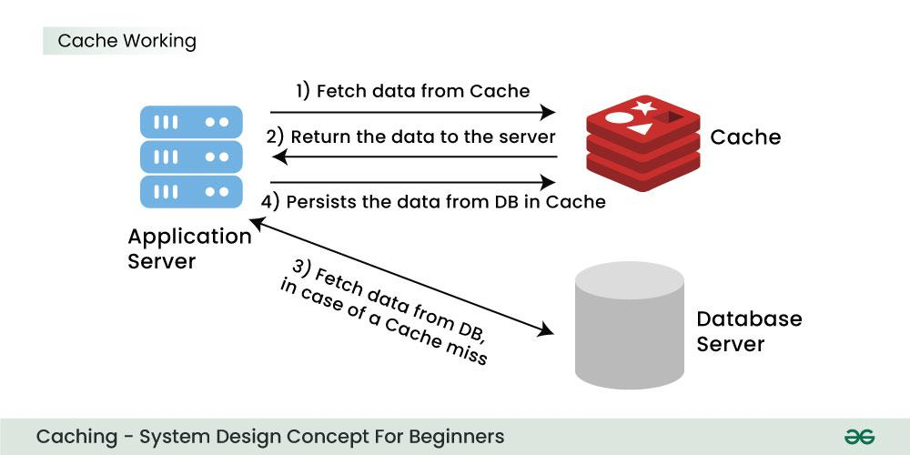
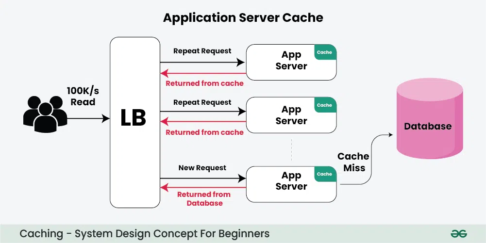
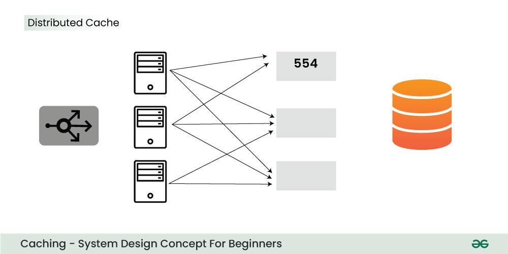

Designing a caching and distributed caching system requires careful consideration of your application's needs, scalability, and performance. Below is an overview of how you could approach this.

### 1. **Caching Basics:**
Caching stores frequently accessed data in memory so that subsequent requests can be served quickly without needing to retrieve it from slower storage (e.g., databases, file systems).

Cache reduces the network calls to the database and speeds up the performance of the system.



**Types of Caching:**
- **Local Caching or Application Server Cache:** Caching that happens within a single application instance (e.g., using in-memory dictionaries). This is fast but limited by the instance's resources.



- **Distributed Caching:** Caching across multiple servers or instances. This is useful for horizontally scaling applications and for keeping data synchronized across instances.


---


### 2. **Requirements Analysis:**
Before you design your system, define your requirements:
- **Data Size:** How much data needs to be cached? (affects cache expiration policies, eviction strategies, and system architecture).
- **Latency:** How fast must the cache serve the data?
- **Consistency:** Is it okay if the cached data can be slightly out of sync with the data source, or does it need to be updated in real time?
- **Scalability:** Will your system grow? How do you scale the cache as the number of application instances increases?

---

### 3. **Distributed Caching Components:**
In a distributed caching system, the following components are crucial:
- **Cache Server/Cluster:** A distributed key-value store that holds the cached data.
  - **Examples:** Redis, Memcached, Amazon ElastiCache, or any other distributed caching system.
- **Cache Client:** The client-side application or service interacting with the cache to store and retrieve data.
- **Data Source:** The backend database or service from which data is fetched when a cache miss occurs.
- **Cache Eviction Policy:** Determines how stale or outdated data is managed. Common policies include:
  - **LRU (Least Recently Used):** Evicts the least recently accessed items.
  - **LFU (Least Frequently Used):** Evicts the least frequently accessed items.
  - **TTL (Time to Live):** Items expire after a set time.

---

### 4. **Distributed Caching Architecture Design:**
A basic design pattern could look like the following:

1. **Client Request:** The application sends a request for data.
2. **Cache Lookup:** The client checks the cache for the requested data.
   - **Cache Hit:** If found, the data is returned from the cache.
   - **Cache Miss:** If not found, the application fetches the data from the data source (database, API, etc.) and stores it in the cache for future requests.
3. **Cache Invalidations:** If data in the database changes, the cache might need to be invalidated or updated.
   - This can be done using manual cache invalidation or **cache expiration** (TTL) mechanisms.
4. **Cache Replication:** In a distributed cache, replication ensures that cache data is available across different nodes or regions for high availability and failover.

---

### 5. **Key Design Decisions:**

1. **Consistency and Availability (CAP Theorem):**
   - **Consistency:** All clients always see the same data.
   - **Availability:** Every request receives a response, whether it’s from the cache or the database.
   - **Partition Tolerance:** The system can still function despite network failures between servers.

   **Choose between:**
   - **Eventual Consistency:** Allows for some delay in synchronization across nodes, but ensures high availability.
   - **Strong Consistency:** Guarantees all replicas of the cache are updated at the same time, at the cost of performance and availability.

2. **Sharding (Horizontal Scaling):**
   - The cache can be sharded (divided into smaller pieces) across multiple servers to distribute the load and improve performance.
   - **Sharding Strategies:** 
     - **Hash-based:** A hash function is used to distribute data across shards.
     - **Range-based:** Each shard holds a contiguous range of data.

3. **Replication:**
   - Cache clusters should use replication to ensure data availability even if a node fails.
   - Commonly used in Redis and Memcached clusters.

4. **Persistence:**
   - Caches can be **volatile** (data lost when the cache server is restarted) or **persistent** (data survives restarts, often using disk-based storage like Redis' AOF or RDB persistence modes).

5. **Cache Invalidation:**
   - **Time-based Expiry (TTL):** Data expires after a predefined period.
   - **Event-based Invalidation:** Data is removed or updated when an event (e.g., a database update) occurs.

6. **Fault Tolerance and Failover:**
   - Ensure the cache can tolerate node failures and still serve requests. Redis supports this with **master-slave replication** and **sentinel** for automatic failover.
   - Memcached can be scaled horizontally, but it's typically less resilient to failures compared to Redis.

---

### 6. **Example Architecture Using Redis:**

1. **Redis Cluster:** A distributed Redis cluster where data is partitioned and replicated across multiple Redis nodes.
2. **Web Application or API Servers:** Application servers can query Redis for cached data.
3. **Database:** A relational or NoSQL database acts as the source of truth for your data.
4. **Cache Invalidation:**
   - When data in the database changes, the application can either manually update the cache or use a message broker (e.g., Kafka, RabbitMQ) to notify all services to invalidate or update the cache.
5. **Client Libraries:** Libraries like **StackExchange.Redis** (for .NET) can be used to interact with Redis and implement caching patterns like **Cache-Aside** (Lazy Loading) or **Write-Through**.

---

### 7. **Performance and Monitoring:**
- Use **metrics** (e.g., cache hit/miss ratios, eviction rates) to monitor the performance of the cache and ensure that it is functioning optimally.
- **Redis Monitoring Tools:** Redis provides built-in monitoring tools like **Redis-CLI** and **Redis Insights** for checking key statistics.
- **Distributed Tracing:** Use tools like **OpenTelemetry** to track cache interactions in distributed systems and ensure cache performance doesn't degrade.

---

### 8. **Cache Design Patterns:**
- **Lazy Loading (Cache-Aside):** Data is loaded into the cache only when requested, and subsequent requests are served from the cache.
- **Write-Through Cache:** Data is written to both the cache and the data store at the same time.
- **Write-Behind Cache:** Data is written to the cache first and then asynchronously to the data store.

---

### 9. **Security and Access Control:**
- Secure access to cache servers (e.g., using firewalls, VPCs, and authentication).
- Encrypt sensitive data in the cache (e.g., AES encryption for data at rest in Redis).
---

### 10. Applications of Caching

## Web Page Caching
Browsers save copies of frequently visited websites to:
- Speed up loading times
- Reduce bandwidth consumption
- Shorten page load duration

## Database Caching
- Stores frequently used data in memory
- Reduces server strain
- Minimizes repeated database queries
- Improves application performance

## Content Delivery Networks (CDNs)
- Distribute cached data globally
- Store copies of media (images, videos)
- Enable faster content retrieval
- Serve content from nearest server

## Session Caching
- Store user session data
- Maintain login status
- Create personalized user experiences
- Eliminate repeated authentication

## API Response Caching
- Cache frequently requested data
- Accelerate response times
- Reduce server load
- Provide near real-time data delivery
- Examples: stock prices, weather information
---

## Example: Redis with C# (.NET)

### Prerequisites:
- Install the **StackExchange.Redis** NuGet package:
```bash
dotnet add package StackExchange.Redis
```  
```
using StackExchange.Redis;
using System;
using System.Threading.Tasks;

class Program
{
    private static ConnectionMultiplexer redis;
    private static IDatabase cache;

    static async Task Main(string[] args)
    {
        // Connect to the Redis server
        redis = ConnectionMultiplexer.Connect("localhost:6379");
        cache = redis.GetDatabase();

        // Cache key and value
        string key = "user:123";
        string value = "John Doe";

        // 1. Add data to the cache
        await cache.StringSetAsync(key, value, TimeSpan.FromMinutes(10));
        Console.WriteLine($"Cached data: {key} -> {value}");

        // 2. Retrieve data from the cache
        string cachedValue = await cache.StringGetAsync(key);
        if (!string.IsNullOrEmpty(cachedValue))
        {
            Console.WriteLine($"Cache Hit: {key} -> {cachedValue}");
        }
        else
        {
            Console.WriteLine("Cache Miss. Fetching from database...");
            // Simulate database fetch
            cachedValue = "John Doe";
            await cache.StringSetAsync(key, cachedValue, TimeSpan.FromMinutes(10));
        }

        // 3. Cache expiration and invalidation
        await cache.KeyExpireAsync(key, TimeSpan.FromMinutes(5));
        Console.WriteLine($"Key '{key}' set to expire in 5 minutes.");

        // 4. Cache eviction
        if (await cache.KeyDeleteAsync(key))
        {
            Console.WriteLine($"Key '{key}' evicted from cache.");
        }
    }
}

```  


### Conclusion:
A well-designed distributed caching system ensures that your application scales efficiently, handles high traffic, and remains responsive. Key considerations include choosing the right caching layer (e.g., Redis, Memcached), implementing cache invalidation strategies, scaling through sharding and replication, and ensuring high availability with fault tolerance.