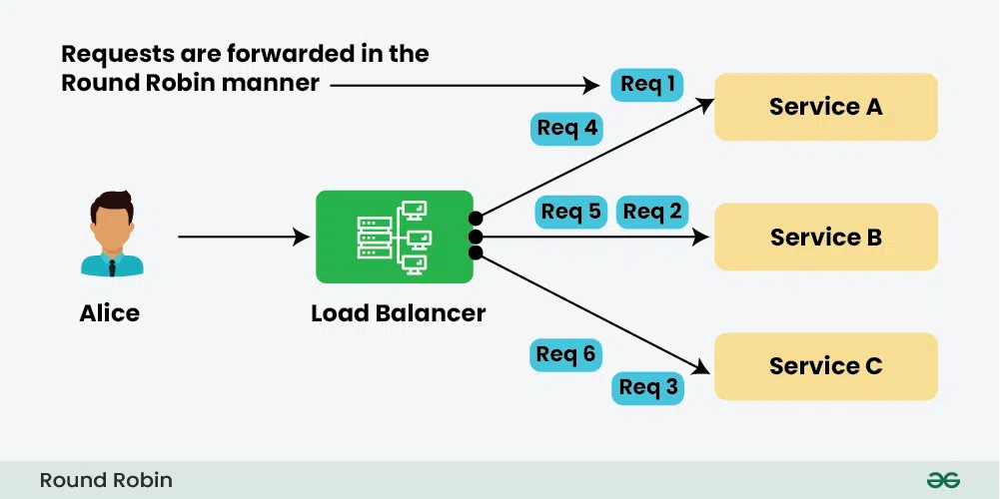
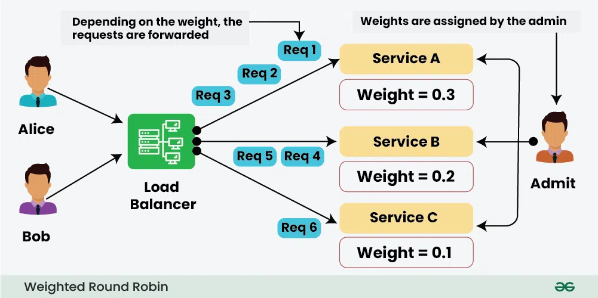
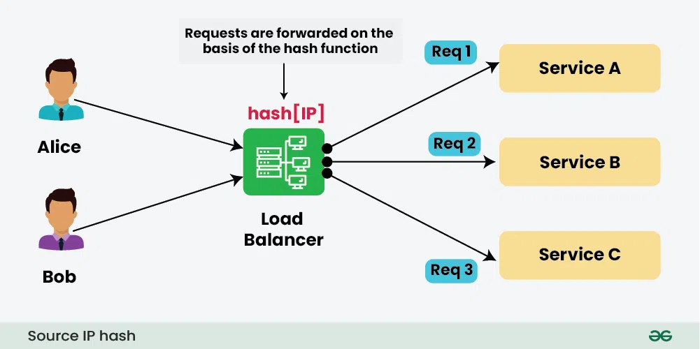
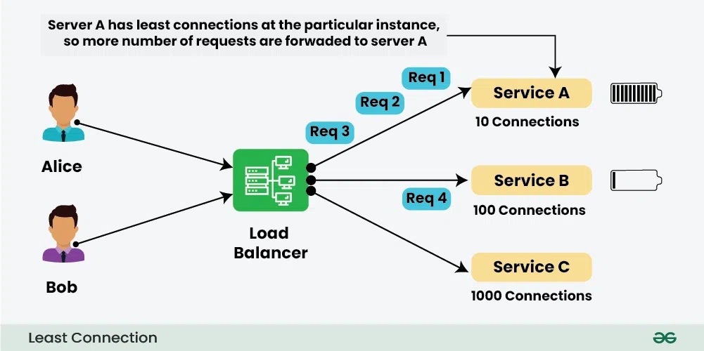
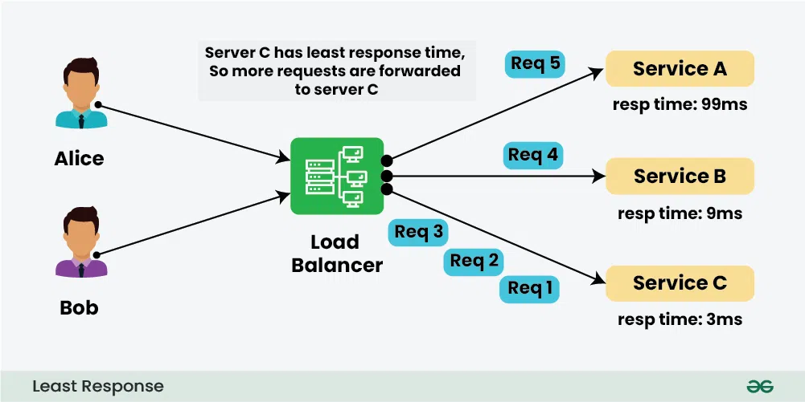
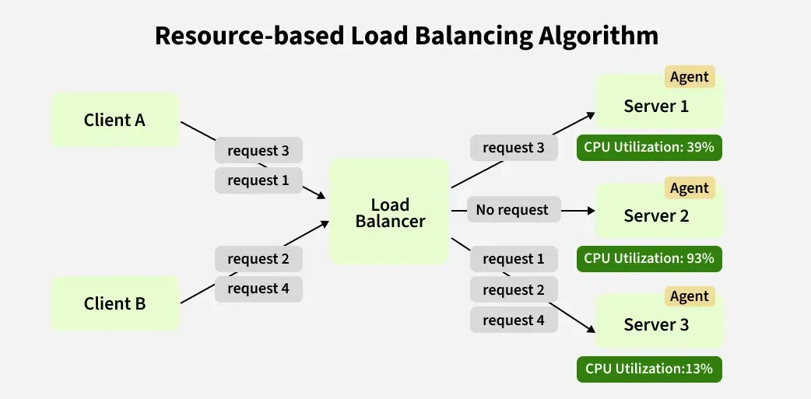

# **Load Balancing Algorithms**

Load balancers use various algorithms to distribute incoming requests across multiple servers or instances. These algorithms help ensure optimal resource utilization, reduce response time, and improve system reliability. Below are commonly used load balancing algorithms, along with a brief explanation of each.

---

# Static Load Balancing Algorithms 
## **1. Round Robin**

### **How It Works**
- Distributes requests sequentially to each server in the pool.
- Once the last server is reached, it starts over from the first.

### **Use Case**
- Simple and effective when all servers have **equal capacity** and **similar performance**.
- Ideal for applications where all servers have similar capacity and performance.
- Works well for evenly distributed workloads, such as basic web requests.
- Best suited for simple environments without complex resource needs.
- Useful in setups where request order matters less than balanced distribution across servers.

---

## **2. Weighted Round Robin**

### **How It Works**
- Similar to Round Robin but assigns a weight to each server based on its capacity.
- Servers with higher weights receive more requests.

### **Use Case**
- Useful when servers have **uneven capacity** or **different hardware configurations**.
- When servers have different capacities or performance levels.
- Ideal for environments where servers vary in resources (CPU, memory, etc.).
- Useful when you want to maximize resource utilization across all servers.
- Helps in preventing smaller servers from overloading while efficiently using larger servers.

---

## **3. IP Hash**

### **How It Works**
- is a method to distribute incoming requests among a set of servers based on the hash value of the source IP address. 
- This algorithm aims to ensure that requests originating from the same source IP address are consistently directed to the same server.
- Uses a **hash function** on the client’s IP address to determine which server receives the request.
- Ensures that a given client consistently connects to the same server (also known as **session persistence**).

### **Use Case**
- Useful when session persistence is required (e.g., shopping carts, user-specific data).
- Ideal for applications needing session consistency, like online banking, where the same user must connect to the same server throughout a session.
- Useful when users from specific regions should connect to dedicated servers for better performance or compliance.
- Effective when a few IPs generate most of the traffic, ensuring balanced load distribution without random switching.

---

# Dynamic Load Balancing Algorithms

## **1. Least Connections**

### **How It Works**
- Directs requests to the server with the **fewest active connections**.
- Assumes servers with fewer connections can handle new requests more quickly.

### **Use Case**
- Works well in scenarios where request durations vary significantly.
- Ideal for applications where some requests take longer to process than others (e.g., video streaming or large file uploads).
- Useful when some connections stay active longer, as it ensures new requests go to servers with fewer active connections.
- Great for systems with fluctuating traffic, as it balances based on real-time server load rather than just counting requests.

---

## **2. Least Response Time**

### **How It Works**
- Sends requests to the server with the **lowest response time**.
- Continuously measures the response time of each server.

### **Use Case**
- Suitable for scenarios where the performance of servers can vary depending on current load.
- Ideal for applications with heavy, fluctuating user traffic where response time matters.
- Great for apps like e-commerce sites or streaming services, where a quick response improves user experience.
- Works well when servers have different load levels, as it directs traffic to the server that’s both available and responds the fastest.

---

## **2. Weighted Least Connections**

### **How It Works**
- Combines **Least Connections** with **weights** assigned to servers.
- Servers with higher capacity are assigned a higher weight, so they receive more traffic even if they have more connections.

### **Use Case**
- Ideal when servers have **different capacities** and traffic involves **long-lived connections**.

---

## **10. Adaptive or Resource-based Load Balancing**

### **How It Works**
- Continuously monitors server health and performance metrics (e.g., CPU usage, memory, response time).
- Dynamically adjusts load distribution based on these metrics.
-  Rather than just routing traffic equally or based on past performance, this algorithm evaluates the current **resource health** of each server to decide where new requests should go.

### **Use Case**
- Best for **large-scale, dynamic environments** with varying workloads.
- Useful for applications that perform CPU-intensive or memory-heavy tasks.
- Works well when servers have different resource levels, as the algorithm adapts to each server’s real-time capacity.
- Ensures availability by routing requests to the least overloaded servers, reducing downtime risks.

---

## **Summary Table**

| Algorithm                  | Criteria                     | Use Case                               |
|----------------------------|------------------------------|----------------------------------------|
| **Round Robin**             | Sequential distribution      | Uniform servers                        |
| **Weighted Round Robin**    | Server capacity              | Unequal server capacity                |
| **Least Connections**       | Fewest active connections    | Varying connection durations           |
| **Weighted Least Connections** | Fewest + capacity weights  | Varying capacities and connection durations |
| **Least Response Time**     | Lowest response time         | Performance-sensitive environments     |
| **IP Hash**                 | Hash of client IP            | Session persistence                    |
| **Consistent Hashing**      | Hash of request data         | Distributed caching, CDNs              |
| **Random**                  | Random selection             | Testing, non-critical environments     |
| **Source IP Affinity**      | Client IP-based persistence  | Sticky sessions                        |
| **Adaptive Load Balancing** | Dynamic server health metrics| Large-scale dynamic systems            |

---

### **How to Choose the Right Algorithm**

- **Round Robin / Weighted Round Robin**:  
  When all servers have similar performance or pre-determined capacities.
  
- **Least Connections / Weighted Least Connections**:  
  When request durations vary significantly, ensuring even distribution of active connections.

- **Least Response Time**:  
  When latency and performance are critical.

- **IP Hash / Source IP Affinity**:  
  When session persistence is required.

- **Adaptive Load Balancing**:  
  When working in dynamic, large-scale environments where server performance fluctuates.

---
